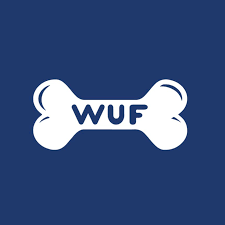
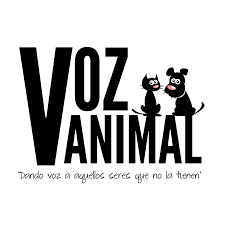

    <strong>Universidad Peruana de Ciencias Aplicadas</strong> 
     </img> 
     
    <strong>Ingeniería de Software - 2025-02</strong> 
     
    <strong>Diseño de Experimentos de Ingeniería de Software - 14651</strong>   
     
    <strong>Profesor: Juan Carlos Tinoco Licas</strong> 
      <strong>INFORME DE TB1</strong> 

    <strong>Startup: Huellitas Conectadas</strong> 
    <strong>Producto: Adopta!</strong>

<h3 align="center" >Team Members:</h3>

    <table align="center">
        <tr>
            <th style="text-align:center;">Miembro</th>
            <th style="text-align:center;">Código</th>
        </tr>
        <tr>
            <td>x </td>
            <td>U </td>
        </tr>
        <tr>
            <td>Espinoza Saenz, Christian Renato </td>
            <td>U202213208 </td>
        </tr>
        <tr>
            <td>x </td>
            <td>U   </td>
        </tr>
        <tr>
            <td>x</td>
            <td>U  </td>
        </tr>
        <tr>
            <td>x </td>
            <td>U </td>
        </tr>
    </table>

 

    <strong>SEPTIEMBRE 2025 </strong>

 

---

# Registro de Versiones del Informe

| Versión |   Fecha    | Autor | Descripción de modificación | 
|:-------:|:----------:|:-----:|:----------------------------| 
|TB1| 20/04/2025 |Christian Espinoza|  Capítulo I: Introducción |

---

# Contenido
## Tabla de Contenidos
### [Registro de versiones del informe](#registro-de-versiones-del-informe)
### [Project Report Collaboration Insights](#project-report-collaboration-insights)
### [Contenido](#contenido)
### [Student Outcome](#student-outcome-1)
### [Capítulo I: Introducción](#capítulo-i-introducción-1)
- [1.1. Startup Profile](#11-startup-profile)
    - [1.1.1. Descripción de la Startup](#111-descripción-de-la-startup)
    - [1.1.2. Perfiles de integrantes del equipo](#112-perfiles-de-integrantes-del-equipo)
- [1.2. Solution Profile](#12-solution-profile)
    - [1.2.1. Antecedentes y problemática](#121-antecedentes-y-problemática)
    - [1.2.2. Lean UX Process](#122-lean-ux-process)
        - [1.2.2.1. Lean UX Problem Statements](#1221-lean-ux-problem-statements)
        - [1.2.2.2. Lean UX Assumptions](#1222-lean-ux-assumptions)
        - [1.2.2.3. Lean UX Hypothesis Statements](#1223-lean-ux-hypothesis-statements)
        - [1.2.2.4. Lean UX Canvas](#1224-lean-ux-canvas)
- [1.3. Segmentos objetivo](#13-segmentos-objetivo)

### [Capítulo II: Requirements Elicitation & Analysis](#capítulo-ii-requirements-elicitation-&-analysis-1)
- [2.1. Competidores](#21-competidores)
    - [2.1.1. Análisis competitivo](#211-análisis-competitivo)
    - [2.1.2. Estrategias y tácticas frente a competidores](#212-estrategias-y-tácticas-frente-a-competidores)
- [2.2. Entrevistas](#22-entrevistas)
    - [2.2.1. Diseño de entrevistas](#221-diseño-de-entrevistas)
    - [2.2.2. Registro de entrevistas](#222-registro-de-entrevistas)
    - [2.2.3. Análisis de entrevistas](#223-análisis-de-entrevistas)
- [2.3. Needfinding](#23-needfinding)
    - [2.3.1. User Personas](#231-user-personas)
    - [2.3.2. User Task Matrix](#232-user-task-matrix)
    - [2.3.3. User Journey Mapping](#233-user-journey-mapping)
    - [2.3.4. Empathy Mapping](#234-empathy-mapping)
    - [2.3.5. As-is Scenario Mapping](#235-as-is-scenario-mapping)
- [2.4. Ubiquitous Language](#24-ubiquitous-language)

### [Capítulo III: Requirements Specification](#capítulo-iii-requirements-specification-1)
- [3.1. To-Be Scenario Mapping](#31-to-be-scenario-mapping)
- [3.2. User Stories](#32-user-stories)
- [3.3. Product Backlog](#33-impact-mapping)
- [3.4. Impact Mapping](#34-product-backlog)

### [Capítulo IV: Product Design](#capítulo-iv-product-design)
- [4.1. Style Guidelines](#41-style-guidelines)  
    - [4.1.1. General Style Guidelines](#411-general-style-guidelines)  
    - [4.1.2. Web Style Guidelines](#412-web-style-guidelines)  
    - [4.1.3. Mobile Style Guidelines](#413-mobile-style-guidelines)  
        - [4.1.3.1. iOS Mobile Style Guidelines](#4131-ios-mobile-style-guidelines)  
        - [4.1.3.2. Android Mobile Style Guidelines](#4132-android-mobile-style-guidelines)  
- [4.2. Information Architecture](#42-information-architecture)  
    - [4.2.1. Organization Systems](#421-organization-systems)  
    - [4.2.2. Labeling Systems](#422-labeling-systems)  
    - [4.2.3. SEO Tags and Meta Tags](#423-seo-tags-and-meta-tags)  
    - [4.2.4. Searching Systems](#424-searching-systems)  
    - [4.2.5. Navigation Systems](#425-navigation-systems)  
- [4.3. Landing Page UI Design](#43-landing-page-ui-design)  
    - [4.3.1. Landing Page Wireframe](#431-landing-page-wireframe)  
    - [4.3.2. Landing Page Mock-up](#432-landing-page-mock-up)  
- [4.4. Mobile Applications UX/UI Design](#44-mobile-applications-uxui-design)  
    - [4.4.1. Mobile Applications Wireframes](#441-mobile-applications-wireframes)  
    - [4.4.2. Mobile Applications Wireflow Diagrams](#442-mobile-applications-wireflow-diagrams)  
    - [4.4.3. Mobile Applications Mock-ups](#443-mobile-applications-mock-ups)  
    - [4.4.4. Mobile Applications User Flow Diagrams](#444-mobile-applications-user-flow-diagrams)  
- [4.5. Mobile Applications Prototyping](#45-mobile-applications-prototyping)  
    - [4.5.1. Android Mobile Applications Prototyping](#451-android-mobile-applications-prototyping)  
    - [4.5.2. iOS Mobile Applications Prototyping](#452-ios-mobile-applications-prototyping)  
- [4.6. Web Applications UX/UI Design](#46-web-applications-uxui-design)  
    - [4.6.1. Web Applications Wireframes](#461-web-applications-wireframes)  
    - [4.6.2. Web Applications Wireflow Diagrams](#462-web-applications-wireflow-diagrams)  
    - [4.6.3. Web Applications Mock-ups](#463-web-applications-mock-ups)  
    - [4.6.4. Web Applications User Flow Diagrams](#464-web-applications-user-flow-diagrams)  
- [4.7. Web Applications Prototyping](#47-web-applications-prototyping)  
- [4.8. Domain-Driven Software Architecture](#48-domain-driven-software-architecture)  
    - [4.8.1. Software Architecture Context Diagram](#481-software-architecture-context-diagram)  
    - [4.8.2. Software Architecture Container Diagrams](#482-software-architecture-container-diagrams)  
    - [4.8.3. Software Architecture Components Diagrams](#483-software-architecture-components-diagrams)  
- [4.9. Software Object-Oriented Design](#49-software-object-oriented-design)  
    - [4.9.1. Class Diagrams](#491-class-diagrams)  
    - [4.9.2. Class Dictionary](#492-class-dictionary)  
- [4.10. Database Design](#410-database-design)  
    - [4.10.1. Relational/Non-Relational Database Diagram](#4101-relationalnon-relational-database-diagram)  

### [Capítulo V: Product Implementation](#capítulo-v-product-implementation)
- [5.1. Software Configuration Management](#51-software-configuration-management)  
    - [5.1.1. Software Development Environment Configuration](#511-software-development-environment-configuration)  
    - [5.1.2. Source Code Management](#512-source-code-management)  
    - [5.1.3. Source Code Style Guide & Conventions](#513-source-code-style-guide--conventions)  
    - [5.1.4. Software Deployment Configuration](#514-software-deployment-configuration)  
- [5.2. Product Implementation & Deployment](#52-product-implementation--deployment)  
    - [5.2.1. Sprint Backlogs](#521-sprint-backlogs)  
    - [5.2.2. Implemented Landing Page Evidence](#522-implemented-landing-page-evidence)  
    - [5.2.3. Implemented Frontend-Web Application Evidence](#523-implemented-frontend-web-application-evidence)  
    - [5.2.4. Acuerdo de Servicio - SaaS](#524-acuerdo-de-servicio---saas)  
    - [5.2.5. Implemented Native-Mobile Application Evidence](#525-implemented-native-mobile-application-evidence)  
    - [5.2.6. Implemented RESTful API and/or Serverless Backend Evidence](#526-implemented-restful-api-andor-serverless-backend-evidence)  
    - [5.2.7. RESTful API Documentation](#527-restful-api-documentation)  
    - [5.2.8. Team Collaboration Insights](#528-team-collaboration-insights)  
- [5.3. Video About-the-Product](#53-video-about-the-product)  

### [Conclusiones](#conclusiones-1)
### [Bibliografía](#bibliografía-1)
### [Anexos](#anexos-1)
---

# Student Outcome

**ABET – EAC – Student Outcome 4**

    Criterio:  La capacidad de reconocer responsabilidades éticas y
profesionales en situaciones de ingeniería y hacer juicios informados, que deben
considerar el impacto de las soluciones de ingeniería en contextos globales, económicos,
ambientales y sociales  

En el siguiente cuadro se describe las acciones realizadas y enunciados de
conclusiones por parte del grupo, que permiten sustentar el haber alcanzado el logro
del ABET – EAC - Student Outcome 4.

    

    

<table>
  <tr>
    <th>Criterio Específico</th>
    <th>Acciones Realizadas</th>
    <th>Conclusiones</th>
  </tr>
  <tr>
    <td>.</td>
    <td>
      <strong>TB1:</strong> 
      <strong>x</strong>  
      <strong>Espinoza Saenz, Christian Renato:</strong>  
      <strong>x</strong>  
      <strong>x</strong>  
      <strong>x</strong>  
    </td>
    <td>
      <strong>TB1:</strong>  
    </td>	
  </tr>
  <tr>
    <td>.</td>
    <td>
      <strong>TB1:</strong> 
      <strong>x:</strong>  
      <strong>Espinoza Saenz, Christian Renato:</strong>  
      <strong>x</strong>  
      <strong>x:</strong>  
      <strong>x:</strong>  
    </td>
    <td>
      <strong>TB1:</strong>  
    </td>
  </tr>
</table>

# Capítulo I: Introducción

## 1.1. Startup Profile
### 1.1.1. Descripción de la Startup

    Huellitas Conectadas es una startup enfocada en transformar la adopción de mascotas en el Perú mediante soluciones digitales innovadoras. Su propuesta se centra en la digitalización del proceso de adopción, la conexión directa entre adoptantes, refugios y rescatistas, y el uso de herramientas tecnológicas que permiten gestionar perfiles, historiales médicos, seguimientos y comunicación de manera simple y transparente. Todo esto con el objetivo de agilizar las adopciones, garantizar el bienestar animal y fomentar prácticas responsables.

 

Creemos en una adopción empática, accesible y responsable, donde cada mascota encuentre un hogar lleno de cariño.
      
    
  

  

    <ul>
        <li>
            <b>Misión:</b>
        </li> 
Buscamos digitalizar y simplificar el proceso de adopción responsable en el Perú mediante una plataforma empática, accesible y confiable que conecte a adoptantes, refugios y rescatistas. Nuestro propósito es que cada conexión se convierta en un hogar seguro, que cada historia compartida inspire confianza y esperanza, y que cada esfuerzo aporte al bienestar y respeto de los animales.           
    <li>
            <b>Visión:</b>
        </li>
Imaginamos un futuro donde ninguna mascota viva sin un hogar, donde cada adopción sea responsable y transparente, y donde la tecnología actúe como un puente de confianza entre adoptantes, refugios y rescatistas. En Huellitas Conectadas trabajamos para que el bienestar animal sea parte esencial de una sociedad más solidaria y comprometida.     </ul>
 

### 1.1.2. Perfiles de integrantes del equipo

### Los integrantes que conforman parte de nuestro startup son:

| Integrante                | Perfil                                                                                                                                                                                                                                                                                                                                                                                                                                                                                                                                                                                                                                                                                                                                                                                              | Foto                                                |
|---------------------------|-----------------------------------------------------------------------------------------------------------------------------------------------------------------------------------------------------------------------------------------------------------------------------------------------------------------------------------------------------------------------------------------------------------------------------------------------------------------------------------------------------------------------------------------------------------------------------------------------------------------------------------------------------------------------------------------------------------------------------------------------------------------------------------------------------|-------------------------------------|
| x, x | Me llamo x.                                                                                                                                                                                                                                                                                                                                                                                                                                     |                                       |
| x,x | Me llamo x.                                                                                                                                                                                                                                                                                                                                                                                                                                                             |                                       |
| x, x | Hola, mi nombre es x.                                                                                           |                      |
| Espinoza Saenz, Christian Renato (U202213208) | Mi nombre es Christian Espinoza, soy un estudiante de 21 años que cursa el 8vo ciclo de la carrera Ingeniería de Software. Poseo ideas únicas e innovadoras para que el trabajo logre sobresalir. Tengo experiencia en la creación de distintos tipos de diagramas, editar diferentes tipos de multimedia como videos, y un conocimiento general en programación de C++, HTML, CSS y SQL. Además, se me facilita desarrollar interfaces intuitivas en el frontend, lo cual será beneficioso para el proyecto.                                                                                                                                                                                                                                                 |                     |

## 1.2. Solution Profile

**Product Name:** Adopta!

**Descripción del Producto:**  Adopta! es una solución digital que busca modernizar y simplificar el proceso de adopción de mascotas en el Perú. Su propósito es conectar de forma empática y transparente a adoptantes, refugios y rescatistas, garantizando que cada decisión se base en información clara y confiable. Con esta herramienta, se promueve una cultura de adopción responsable, se reducen los tiempos de espera y se genera un impacto positivo en la vida de los animales y las familias que los reciben. 

**Monetización:** El modelo de Adopta! estará basado en el acceso gratuito a las funciones esenciales de adopción, garantizando que cualquier persona pueda conectar con refugios y rescatistas sin costo. Para quienes requieran más beneficios, se ofrecerán servicios de pago como mayor visibilidad de mascotas y reportes detallados. También se considerarán alianzas con veterinarias y marcas de productos para mascotas como una fuente complementaria de ingresos, asegurando la sostenibilidad de la plataforma.

### 1.2.1. Antecedentes y problemática

En Lima Metropolitana, los refugios de mascotas enfrentan grandes dificultades para gestionar procesos de adopción, sobre todo en el caso de animales con necesidades médicas. La ausencia de una plataforma digital que centralice historiales clínicos y datos de adopción genera desconfianza entre los posibles adoptantes, lo que reduce las oportunidades para mascotas que sí pueden recibir tratamiento. A esto se suma que muchos refugios aún dependen de métodos manuales o del uso informal de redes sociales, sin procesos estandarizados, lo que ralentiza y complica las adopciones. Esta falta de herramientas especializadas limita las posibilidades de que miles de animales en situación de abandono encuentren un hogar definitivo.
  
Para mostrar con mayor claridad el valor de Adopta!, empleamos el modelo 5W y 2H.
  

***What***

* La información médica de las mascotas está dispersa en distintos formatos, desde registros en papel hasta publicaciones en redes sociales, lo que dificulta su acceso y confiabilidad.  
* No existe una plataforma digital que conecte de manera eficiente a refugios, veterinarios y adoptantes, generando vacíos en la comunicación.  
* El proceso de adopción carece de estandarización, provocando experiencias poco claras y frustrantes para todos los involucrados.  
* Para los refugios, esto limita la visibilidad y el potencial de adopción de mascotas con necesidades especiales.  
* Para los adoptantes, implica decidir con datos incompletos o poco confiables, lo que aumenta el riesgo de adopciones fallidas y desalienta futuras intenciones de adoptar.  

***Who***

* Las mascotas con necesidades médicas especiales (35% de los animales en refugios), que tardan hasta tres veces más en ser adoptadas en comparación con las mascotas sanas.  
* Los refugios independientes (72% del total), que destinan cerca del 40% de sus recursos a gestiones manuales y poco eficientes.  
* Los adoptantes potenciales, de los cuales un 68% abandona el proceso por falta de información confiable.  

**Aliados clave para cambiar esta realidad:**  
* Veterinarios jóvenes con competencias digitales (25–35 años).  
* Empresas de software interesadas en programas de responsabilidad social.  
* Organizaciones animalistas con alcance mediático, capaces de promover estándares unificados para la información médica en adopciones.  

***Where***
* El problema es más crítico en los distritos periféricos de Lima, como San Juan de Lurigancho, Villa El Salvador y Comas, donde opera el 65% de los refugios independientes con sobrepoblación (15–20 animales en espacios diseñados para 10).  
* Estas zonas concentran cerca del 80% de los casos de mascotas con necesidades especiales que superan un año de permanencia en refugios.  

***When***
* El problema se intensifica en temporadas posteriores a vacaciones (enero y julio), cuando los casos de abandono aumentan hasta en un 40%.  
* Se agrava al diagnosticarse condiciones médicas complejas en animales rescatados, de las cuales el 68% no logra documentarse de forma adecuada.  
* Durante el proceso de adopción, cuando el 72% de los interesados desiste al no encontrar información médica clara y actualizada.  
* La necesidad de una solución se hace evidente cuando mascotas con enfermedades tratables permanecen más de 6 meses en refugios, cuando un 25% de las adopciones falla por desconocimiento de necesidades especiales y cuando los refugios destinan más del 30% de su tiempo a gestiones administrativas en lugar de cuidados directos.  

***Why***
* La falta de información médica clara y confiable genera desconfianza en los adoptantes, lo que reduce las posibilidades de que animales con necesidades especiales encuentren un hogar.  
* Los refugios carecen de herramientas accesibles para registrar y compartir el estado de salud de cada mascota, lo que prolonga su permanencia en adopción.  
* La mayoría de refugios opera con presupuestos muy limitados (82% dispone de menos de S/5,000 al mes), priorizando alimentación y atención veterinaria sobre inversión en tecnología.  
* Gran parte de los administradores son voluntarios mayores de 50 años (67%), con poca experiencia digital, lo que dificulta implementar sistemas complejos sin apoyo externo.  
* La principal barrera no es la falta de necesidad, sino la ausencia de soluciones tecnológicas simples, asequibles y acompañadas de soporte que permitan a los refugios superar estas limitaciones.  

***How***
* El sistema fragmentado actual genera un ciclo de ineficiencia: 23% de los refugios registran la información en papel, 61% dependen de redes sociales, y en el 45% de los casos los adoptantes reciben datos médicos contradictorios.  
* Como consecuencia, las mascotas con necesidades especiales tienen un 83% menos probabilidades de ser adoptadas.  
* Los refugios llegan a invertir hasta 15 horas semanales por animal en gestiones manuales.  
* El 25% de las adopciones fracasa debido a expectativas médicas mal alineadas entre refugios y adoptantes.  

***How Much***
* Los refugios invierten hasta S/3,500 mensuales por cada animal no adoptado, lo que representa un 40% más de gasto en comparación con mascotas sanas.  
* Las clínicas veterinarias pierden cerca de un 30% de eficiencia en los seguimientos médicos por la falta de integración de datos.  
* A nivel general, el sistema desperdicia alrededor de 1.2 millones de horas al año en gestiones manuales de información, según la Asociación de Protección Animal Peruana.  

 

### 1.2.2. *Lean UX Process*

#### 1.2.2.1. *Lean UX Problem Statements*

***Problem Statement:***

**1. Dominio:**  
* El sector de aplicación es la adopción de mascotas en el Perú, con énfasis en refugios y rescatistas que buscan promover una adopción responsable y transparente. El enfoque se centra en el uso de herramientas digitales para centralizar información médica, mejorar la visibilidad de los animales y generar confianza en los adoptantes.

**2. Segmentos de Clientes:**

***Refugios y rescatistas independientes:***  
  * Carecen de un sistema centralizado para gestionar historiales médicos y procesos de adopción.  
  * Operan con recursos económicos y humanos limitados, priorizando alimentación y cuidados básicos.  
  * Dependen en gran medida de redes sociales sin estandarización, lo que dificulta dar seguimiento adecuado a cada caso.  

***Adoptantes potenciales:***  
  * No encuentran información médica clara y confiable, lo que genera desconfianza.  
  * El 68% desiste del proceso cuando se trata de mascotas con necesidades especiales.  
  * Enfrentan procesos largos, poco transparentes y sin acompañamiento post-adopción.  

**3. Puntos de Dolor (Pain Points):**  
* **Falta de información confiable sobre la salud de las mascotas:** Historiales dispersos en papel o mensajes en redes sociales generan dudas en los adoptantes.  
* **Procesos de adopción desordenados:** Cada refugio maneja procedimientos distintos, lo que confunde y desmotiva a los adoptantes.  
* **Sobrepoblación en refugios:** Mascotas con necesidades especiales permanecen hasta 3 veces más tiempo que las sanas en espera de adopción.  
* **Limitado acceso a tecnología adecuada:** La mayoría de refugios no cuenta con herramientas digitales simples ni capacitación tecnológica.  
* **Alto riesgo de adopciones fallidas:** La falta de información clara sobre condiciones médicas genera devoluciones (25% de los casos).  

**4. Brecha Identificada (Gap):**  
  Existe una falta evidente de soluciones digitales que sean:

* **Accesibles y fáciles de usar para refugios pequeños e independientes,** que no cuentan con recursos tecnológicos avanzados.  
* **Enfocadas en centralizar y estandarizar historiales médicos,** para dar confianza a los adoptantes.  
* **Capaces de fortalecer la transparencia y la confianza,** mostrando no solo fotos, sino también información clara y validada de cada mascota.  
* **Diseñadas para fomentar adopciones responsables,** incluyendo seguimiento post-adopción.  

**5. Visión / Estrategia:**  
 La visión de **Adopta!** es digitalizar el camino hacia la adopción responsable, transformando la información en confianza y generando un puente entre refugios, rescatistas y adoptantes. Para ello, se plantea:  

* Crear una plataforma digital que centralice información médica y perfiles de mascotas.  
* Estandarizar el proceso de adopción, haciéndolo más claro y confiable para todas las partes.  
* Ofrecer herramientas simples que ayuden a refugios a gestionar sus animales sin carga administrativa excesiva.  
* Facilitar a los adoptantes información clara y accesible que les permita tomar decisiones responsables.  
* Promover una red colaborativa entre refugios, veterinarios y adoptantes, impulsando el bienestar animal.  

#### 1.2.2.2. *Lean UX Assumptions*

***Business Assumptions:***

1. La adopción de mascotas debería ser un proceso más humano, seguro y accesible, generando confianza tanto en adoptantes como en refugios.  
2. Los adoptantes buscan información clara sobre la mascota y sus cuidadores antes de tomar la decisión de adopción.  
3. Refugios y rescatistas necesitan herramientas simples para gestionar publicaciones, solicitudes y validar a posibles adoptantes.  
4. La transparencia en los datos de mascotas, identidad de usuarios y comunicación directa genera confianza en el proceso de adopción.  
5. La plataforma deberá cubrir tres contextos fundamentales: gestión de mascotas, procesos de adopción y autenticación de usuarios.  
6. La mayor barrera será la adopción tecnológica por parte de refugios y rescatistas, así como la confianza de los adoptantes en el sistema.  
7. La resolución de estos retos se logrará mediante diseño centrado en el usuario, educación, soporte y validación de perfiles.  
8. La competencia principal serán redes sociales no especializadas y páginas web de adopción con poca optimización para gestión y seguimiento de procesos.  
9. La ventaja competitiva se obtendrá ofreciendo una experiencia centrada en empatía, claridad de información y herramientas que faciliten la adopción tanto para usuarios como para refugios.  

***Business Outcomes:***

- Alcanzar 100 refugios/rescatistas verificados en los primeros 6 meses.  
- Facilitar al menos 500 solicitudes de adopción en el primer año.  
- Validar la identidad del 90% de los adoptantes registrados en la plataforma.  
- Lograr que el 80% de las mascotas publicadas cuenten con historial médico y descripción emocional.  
- Incrementar el ratio de adopciones exitosas, con seguimiento post-adopción, en un 40% durante los primeros 12 meses.  

***User Assumptions:***

1. **¿Quién es el usuario?**  
   * Adoptantes interesados en integrar una mascota a su vida (parejas, familias, jóvenes independientes).  
   * Refugios y rescatistas independientes que buscan dar en adopción animales de forma segura y organizada.  

2. **¿Qué problemas resuelve?**  
   * Publicaciones poco claras o carentes de historia emocional.  
   * Procesos de adopción no estandarizados y sin filtros adecuados.  
   * Usuarios malintencionados o identidades falsas.  

3. **¿Qué características son críticas?**  
   * Formularios de adopción detallados y validados automáticamente.  
   * Perfiles completos de mascotas con fotos, historial médico y descripción emocional.  
   * Validación de identidad de adoptantes mediante APIs y revisión manual.  
   * Seguimiento de solicitudes y comunicación fluida.  
   * Filtros de búsqueda útiles por tipo de mascota, necesidades, edad, tamaño y ubicación.  

4. **¿Dónde se integra en su vida?**  
   * Adoptantes: al decidir integrar una mascota en su vida y querer hacerlo responsablemente.  
   * Refugios/rescatistas: en la publicación de mascotas, gestión de solicitudes y programación de visitas.  

5. **¿Cuándo y cómo se utiliza?**  
   * Adoptantes navegan diariamente, completan formularios y reciben notificaciones sobre sus solicitudes.  
   * Refugios gestionan publicaciones, validan adoptantes y programan visitas.  

6. **¿Cómo debe verse y funcionar?**  
   * Interfaz cálida, empática y confiable.  
   * Diseño simple, accesible y sensible al contexto emocional de la adopción.  
   * Flujo guiado, sin fricciones, fomentando la conexión entre personas y animales.  

***User Outcomes:***

- Adoptantes encuentran mascotas compatibles con su estilo de vida y completan procesos de adopción más confiables.  
- Refugios y rescatistas reducen la carga operativa y gestionan adopciones de manera más eficiente.  
- Los usuarios ganan confianza gracias a la validación de perfiles y la transparencia del proceso.  
- Se generan vínculos emocionales genuinos a través de historias, fotos y seguimiento del proceso de adopción.  
- Se reduce el abandono post-adopción mediante un sistema responsable y empático.  

***Feature Assumptions:***

- Las funciones de publicación y búsqueda de mascotas funcionan correctamente en distintos dispositivos y condiciones de conexión.  
- Los formularios y validaciones operan de manera confiable, detectando campos obligatorios y posibles inconsistencias.  
- La validación de identidad es precisa, combinando automatización y revisión humana.  
- El sistema de notificaciones mantiene comunicación efectiva entre adoptantes y refugios.  
- La plataforma es escalable y modular, permitiendo futuras incorporaciones de variables como vacunas, esterilización y recomendaciones de cuidado.  

#### 1.2.2.3. *Lean UX Hypothesis Statements*

* **Creemos que** permitir a los rescatistas y refugios publicar mascotas con fotos, historia emocional y necesidades especiales visiblemente destacadas aumentará el interés de los adoptantes. **Sabremos que esto es cierto cuando** veamos un aumento del 25% en la tasa de visualización de perfiles completos de mascotas durante el primer mes.

* **Consideramos que** incluir una sección con historial médico claro y validado en cada perfil de mascota generará más confianza en los adoptantes. **Lo validaremos cuando** el 60% de los formularios enviados correspondan a mascotas con historial médico publicado.

* **Planteamos que** implementar un formulario de adopción más completo (hogar, rutina, espacio, vínculo emocional) reducirá los abandonos post-adopción. **Esto será cierto cuando,** veamos un 30% de aumento en adopciones exitosas con seguimiento positivo en los 3 meses posteriores.

* **Confiamos en que** permitir agendar visitas directamente desde la app facilitará la coordinación y acelerará el proceso de adopción. **Esto quedará demostrado cuando** al menos el 40% de los usuarios con formulario aprobado agenden una visita dentro de la primera semana.

* **Estimamos que** notificar a los usuarios sobre el estado de sus solicitudes de adopción aumentará su confianza en la plataforma. **Sabremos que esto es cierto cuando** el 70% de los usuarios revisen el estado de su solicitud al menos una vez en los primeros 3 días tras enviarla.

* **Creemos que** validar la identidad de adoptantes, rescatistas y refugios usando APIs como Onfido o ValidarID reducirá los perfiles fraudulentos. **Lo confirmaremos cuando** el porcentaje de cuentas rechazadas por datos falsos disminuya en un 40% tras los primeros 2 meses de uso.

* **Consideramos que** permitir a los usuarios registrarse como adoptantes, rescatistas o refugios con requisitos personalizados (DNI, RUC, fotos, certificados) mejorará la calidad de perfiles en la plataforma. **Esto será cierto cuando** el 90% de los nuevos registros completos sean verificados sin necesidad de contacto adicional del soporte.

* **Planteamos que** ofrecer filtros según tamaño, tipo, edad y necesidades especiales facilitará encontrar mascotas compatibles. **Sabremos que esto es cierto cuando** el tiempo promedio de búsqueda antes de abrir un perfil disminuya en un 20%.

#### 1.2.2.4. *Lean UX Canvas*

## 1.3. Segmentos objetivo

En esta sección se identifican los segmentos de clientes objetivo de *Huellitas Conectadas*, considerando sus características, motivaciones y necesidades frente al proceso de adopción de mascotas.

 

**Segmento Objetivo #1: Personal de Refugios y Rescatistas de Animales (Administradores, Cuidadores y Voluntarios)**

**Aspectos demográficos:**  
- Sexo: No hay preferencia por género.  
- Edades: Adultos entre 25 y 50 años (inclusive).  

**Aspectos geográficos:**  
- Nacionalidad: Peruana.  
- Zona geográfica: Principalmente áreas urbanas y semiurbanas, donde se concentran los refugios más grandes y activos, con énfasis en Lima Metropolitana.  

**Aspectos psicográficos:**  
- Personas comprometidas con el bienestar animal, muchas veces voluntarios o trabajadores con vocación social.  
- Buscan herramientas que faciliten la gestión diaria del refugio o el rescate (registro de animales, control de adopciones, seguimiento de tratamientos, etc.).  
- Interesados en soluciones tecnológicas simples, efectivas y accesibles que mejoren la organización interna y aumenten la tasa de adopciones.  
- Valoran la colaboración abierta y están dispuestos a compartir datos o sugerencias con otros refugios o grupos de rescate a través de una comunidad.  

 

**Segmento Objetivo #2: Adoptantes Potenciales (Personas interesadas en adoptar animales)**

**Aspectos demográficos:**  
- Sexo: Masculino y femenino.  
- Edades: Jóvenes y adultos entre 20 y 45 años (inclusive).  

**Aspectos geográficos:**  
- Nacionalidad: Peruana.  
- Zona geográfica: Urbana.  
- Departamentos: Principalmente Lima Metropolitana, pero también ciudades intermedias como Arequipa, Chiclayo, Huancayo y Cusco.  

**Aspectos psicográficos:**  
- Personas con afinidad por los animales y conciencia sobre la adopción responsable.  
- Buscan una forma rápida, transparente y confiable de conocer animales en adopción.  
- Desean ver historias, fotos y fichas médicas para tomar decisiones informadas.  
- Motivados por el impacto positivo de adoptar y dar una segunda oportunidad a un animal rescatado.  

# Capítulo II: Requirements Elicitation & Analysis

## 2.1. Competidores

Tras un análisis del mercado, se identificaron tres plataformas tecnológicas con funcionalidades similares a Huellitas Conectadas, la propuesta orientada a la adopción responsable de mascotas:

**Competidores identificados:**

* ***WUF***
Es una plataforma peruana orientada a la adopción responsable y al bienestar animal, reconocida por su trabajo en visibilizar la problemática del abandono y promover la tenencia responsable. WUF se caracteriza por contar con un proceso de adopción estructurado, brindar seguimiento a los adoptantes y fomentar la concientización a través de campañas digitales, programas educativos y alianzas estratégicas con empresas y medios de comunicación.

 

* ***Wukta***
Es una plataforma enfocada en la adopción de mascotas y en la construcción de una comunidad pet-friendly activa. Wukta busca generar un espacio de colaboración donde rescatistas, refugios y adoptantes puedan interactuar de manera cercana. Se distingue por impulsar contenido educativo sobre el cuidado responsable de los animales, promover valores de respeto y bienestar, y facilitar conexiones directas que fortalecen la red de apoyo entre quienes buscan dar o recibir un hogar a una mascota.

 

* ***Voz Animal Perú***
Es una organización dedicada al rescate activo de animales en situación de abandono, con un fuerte énfasis en campañas de esterilización y educación sobre la tenencia responsable. Voz Animal Perú se ha consolidado como un actor clave en la protección animal al promover iniciativas de alto impacto social que buscan involucrar directamente a la comunidad.

### 2.1.1. Análisis competitivo
<table>
    <thead>
        <tr>
            <th colspan="6">Competitive Analysis Landscape</th>
        </tr>
        <tr>
            <th colspan="6">Este análisis busca identificar a los principales competidores de Adopta! y definir estrategias que permitan diferenciar la propuesta de valor en el sector de adopción animal.</th>
        </tr>
        <tr>
            <th colspan="2">Nombre</th>
            <th>Adopta!</th>
            <th>WUF</th>
            <th>Wukta</th>
            <th>Voz Animal Perú</th>
        </tr>
        <tr>
            <th colspan="2">Logo</th>
            <th></th>
            <th></th>
            <th></th>
            <th></th>
        </tr>
    </thead>
    <tbody>
        <tr>
            <td rowspan="2" align="justify">Perfil</td>
            <td align="justify">Overview</td>
            <td align="justify">Plataforma digital que facilita adopciones responsables, brindando fichas con información médica clara y confiable, además de herramientas de gestión para refugios y rescatistas.</td>
            <td align="justify">ONG consolidada que promueve adopciones, campañas de esterilización y programas educativos, respaldada por alianzas corporativas.</td>
            <td align="justify">Plataforma web que conecta adoptantes con rescatistas y albergues a través de perfiles digitales de mascotas.</td>
            <td align="justify">ONG enfocada en rescate, rehabilitación y adopción de animales abandonados, con fuerte presencia en redes sociales y campañas de sensibilización.</td>
        </tr>
        <tr>
            <td align="justify">Ventaja competitiva</td>
            <td align="justify">Información médica transparente y centralizada, junto con herramientas digitales simples que fortalecen la confianza y aceleran el proceso de adopción.</td>
            <td align="justify">Reconocimiento institucional, confianza pública y red de aliados estratégicos.</td>
            <td align="justify">Interfaz simple, rápida y enfocada en digitalización para facilitar la conexión entre adoptantes y rescatistas.</td>
            <td align="justify">Alto compromiso social, rescates directos y campañas virales que movilizan a la comunidad.</td>
        </tr>
        <tr>
            <td rowspan="5" align="justify">Perfil de Marketing</td>
            <td align="justify">Mercado Objetivo</td>
            <td align="justify">Adoptantes responsables en Lima Metropolitana y protectores/refugios independientes.</td>
            <td align="justify">Público general sensibilizado con la causa animal y potenciales donantes.</td>
            <td align="justify">Adoptantes y albergues (formales o informales) que buscan visibilidad digital.</td>
            <td align="justify">Familias, voluntarios y activistas interesados en el bienestar animal.</td>
        </tr>
        <tr>
            <td align="justify">Estrategias de Marketing</td>
            <td align="justify">Campañas en redes sociales, difusión de historias de adopción y alianzas con influencers y veterinarias.</td>
            <td align="justify">Campañas masivas en medios, presencia en eventos y merchandising solidario.</td>
            <td align="justify">Difusión digital mediante redes sociales, blog y convenios con refugios.</td>
            <td align="justify">Activismo digital, publicaciones emocionales y campañas virales en redes.</td>
        </tr>
        <tr>
            <td align="justify">Productos & Servicios</td>
            <td align="justify">Plataforma digital con fichas de mascotas, gestión de refugios, guías de donación y sistema de agendamiento.</td>
            <td align="justify">Adopciones, apadrinamiento, donaciones, campañas de esterilización y educación.</td>
            <td align="justify">Publicación de mascotas en adopción, contacto directo vía web, registro básico.</td>
            <td align="justify">Rescate y rehabilitación, campañas de salud, adopciones y denuncias de maltrato.</td>
        </tr>
        <tr>
            <td align="justify">Precios & Costos</td>
            <td align="justify">Gratuito para adoptantes. Planes premium futuros para refugios y rescatistas.</td>
            <td align="justify">Gratuito, financiado mediante donaciones y auspiciadores.</td>
            <td align="justify">Gratuito; sostenibilidad basada en convenios con refugios y protectores.</td>
            <td align="justify">Gratuito; depende de donaciones puntuales y voluntariado.</td>
        </tr>
        <tr>
            <td align="justify">Canales de distribución</td>
            <td align="justify">Plataforma web adaptativa; app móvil en desarrollo.</td>
            <td align="justify">Web optimizada, con presencia activa en Instagram y Facebook.</td>
            <td align="justify">Plataforma web responsive; sin aplicación móvil.</td>
            <td align="justify">Redes sociales (Facebook, Instagram) y sitio web básico.</td>
        </tr>
        <tr>
            <td rowspan="4" align="justify">Análisis SWOT</td>
            <td align="justify">Fortalezas</td>
            <td align="justify">Transparencia, centralización de información y experiencia de usuario enfocada en confianza.</td>
            <td align="justify">Marca reconocida, aliados corporativos y confianza del público.</td>
            <td align="justify">Simplicidad en la adopción y fuerte enfoque digital.</td>
            <td align="justify">Gran alcance en redes sociales, reputación positiva y activismo fuerte.</td>
        </tr>
        <tr>
            <td align="justify">Debilidades</td>
            <td align="justify">Nueva marca que requiere posicionarse y generar confianza.</td>
            <td align="justify">Puede resultar impersonal al no involucrar directamente a refugios en cada proceso.</td>
            <td align="justify">Poca personalización y falta de garantías en seguimiento post-adopción.</td>
            <td align="justify">Saturación de casos y baja trazabilidad en algunos rescates.</td>
        </tr>
        <tr>
            <td align="justify">Oportunidades</td>
            <td align="justify">Mayor interés en adopción responsable y digitalización del proceso. Posibilidad de alianzas con veterinarias y expansión regional.</td>
            <td align="justify">Escalar a provincias, lanzar app propia e incluir nuevas funcionalidades online.</td>
            <td align="justify">Desarrollar seguimiento post-adopción y ampliar alianzas con marcas afines.</td>
            <td align="justify">Profesionalizar procesos y ampliar su red de apoyo comunitario.</td>
        </tr>
        <tr>
            <td align="justify">Amenazas</td>
            <td align="justify">Desconfianza inicial y saturación del mercado de adopción informal.</td>
            <td align="justify">Aparición de plataformas más tecnológicas y descentralizadas.</td>
            <td align="justify">Competencia alta y baja rentabilidad.</td>
            <td align="justify">Volatilidad de donaciones y alta dependencia del voluntariado.</td>
        </tr>
    </tbody>
</table>

### 2.1.2. Estrategias y tácticas frente a competidores

Para consolidarse frente a la competencia y alcanzar un posicionamiento sólido en el mercado limeño, **Adopta!** pondrá en marcha estrategias basadas en sus ventajas competitivas y en la identificación de oportunidades que aún no han sido cubiertas por otras organizaciones.  

### Estrategia de diferenciación tecnológica
La plataforma web de **Adopta!** facilitará la interacción entre adoptantes y protectores, priorizando la transparencia y el bienestar animal. Se proyecta la incorporación progresiva de herramientas como historial médico digital y alertas de seguimiento, lo que marcará una diferencia frente a iniciativas como Voz Animal o Wukta.  

### Alianzas estratégicas 
En el mediano plazo, se buscará establecer convenios con clínicas veterinarias y refugios formalmente constituidos, con el objetivo de fortalecer la credibilidad de los perfiles de adopción y brindar acceso a servicios veterinarios con costos preferenciales. Estas alianzas se implementarán de manera gradual en las siguientes fases de la plataforma.  

### Campañas digitales con enfoque educativo y emocional
Las redes sociales serán un canal clave para sensibilizar sobre la adopción responsable. Se dará prioridad a contenidos educativos, testimonios de adopciones exitosas y material visual que refuerce el vínculo entre los usuarios y los animales, ampliando el impacto de la plataforma.  

### Captación y fidelización de protectores
**Adopta!** ofrece a los protectores herramientas digitales para publicar perfiles de animales y gestionar solicitudes de adopción. También se contempla el uso de incentivos no monetarios, como reconocimientos digitales o apoyo en la difusión de campañas, para fortalecer su compromiso.  

### Gestión de riesgos y validación de adopciones
Ante los riesgos asociados a la informalidad y el exceso de publicaciones en redes sociales, **Adopta!** implementará un sistema de validación y seguimiento para cada proceso de adopción, reforzando la confianza de la comunidad y previniendo devoluciones o casos de maltrato.  

## 2.2. Entrevistas

### 2.2.2. Registro de entrevistas

### 2.2.3. Análisis de entrevistas

## 2.3. *Needfinding*

### 2.3.1. *User Personas*

### 2.3.2. *User Task Matrix*

  

### 2.3.3. *User Journey Mapping*

### 2.3.4. *Empathy Mapping*

### 2.3.5. *As-is Scenario Mapping*

## 2.4. *Ubiquitous Language*

A continuación, se presentan los términos propios del dominio del negocio:

| **Término**                 | **Definición**                                                                 |
|---------------------------|--------------------------------------------------------------------------------|
| **Shelter**               | Lugar temporal donde se cuidan animales rescatados mientras esperan ser adoptados. |
| **Adopter**               | Persona que asume la responsabilidad de ofrecer un hogar permanente a una mascota. |
| **Medical History**       | Registro que resume el estado de salud del animal, incluyendo vacunas y tratamientos. |
| **Responsible Adoption**  | Proceso en el cual el adoptante se compromete de manera ética al cuidado integral de la mascota. |
| **Animal Welfare**        | Condición física y emocional de los animales, garantizada con alimentación, salud y trato adecuado. |
| **Protector**             | Persona u organización que rescata animales y gestiona su cuidado hasta encontrarles hogar. |
| **Post-Adoption Follow-up** | Etapa de control posterior para confirmar la adaptación del animal y el cumplimiento de compromisos. |
| **Adoption Request**      | Formulario inicial que completa el interesado para iniciar el proceso de adopción. |
| **Adoption Agreement**    | Documento legal que formaliza los deberes y derechos entre adoptante y rescatista. |
| **Digital Profile**       | Ficha en línea del animal con información básica, fotos y datos de salud visibles para adoptantes. |

# Conclusiones

 

+ .   

.

 

## Video About-the-Team

 

# Bibliografía

 

 

# Anexos

+ Repositorio GitHub del Informe: [Ver Repositorio](https://github.com/Huellitas-DisenodeExperimentos-14651/Project-Report)  

## Needfinding Interviews

## Validation Interviews

  
## Video Exposición del TB1

## Video About The-Product:

## Video About The-Team: