<p align="center">
    <strong>Universidad Peruana de Ciencias Aplicadas</strong><br>
    <br></img><br>
    <br>
    <strong>Ingeniería de Software - 2025-02</strong><br>
    <br>
    <strong>Diseño de Experimentos de Ingeniería de Software - 1ASI0732 </strong><br>  
    <br>
    <strong>Profesor: Juan Carlos Tinoco Licas</strong><br>
    <br> <strong>Informe de Trabajo Final</strong> 
</p>
<p align="center">
    <strong>Startup: Huellitas Conectadas</strong><br>
    <strong>Producto: Adopta!</strong>
</p>

<h3 align="center" >Team Members:</h3>
<div>
    <table align="center">
        <tr>
            <th style="text-align:center;">Miembro</th>
            <th style="text-align:center;">Código</th>
        </tr>
        <tr>
            <td></td>
            <td></td>
        </tr>
        <tr>
            <td>Espinoza Saenz, Christian Renato </td>
            <td>U202213208 </td>
        </tr>
        <tr>
            <td>Payesa Torres, Harrison Hubert</td>
            <td>U202221024  </td>
        </tr>
        <tr>
            <td>Navarro Correa, César Augusto</td>
            <td>U202310129 </td>
        </tr>
    </table>
</div>
<br>
<p align="center">
    <strong>Diciembre 2025 </strong>
</p>
<br>

---

<div style="page-break-after: always;"></div>

# Registro de Versiones del Informe

<div align="center">

| Versión |   Fecha    | Autor | Descripción de modificación | 
|:-------:|:----------:|:-----:|:----------------------------| 
| TB1    | 19/09/2025 | Todo el equipo | Capítulo I, II, III, IV y V | 
| TP1    | 10/10/2025 | Christian Espinoza, Harrison Payesa, César Navarro | Capítulo VI y Capítulo VII |
| TB2    | 15/11/2025 | Todo el equipo | Capítulo VI, VII y VIII |
| TP1    | 30/11/2025 | Todo el equipo | Capítulo VIII |

</div>

---
# Project Report Collaboration Insights

Se documento la colaboración del equipo para la elaboración del informe del proyecto. Incluye el URL oficial del repositorio del informe.

• Repositorio del informe: https://github.com/Huellitas-DisenodeExperimentos-14651/Project-Report


Evidencias :
Se adjunta captura de los ultimos commits trabajados al igual que los usuarios y los contribuidores.

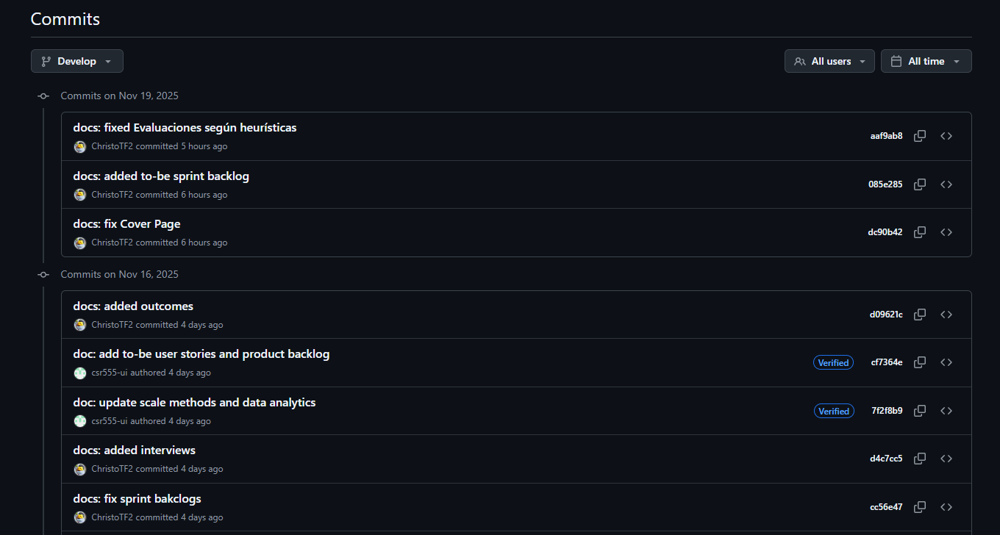
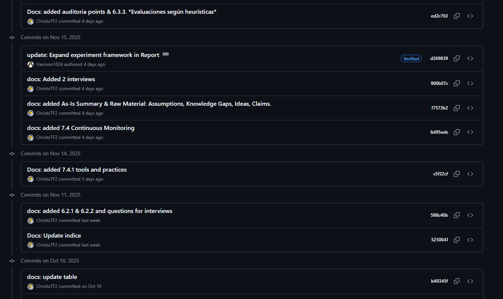
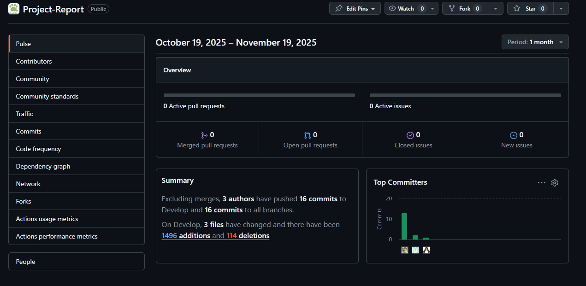
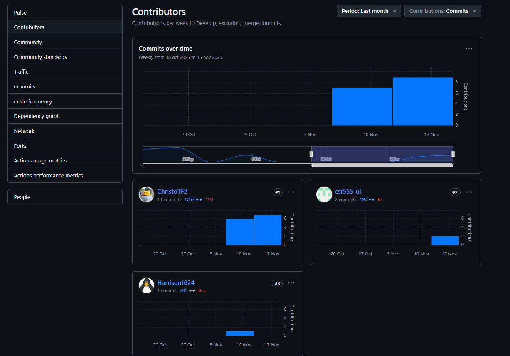


<div style="page-break-after: always;"></div>


# Contenido
## Tabla de Contenidos
### [Registro de versiones del informe](#registro-de-versiones-del-informe)
### [Project Report Collaboration Insights](#project-report-collaboration-insights)
### [Contenido](#contenido)
### [Student Outcome](#student-outcome-1)

## Part I: As-Is Software Project

### [Capítulo I: Introducción](#capítulo-i-introducción-1)
- [1.1. Startup Profile](#11-startup-profile)
  - [1.1.1. Descripción de la Startup](#111-descripción-de-la-startup)
  - [1.1.2. Perfiles de integrantes del equipo](#112-perfiles-de-integrantes-del-equipo)
- [1.2. Solution Profile](#12-solution-profile)
  - [1.2.1. Antecedentes y problemática](#121-antecedentes-y-problemática)
  - [1.2.2. Lean UX Process.](#122-lean-ux-process)
    - [1.2.2.1. Lean UX Problem Statements.](#1221-lean-ux-problem-statements)
    - [1.2.2.2. Lean UX Assumptions.](#1222-lean-ux-assumptions)
    - [1.2.2.3. Lean UX Hypothesis Statements.](#1223-lean-ux-hypothesis-statements)
    - [1.2.2.4. Lean UX Canvas.](#1224-lean-ux-canvas)
  - [1.3. Segmentos objetivo.](#13-segmentos-objetivo)

### [Capítulo II: Requirements Elicitation & Analysis](#capítulo-ii-requirements-elicitation-&-analysis-1)
- [2.1. Competidores.](#21-competidores)
  - [2.1.1. Análisis competitivo.](#211-análisis-competitivo)
  - [2.1.2. Estrategias y tácticas frente a competidores.](#212-estrategias-y-tácticas-frente-a-competidores)
- [2.2. Entrevistas.](#22-entrevistas)
  - [2.2.1. Diseño de entrevistas.](#221-diseño-de-entrevistas)
  - [2.2.2. Registro de entrevistas.](#222-registro-de-entrevistas)
  - [2.2.3. Análisis de entrevistas.](#223-análisis-de-entrevistas)
- [2.3. Needfinding.](#23-needfinding)
  - [2.3.1. User Personas.](#231-user-personas)
  - [2.3.2. User Task Matrix.](#232-user-task-matrix)
  - [2.3.3. User Journey Mapping.](#233-user-journey-mapping)
  - [2.3.4. Empathy Mapping.](#234-empathy-mapping)
  - [2.3.5. As-is Scenario Mapping.](#235-as-is-scenario-mapping)
- [2.4. Ubiquitous Language.](#24-ubiquitous-language)

### [Capítulo III: Requirements Specification](#capítulo-iii-requirements-specification-1)
- [3.1. To-Be Scenario Mapping.](#31-to-be-scenario-mapping)
- [3.2. User Stories.](#32-user-stories)
- [3.3. Product Backlog.](#33-product-backlog)
- [3.4. Impact Mapping.](#34-impact-mapping)

### [Capítulo IV: Product Design](#capítulo-iv-product-design)
- [4.1. Style Guidelines.](#41-style-guidelines)
  - [4.1.1. General Style Guidelines.](#411-general-style-guidelines)
  - [4.1.2. Web Style Guidelines.](#412-web-style-guidelines)
  - [4.1.3. Mobile Style Guidelines.](#413-mobile-style-guidelines)
    - [4.1.3.1. iOS Mobile Style Guidelines.](#4131-ios-mobile-style-guidelines)
    - [4.1.3.2. Android Mobile Style Guidelines.](#4132-android-mobile-style-guidelines)
- [4.2. Information Architecture.](#42-information-architecture)
  - [4.2.1. Organization Systems.](#421-organization-systems)
  - [4.2.2. Labeling Systems.](#422-labeling-systems)
  - [4.2.3. SEO Tags and Meta Tags](#423-seo-tags-and-meta-tags)
  - [4.2.4. Searching Systems.](#424-searching-systems)
  - [4.2.5. Navigation Systems.](#425-navigation-systems)
- [4.3. Landing Page UI Design.](#43-landing-page-ui-design)
  - [4.3.1. Landing Page Wireframe.](#431-landing-page-wireframe)
  - [4.3.2. Landing Page Mock-up.](#432-landing-page-mock-up)
- [4.4. Mobile Applications UX/UI Design.](#44-mobile-applications-uxui-design)
  - [4.4.1. Mobile Applications Wireframes.](#441-mobile-applications-wireframes)
  - [4.4.2. Mobile Applications Wireflow Diagrams.](#442-mobile-applications-wireflow-diagrams)
  - [4.4.3. Mobile Applications Mock-ups.](#443-mobile-applications-mock-ups)
  - [4.4.4. Mobile Applications User Flow Diagrams.](#444-mobile-applications-user-flow-diagrams)
- [4.5. Mobile Applications Prototyping.](#45-mobile-applications-prototyping)
  - [4.5.1. Android Mobile Applications Prototyping.](#451-android-mobile-applications-prototyping)
  - [4.5.2. iOS Mobile Applications Prototyping.](#452-ios-mobile-applications-prototyping)
- [4.6. Web Applications UX/UI Design.](#46-web-applications-uxui-design)
  - [4.6.1. Web Applications Wireframes.](#461-web-applications-wireframes)
  - [4.6.2. Web Applications Wireflow Diagrams.](#462-web-applications-wireflow-diagrams)
  - [4.6.3. Web Applications Mock-ups.](#463-web-applications-mock-ups)
  - [4.6.4. Web Applications User Flow Diagrams.](#464-web-applications-user-flow-diagrams)
- [4.7. Web Applications Prototyping.](#47-web-applications-prototyping)
- [4.8. Domain-Driven Software Architecture.](#48-domain-driven-software-architecture)
  - [4.8.1. Software Architecture Context Diagram.](#481-software-architecture-context-diagram)
  - [4.8.2. Software Architecture Container Diagrams.](#482-software-architecture-container-diagrams)
  - [4.8.3. Software Architecture Components Diagrams.](#483-software-architecture-components-diagrams)
- [4.9. Software Object-Oriented Design.](#49-software-object-oriented-design)
  - [4.9.1. Class Diagrams.](#491-class-diagrams)
  - [4.9.2. Class Dictionary.](#492-class-dictionary)
- [4.10. Database Design.](#410-database-design)
  - [4.10.1. Relational/Non-Relational Database Diagram.](#4101-relationalnon-relational-database-diagram)

### [Capítulo V: Product Implementation](#capítulo-v-product-implementation)
- [5.1. Software Configuration Management.](#51-software-configuration-management)
  - [5.1.1. Software Development Environment Configuration.](#511-software-development-environment-configuration)
  - [5.1.2. Source Code Management.](#512-source-code-management)
  - [5.1.3. Source Code Style Guide & Conventions.](#513-source-code-style-guide--conventions)
  - [5.1.4. Software Deployment Configuration.](#514-software-deployment-configuration)
- [5.2. Product Implementation & Deployment.](#52-product-implementation--deployment)
  - [5.2.1. Sprint Backlogs.](#521-sprint-backlogs)
  - [5.2.2. Implemented Landing Page Evidence.](#522-implemented-landing-page-evidence)
  - [5.2.3. Implemented Frontend-Web Application Evidence.](#523-implemented-frontend-web-application-evidence)
  - [5.2.4. Acuerdo de Servicio - SaaS.](#524-acuerdo-de-servicio---saas)
  - [5.2.5. Implemented Native-Mobile Application Evidence.](#525-implemented-native-mobile-application-evidence)
  - [5.2.6. Implemented RESTful API and/or Serverless Backend Evidence.](#526-implemented-restful-api-andor-serverless-backend-evidence)
  - [5.2.7. RESTful API documentation.](#527-restful-api-documentation)
  - [5.2.8. Team Collaboration Insights.](#528-team-collaboration-insights)
- [5.3. Video About-the-Product.](#53-video-about-the-product)

## Part II: Verification, Validation & Pipeline

### [Capítulo VI: Product Verification & Validation](#capítulo-vi-product-verification--validation)
- [6.1. Testing Suites & Validation.](#61-testing-suites--validation)
  - [6.1.1. Core Entities Unit Tests.](#611-core-entities-unit-tests)
  - [6.1.2. Core Integration Tests.](#612-core-integration-tests)
  - [6.1.3. Core Behavior-Driven Development.](#613-core-behavior-driven-development)
  - [6.1.4. Core System Tests.](#614-core-system-tests)
- [6.2. Static testing & Verification.](#62-static-testing--verification)
  - [6.2.1. Static Code Analysis.](#621-static-code-analysis)
    - [6.2.1.1. Coding standard & Code conventions.](#6211-coding-standard--code-conventions)
    - [6.2.1.2. Code Quality & Code Security.](#6212-code-quality--code-security)
  - [6.2.2. Reviews.](#622-reviews)
- [6.3. Validation Interviews.](#63-validation-interviews)
  - [6.3.1. Diseño de Entrevistas.](#631-diseño-de-entrevistas)
  - [6.3.2. Registro de Entrevistas.](#632-registro-de-entrevistas)
  - [6.3.3. Evaluaciones según heurísticas.](#633-evaluaciones-según-heurísticas)
- [6.4. Auditoría de Experiencias de Usuario.](#64-auditoría-de-experiencias-de-usuario)
  - [6.4.1. Auditoría realizada.](#641-auditoría-realizada)
    - [6.4.1.1. Información del grupo auditado.](#6411-información-del-grupo-auditado)
    - [6.4.1.2. Cronograma de auditoría realizada.](#6412-cronograma-de-auditoría-realizada)
    - [6.4.1.3. Contenido de auditoría realizada.](#6413-contenido-de-auditoría-realizada)
  - [6.4.2. Auditoría recibida.](#642-auditoría-recibida)
    - [6.4.2.1. Información del grupo auditor.](#6421-información-del-grupo-auditor)
    - [6.4.2.2. Cronograma de auditoría recibida.](#6422-cronograma-de-auditoría-recibida)
    - [6.4.2.3. Contenido de auditoría recibida.](#6423-contenido-de-auditoría-recibida)
    - [6.4.2.4. Resumen de modificaciones para subsanar hallazgos.](#6424-resumen-de-modificaciones-para-subsanar-hallazgos)

### [Capítulo VII: DevOps Practices](#capítulo-vii-devops-practices)
- [7.1. Continuous Integration.](#71-continuous-integration)
  - [7.1.1. Tools and Practices.](#711-tools-and-practices)
  - [7.1.2. Build & Test Suite Pipeline Components.](#712-build--test-suite-pipeline-components)
- [7.2. Continuous Delivery.](#72-continuous-delivery)
  - [7.2.1. Tools and Practices.](#721-tools-and-practices)
  - [7.2.2. Stages Deployment Pipeline Components.](#722-stages-deployment-pipeline-components)
- [7.3. Continuous deployment.](#73-continuous-deployment)
  - [7.3.1. Tools and Practices.](#731-tools-and-practices)
  - [7.3.2. Production Deployment Pipeline Components.](#732-production-deployment-pipeline-components)
- [7.4. Continuous Monitoring.](#74-continuous-monitoring)
  - [7.4.1. Tools and Practices.](#741-tools-and-practices)
  - [7.4.2. Monitoring Pipeline Components.](#742-monitoring-pipeline-components)
  - [7.4.3. Alerting Pipeline Components.](#743-alerting-pipeline-components)
  - [7.4.4. Notification Pipeline Components.](#744-notification-pipeline-components)

## Part III: Experiment-Driven Lifecycle

### [Capítulo VIII: Experiment-Driven Development](#capítulo-viii-experiment-driven-development)
- [8.1. Experiment Planning.](#81-experiment-planning)
  - [8.1.1. As-Is Summary.](#811-as-is-summary)
  - [8.1.2. Raw Material: Assumptions, Knowledge Gaps, Ideas, Claims.](#812-raw-material-assumptions-knowledge-gaps-ideas-claims)
  - [8.1.3. Experiment-Ready Questions.](#813-experiment-ready-questions)
  - [8.1.4. Question Backlog.](#814-question-backlog)
  - [8.1.5. Experiment Cards.](#815-experiment-cards)
- [8.2. Experiment Design.](#82-experiment-design)
  - [8.2.1. Hypotheses.](#821-hypotheses)
  - [8.2.2. Domain Business Metrics.](#822-domain-business-metrics)
  - [8.2.3. Measures.](#823-measures)
  - [8.2.4. Conditions.](#824-conditions)
  - [8.2.5. Scale Calculations and Decisions.](#825-scale-calculations-and-decisions)
  - [8.2.6. Methods Selection.](#826-methods-selection)
  - [8.2.7. Data Analytics: Goals, KPIs and Metrics Selection.](#827-data-analytics-goals-kpis-and-metrics-selection)
  - [8.2.8. Web and Mobile Tracking Plan.](#828-web-and-mobile-tracking-plan)
- [8.3. Experimentation.](#83-experimentation)
  - [8.3.1. To-Be User Stories.](#831-to-be-user-stories)
  - [8.3.2. To-Be Product Backlog.](#832-to-be-product-backlog)
  - [8.3.3. Pipeline-supported, Experiment-Driven To-Be Software Platform Lifecycle.](#833-pipeline-supported-experiment-driven-to-be-software-platform-lifecycle)
    - [8.3.3.1. To-Be Sprint Backlogs.](#8331-to-be-sprint-backlogs)
    - [8.3.3.2. Implemented To-Be Landing Page Evidence.](#8332-implemented-to-be-landing-page-evidence)
    - [8.3.3.3. Implemented To-Be Frontend-Web Application Evidence.](#8333-implemented-to-be-frontend-web-application-evidence)
    - [8.3.3.4. Implemented To-Be Native-Mobile Application Evidence.](#8334-implemented-to-be-native-mobile-application-evidence)
    - [8.3.3.5. Implemented To-Be RESTful API and/or Serverless Backend Evidence.](#8335-implemented-to-be-restful-api-andor-serverless-backend-evidence)
    - [8.3.3.6. Team Collaboration Insights.](#8336-team-collaboration-insights)
  - [8.3.4. To-Be Validation Interviews.](#834-to-be-validation-interviews)
    - [8.3.4.1. Diseño de Entrevistas.](#8341-diseño-de-entrevistas)
    - [8.3.4.2. Registro de Entrevistas.](#8342-registro-de-entrevistas)
  - [8.4. Experiment Aftermath & Analysis.](#84-experiment-aftermath--analysis)
    - [8.4.1. Analysis and Interpretation of Results.](#841-analysis-and-interpretation-of-results)
    - [8.4.2. Re-scored and Re-prioritized Question Backlog.](#842-re-scored-and-re-prioritized-question-backlog)
  - [8.5. Continuous Learning.](#85-continuous-learning)
    - [8.5.1. Shareback Session Artifacts: Learning Workflow.](#851-shareback-session-artifacts-learning-workflow)
  - [8.6. To-Be Software Platform Pre-launch.](#86-to-be-software-platform-pre-launch)
    - [8.6.1. About-the-Product Intro Video.](#861-about-the-product-intro-video)

### [Conclusiones](#conclusiones-1)
### [Bibliografía](#bibliografía-1)
### [Anexos](#anexos-1)
---
<div style="page-break-after: always;"></div>

# Student Outcome

**ABET – EAC – Student Outcome 4**

<div align="justify">
    Criterio:  La capacidad de reconocer responsabilidades éticas y
profesionales en situaciones de ingeniería y hacer juicios informados, que deben
considerar el impacto de las soluciones de ingeniería en contextos globales, económicos,
ambientales y sociales<br><br>

En el siguiente cuadro se describe las acciones realizadas y enunciados de
conclusiones por parte del grupo, que permiten sustentar el haber alcanzado el logro
del ABET – EAC - Student Outcome 4.
</div>    

<div align="justify">
</div>    

<div align="justify">
<table>
  <tr>
    <th>Criterio Específico</th>
    <th>Acciones Realizadas</th>
    <th>Conclusiones</th>
  </tr>
  <tr>
    <td>Reconoce responsabilidad ética y profesional en situaciones de ingeniería de software</td>
    <td>
      <strong>Espinoza Saenz, Christian Renato (TB1):</strong> Me enfoqué en el <em>Startup Business Model</em> y en el <em>Needfinding</em>, asegurando que la recolección de información de los usuarios se realizara de manera ética y transparente, evitando sesgos y respetando la privacidad de los participantes.<br><br>
      <strong>Espinoza Saenz, Christian Renato (TP1):</strong> Cumplí con este principio al trabajar en Testing Suites & Validation, Continuous Integration y Build & Test Suite Pipeline Components, garantizando la integridad y confiabilidad de las pruebas.<br><br>
      <strong>Espinoza Saenz, Christian Renato (TB2):</strong> Aseguré la calidad del código mediante el establecimiento de estándares de codificación y convenciones en Coding Standard & Code Conventions. En el monitoreo continuo, desarrollé prácticas éticas que garantizan la transparencia operativa.<br><br>
      <strong>Espinoza Saenz, Christian Renato (TF):</strong> Lideré la planificación y análisis experimental (8.3.3–8.4), la re-priorización del question backlog (8.4.2) y la sesión de aprendizaje continuo (8.5.1), manteniendo trazabilidad ética de entrevistas To‑Be y uso responsable de datos simulados.<br><br>
      <strong>Payesa Torres, Harrison Hubert (TB1):</strong> Asumí la responsabilidad en el diseño de la base de datos y la documentación técnica, cuidando la gestión adecuada de datos sensibles.<br><br>
      <strong>Payesa Torres, Harrison Hubert (TP1):</strong> Continuous Deployment y Production Pipeline asegurando buenas prácticas y estándares éticos.<br><br>
      <strong>Payesa Torres, Harrison Hubert (TB2):</strong> Priorización del Question Backlog respetando privacidad y enfoque responsable de experimentos.<br><br>
      <strong>Payesa Torres, Harrison Hubert (TF):</strong> Implementé y validé evidencias To‑Be en frontend y mobile (8.3.3.2–8.3.3.4), registré entrevistas finales (8.3.4.2) y capturé métricas de rendimiento sin exponer datos reales, reforzando transparencia en la presentación del producto (8.6.1).<br><br>
      <strong>Navarro Correa, César Augusto (TB1):</strong> Desarrollo de Continuous Delivery con prácticas seguras y correctas.<br><br>
      <strong>Navarro Correa, César Augusto (TP1):</strong> Implementación de app móvil y backend con estándares de calidad y seguridad.<br><br>
      <strong>Navarro Correa, César Augusto (TB2):</strong> Métodos experimentales y tracking plan con respeto a principios de analítica responsable.<br><br>
      <strong>Navarro Correa, César Augusto (TF):</strong> Desarrollo y refuerzo del backend y API To‑Be (8.3.3.5), soporte a experimentos (endpoints para métricas), ajustes de rendimiento antes del pre‑launch y colaboración técnica ética documentada (8.3.3.6).<br>
    </td>
    <td>
      Cada integrante asumió un rol ético y profesional aplicando principios de transparencia, seguridad y trazabilidad en todas las fases, incluyendo la etapa final (TF) donde se garantizó uso responsable de datos experimentales y publicación de evidencias verificables.
    </td> 
  </tr>
  <tr>
    <td>Emite juicios informados considerando el impacto de las soluciones de ingeniería de software en contextos globales, económicos, ambientales y sociales</td>
    <td>
      <strong>Espinoza Saenz, Christian Renato (TB1):</strong> Relacioné el proyecto con su impacto social fomentando adopciones responsables.<br><br>
      <strong>Espinoza Saenz, Christian Renato (TP1):</strong> Evaluación crítica de calidad y validación considerando implicaciones económicas y sociales.<br><br>
      <strong>Espinoza Saenz, Christian Renato (TB2):</strong> Identificación de brechas sociales y económicas para diseño experimental con impacto positivo.<br><br>
      <strong>Espinoza Saenz, Christian Renato (TF):</strong> Interpreté resultados (8.4.1), ajusté prioridades para maximizar reducción de abandono y mejorar confianza (8.4.2), orientando decisiones hacia bienestar animal y eficiencia operativa futura.<br><br>
      <strong>Payesa Torres, Harrison Hubert (TB1):</strong> Análisis de modelo de monetización accesible y sostenible.<br><br>
      <strong>Payesa Torres, Harrison Hubert (TP1):</strong> Decisiones conscientes en despliegue evaluando eficiencia y seguridad en diferentes contextos.<br><br>
      <strong>Payesa Torres, Harrison Hubert (TB2):</strong> Diseño de métricas y condiciones para maximizar bienestar animal.<br><br>
      <strong>Payesa Torres, Harrison Hubert (TF):</strong> Validación práctica de funcionalidades To‑Be que impactan adopciones (filtros, historial, recomendaciones), aportando datos cualitativos para futura optimización económica sin comprometer accesibilidad social.<br><br>
      <strong>Navarro Correa, César Augusto (TB1):</strong> Viabilidad técnica de backend escalable y sostenible.<br><br>
      <strong>Navarro Correa, César Augusto (TP1):</strong> Configuración de pipelines con impacto en eficiencia y seguridad.<br><br>
      <strong>Navarro Correa, César Augusto (TB2):</strong> Selección de KPIs y métodos analíticos con enfoque de valor social y económico.<br><br>
      <strong>Navarro Correa, César Augusto (TF):</strong> Refuerzo de endpoints y optimizaciones para soportar métricas experimentales, preparando base para decisiones futuras sobre escalabilidad y costos operativos con impacto positivo en refugios y usuarios.<br>
    </td>
    <td>
      Los juicios informados en la fase final (TF) consolidaron decisiones sobre qué funcionalidades generan mayor impacto social (confianza, transparencia), optimizando prioridades antes de monetizar y favoreciendo sostenibilidad y bienestar animal.
    </td>
  </tr>
</table>
</div>


<div style="page-break-after: always;"></div>


# Capítulo I: Introducción

## 1.1. Startup Profile
### 1.1.1. Descripción de la Startup
<div align="justify">
    Huellitas Conectadas es una startup enfocada en transformar la adopción de mascotas en el Perú mediante soluciones digitales innovadoras. Su propuesta se centra en la digitalización del proceso de adopción, la conexión directa entre adoptantes, refugios y rescatistas, y el uso de herramientas tecnológicas que permiten gestionar perfiles, historiales médicos, seguimientos y comunicación de manera simple y transparente. Todo esto con el objetivo de agilizar las adopciones, garantizar el bienestar animal y fomentar prácticas responsables.

 

Creemos en una adopción empática, accesible y responsable, donde cada mascota encuentre un hogar lleno de cariño.
    <br><br>
    
  <div align="center">


  </div>

</div>
<div align="justify">
    <ul>
        <li>
            <b>Misión:</b>
        </li> 
Buscamos digitalizar y simplificar el proceso de adopción responsable en el Perú mediante una plataforma empática, accesible y confiable que conecte a adoptantes, refugios y rescatistas. Nuestro propósito es que cada conexión se convierta en un hogar seguro, que cada historia compartida inspire confianza y esperanza, y que cada esfuerzo aporte al bienestar y respeto de los animales.         <br><br>
    <li>
            <b>Visión:</b>
        </li>
Imaginamos un futuro donde ninguna mascota viva sin un hogar, donde cada adopción sea responsable y transparente, y donde la tecnología actúe como un puente de confianza entre adoptantes, refugios y rescatistas. En Huellitas Conectadas trabajamos para que el bienestar animal sea parte esencial de una sociedad más solidaria y comprometida.     </ul>
<br>
</div>

<div style="page-break-after: always;"></div>

### 1.1.2. Perfiles de integrantes del equipo

### Los integrantes que conforman parte de nuestro startup son:
<div align="justify">

| Integrante                | Perfil                                                                                                                                                                                                                                                                                                                                                                                                                                                                                                                                                                                                                                                                                                                                                                                              | Foto                                                |
|---------------------------|-----------------------------------------------------------------------------------------------------------------------------------------------------------------------------------------------------------------------------------------------------------------------------------------------------------------------------------------------------------------------------------------------------------------------------------------------------------------------------------------------------------------------------------------------------------------------------------------------------------------------------------------------------------------------------------------------------------------------------------------------------------------------------------------------------|-------------------------------------|
| Navarro Correa, César Augusto  | Mi nombre es César Auguto Navarro Correa                                                                                                                                                                                                                                                                                                                                                                                                                                     |                                       |
||                                                                                                                                                                                                                                                                                                                                                                                                                                                               |                                   |
| Payesa Torres, Harrison Hubert (U202221024) | Mi nombre es Harrison Payesa. Soy estudiante de la carrera de Ingeniería de Software. Tengo conocimientos en lenguaje Python, C++ y JavaScript, ademas de haber hecho proyectos con FrontEnd usando HTML, CSS y JS. En mi tiempo libre suelo ver películas y escuchar música.                                                                                           |                      |
| Espinoza Saenz, Christian Renato (U202213208) | Mi nombre es Christian Espinoza, soy un estudiante de 21 años que cursa el 8vo ciclo de la carrera Ingeniería de Software. Poseo ideas únicas e innovadoras para que el trabajo logre sobresalir. Tengo experiencia en la creación de distintos tipos de diagramas, editar diferentes tipos de multimedia como videos, y un conocimiento general en programación de C++, HTML, CSS y SQL. Además, se me facilita desarrollar interfaces intuitivas en el frontend, lo cual será beneficioso para el proyecto.                                                                                                                                                                                                                                                 |                     |

</div>


<div style="page-break-after: always;"></div>

## 1.2. Solution Profile

**Product Name:** Adopta!

<div align="justify">

**Descripción del Producto:**  Adopta! es una solución digital que busca modernizar y simplificar el proceso de adopción de mascotas en el Perú. Su propósito es conectar de forma empática y transparente a adoptantes, refugios y rescatistas, garantizando que cada decisión se base en información clara y confiable. Con esta herramienta, se promueve una cultura de adopción responsable, se reducen los tiempos de espera y se genera un impacto positivo en la vida de los animales y las familias que los reciben. 

**Monetización:** El modelo de Adopta! estará basado en el acceso gratuito a las funciones esenciales de adopción, garantizando que cualquier persona pueda conectar con refugios y rescatistas sin costo. Para quienes requieran más beneficios, se ofrecerán servicios de pago como mayor visibilidad de mascotas y reportes detallados. También se considerarán alianzas con veterinarias y marcas de productos para mascotas como una fuente complementaria de ingresos, asegurando la sostenibilidad de la plataforma.

</div>

### 1.2.1. Antecedentes y problemática

<div align="justify">
En Lima Metropolitana, los refugios de mascotas enfrentan grandes dificultades para gestionar procesos de adopción, sobre todo en el caso de animales con necesidades médicas. La ausencia de una plataforma digital que centralice historiales clínicos y datos de adopción genera desconfianza entre los posibles adoptantes, lo que reduce las oportunidades para mascotas que sí pueden recibir tratamiento. A esto se suma que muchos refugios aún dependen de métodos manuales o del uso informal de redes sociales, sin procesos estandarizados, lo que ralentiza y complica las adopciones. Esta falta de herramientas especializadas limita las posibilidades de que miles de animales en situación de abandono encuentren un hogar definitivo.
<br><br>
Para mostrar con mayor claridad el valor de Adopta!, empleamos el modelo 5W y 2H.
<br><br>
</div>


<div align="justify">

***What***

* La información médica de las mascotas está dispersa en distintos formatos, desde registros en papel hasta publicaciones en redes sociales, lo que dificulta su acceso y confiabilidad.  
* No existe una plataforma digital que conecte de manera eficiente a refugios, veterinarios y adoptantes, generando vacíos en la comunicación.  
* El proceso de adopción carece de estandarización, provocando experiencias poco claras y frustrantes para todos los involucrados.  
* Para los refugios, esto limita la visibilidad y el potencial de adopción de mascotas con necesidades especiales.  
* Para los adoptantes, implica decidir con datos incompletos o poco confiables, lo que aumenta el riesgo de adopciones fallidas y desalienta futuras intenciones de adoptar.  

***Who***

* Las mascotas con necesidades médicas especiales (35% de los animales en refugios), que tardan hasta tres veces más en ser adoptadas en comparación con las mascotas sanas.  
* Los refugios independientes (72% del total), que destinan cerca del 40% de sus recursos a gestiones manuales y poco eficientes.  
* Los adoptantes potenciales, de los cuales un 68% abandona el proceso por falta de información confiable.  

**Aliados clave para cambiar esta realidad:**  
* Veterinarios jóvenes con competencias digitales (25–35 años).  
* Empresas de software interesadas en programas de responsabilidad social.  
* Organizaciones animalistas con alcance mediático, capaces de promover estándares unificados para la información médica en adopciones.  


***Where***
* El problema es más crítico en los distritos periféricos de Lima, como San Juan de Lurigancho, Villa El Salvador y Comas, donde opera el 65% de los refugios independientes con sobrepoblación (15–20 animales en espacios diseñados para 10).  
* Estas zonas concentran cerca del 80% de los casos de mascotas con necesidades especiales que superan un año de permanencia en refugios.  


***When***
* El problema se intensifica en temporadas posteriores a vacaciones (enero y julio), cuando los casos de abandono aumentan hasta en un 40%.  
* Se agrava al diagnosticarse condiciones médicas complejas en animales rescatados, de las cuales el 68% no logra documentarse de forma adecuada.  
* Durante el proceso de adopción, cuando el 72% de los interesados desiste al no encontrar información médica clara y actualizada.  
* La necesidad de una solución se hace evidente cuando mascotas con enfermedades tratables permanecen más de 6 meses en refugios, cuando un 25% de las adopciones falla por desconocimiento de necesidades especiales y cuando los refugios destinan más del 30% de su tiempo a gestiones administrativas en lugar de cuidados directos.  


***Why***
* La falta de información médica clara y confiable genera desconfianza en los adoptantes, lo que reduce las posibilidades de que animales con necesidades especiales encuentren un hogar.  
* Los refugios carecen de herramientas accesibles para registrar y compartir el estado de salud de cada mascota, lo que prolonga su permanencia en adopción.  
* La mayoría de refugios opera con presupuestos muy limitados (82% dispone de menos de S/5,000 al mes), priorizando alimentación y atención veterinaria sobre inversión en tecnología.  
* Gran parte de los administradores son voluntarios mayores de 50 años (67%), con poca experiencia digital, lo que dificulta implementar sistemas complejos sin apoyo externo.  
* La principal barrera no es la falta de necesidad, sino la ausencia de soluciones tecnológicas simples, asequibles y acompañadas de soporte que permitan a los refugios superar estas limitaciones.  


***How***
* El sistema fragmentado actual genera un ciclo de ineficiencia: 23% de los refugios registran la información en papel, 61% dependen de redes sociales, y en el 45% de los casos los adoptantes reciben datos médicos contradictorios.  
* Como consecuencia, las mascotas con necesidades especiales tienen un 83% menos probabilidades de ser adoptadas.  
* Los refugios llegan a invertir hasta 15 horas semanales por animal en gestiones manuales.  
* El 25% de las adopciones fracasa debido a expectativas médicas mal alineadas entre refugios y adoptantes.  


***How Much***
* Los refugios invierten hasta S/3,500 mensuales por cada animal no adoptado, lo que representa un 40% más de gasto en comparación con mascotas sanas.  
* Las clínicas veterinarias pierden cerca de un 30% de eficiencia en los seguimientos médicos por la falta de integración de datos.  
* A nivel general, el sistema desperdicia alrededor de 1.2 millones de horas al año en gestiones manuales de información, según la Asociación de Protección Animal Peruana.  

<br>
</div>

### 1.2.2. *Lean UX Process*

#### 1.2.2.1. *Lean UX Problem Statements*

<div align="justify">

***Problem Statement:***

**1. Dominio:**  
* El sector de aplicación es la adopción de mascotas en el Perú, con énfasis en refugios y rescatistas que buscan promover una adopción responsable y transparente. El enfoque se centra en el uso de herramientas digitales para centralizar información médica, mejorar la visibilidad de los animales y generar confianza en los adoptantes.

**2. Segmentos de Clientes:**

***Refugios y rescatistas independientes:***  
  * Carecen de un sistema centralizado para gestionar historiales médicos y procesos de adopción.  
  * Operan con recursos económicos y humanos limitados, priorizando alimentación y cuidados básicos.  
  * Dependen en gran medida de redes sociales sin estandarización, lo que dificulta dar seguimiento adecuado a cada caso.  

***Adoptantes potenciales:***  
  * No encuentran información médica clara y confiable, lo que genera desconfianza.  
  * El 68% desiste del proceso cuando se trata de mascotas con necesidades especiales.  
  * Enfrentan procesos largos, poco transparentes y sin acompañamiento post-adopción.  

**3. Puntos de Dolor (Pain Points):**  
* **Falta de información confiable sobre la salud de las mascotas:** Historiales dispersos en papel o mensajes en redes sociales generan dudas en los adoptantes.  
* **Procesos de adopción desordenados:** Cada refugio maneja procedimientos distintos, lo que confunde y desmotiva a los adoptantes.  
* **Sobrepoblación en refugios:** Mascotas con necesidades especiales permanecen hasta 3 veces más tiempo que las sanas en espera de adopción.  
* **Limitado acceso a tecnología adecuada:** La mayoría de refugios no cuenta con herramientas digitales simples ni capacitación tecnológica.  
* **Alto riesgo de adopciones fallidas:** La falta de información clara sobre condiciones médicas genera devoluciones (25% de los casos).  

**4. Brecha Identificada (Gap):**  
<br><br>Existe una falta evidente de soluciones digitales que sean:

* **Accesibles y fáciles de usar para refugios pequeños e independientes,** que no cuentan con recursos tecnológicos avanzados.  
* **Enfocadas en centralizar y estandarizar historiales médicos,** para dar confianza a los adoptantes.  
* **Capaces de fortalecer la transparencia y la confianza,** mostrando no solo fotos, sino también información clara y validada de cada mascota.  
* **Diseñadas para fomentar adopciones responsables,** incluyendo seguimiento post-adopción.  

**5. Visión / Estrategia:**  
<br>La visión de **Adopta!** es digitalizar el camino hacia la adopción responsable, transformando la información en confianza y generando un puente entre refugios, rescatistas y adoptantes. Para ello, se plantea:  

* Crear una plataforma digital que centralice información médica y perfiles de mascotas.  
* Estandarizar el proceso de adopción, haciéndolo más claro y confiable para todas las partes.  
* Ofrecer herramientas simples que ayuden a refugios a gestionar sus animales sin carga administrativa excesiva.  
* Facilitar a los adoptantes información clara y accesible que les permita tomar decisiones responsables.  
* Promover una red colaborativa entre refugios, veterinarios y adoptantes, impulsando el bienestar animal.  

</div>


#### 1.2.2.2. *Lean UX Assumptions*

***Business Assumptions:***

<div align="justify">

1. La adopción de mascotas debería ser un proceso más humano, seguro y accesible, generando confianza tanto en adoptantes como en refugios.  
2. Los adoptantes buscan información clara sobre la mascota y sus cuidadores antes de tomar la decisión de adopción.  
3. Refugios y rescatistas necesitan herramientas simples para gestionar publicaciones, solicitudes y validar a posibles adoptantes.  
4. La transparencia en los datos de mascotas, identidad de usuarios y comunicación directa genera confianza en el proceso de adopción.  
5. La plataforma deberá cubrir tres contextos fundamentales: gestión de mascotas, procesos de adopción y autenticación de usuarios.  
6. La mayor barrera será la adopción tecnológica por parte de refugios y rescatistas, así como la confianza de los adoptantes en el sistema.  
7. La resolución de estos retos se logrará mediante diseño centrado en el usuario, educación, soporte y validación de perfiles.  
8. La competencia principal serán redes sociales no especializadas y páginas web de adopción con poca optimización para gestión y seguimiento de procesos.  
9. La ventaja competitiva se obtendrá ofreciendo una experiencia centrada en empatía, claridad de información y herramientas que faciliten la adopción tanto para usuarios como para refugios.  

</div>

***Business Outcomes:***

<div align="justify">

- Alcanzar 100 refugios/rescatistas verificados en los primeros 6 meses.  
- Facilitar al menos 500 solicitudes de adopción en el primer año.  
- Validar la identidad del 90% de los adoptantes registrados en la plataforma.  
- Lograr que el 80% de las mascotas publicadas cuenten con historial médico y descripción emocional.  
- Incrementar el ratio de adopciones exitosas, con seguimiento post-adopción, en un 40% durante los primeros 12 meses.  

</div>

***User Assumptions:***

<div align="justify">

1. **¿Quién es el usuario?**  
   * Adoptantes interesados en integrar una mascota a su vida (parejas, familias, jóvenes independientes).  
   * Refugios y rescatistas independientes que buscan dar en adopción animales de forma segura y organizada.  

2. **¿Qué problemas resuelve?**  
   * Publicaciones poco claras o carentes de historia emocional.  
   * Procesos de adopción no estandarizados y sin filtros adecuados.  
   * Usuarios malintencionados o identidades falsas.  

3. **¿Qué características son críticas?**  
   * Formularios de adopción detallados y validados automáticamente.  
   * Perfiles completos de mascotas con fotos, historial médico y descripción emocional.  
   * Validación de identidad de adoptantes mediante APIs y revisión manual.  
   * Seguimiento de solicitudes y comunicación fluida.  
   * Filtros de búsqueda útiles por tipo de mascota, necesidades, edad, tamaño y ubicación.  

4. **¿Dónde se integra en su vida?**  
   * Adoptantes: al decidir integrar una mascota en su vida y querer hacerlo responsablemente.  
   * Refugios/rescatistas: en la publicación de mascotas, gestión de solicitudes y programación de visitas.  

5. **¿Cuándo y cómo se utiliza?**  
   * Adoptantes navegan diariamente, completan formularios y reciben notificaciones sobre sus solicitudes.  
   * Refugios gestionan publicaciones, validan adoptantes y programan visitas.  

6. **¿Cómo debe verse y funcionar?**  
   * Interfaz cálida, empática y confiable.  
   * Diseño simple, accesible y sensible al contexto emocional de la adopción.  
   * Flujo guiado, sin fricciones, fomentando la conexión entre personas y animales.  

</div>

***User Outcomes:***

<div align="justify">

- Adoptantes encuentran mascotas compatibles con su estilo de vida y completan procesos de adopción más confiables.  
- Refugios y rescatistas reducen la carga operativa y gestionan adopciones de manera más eficiente.  
- Los usuarios ganan confianza gracias a la validación de perfiles y la transparencia del proceso.  
- Se generan vínculos emocionales genuinos a través de historias, fotos y seguimiento del proceso de adopción.  
- Se reduce el abandono post-adopción mediante un sistema responsable y empático.  

</div>

***Feature Assumptions:***

<div align="justify">

- Las funciones de publicación y búsqueda de mascotas funcionan correctamente en distintos dispositivos y condiciones de conexión.  
- Los formularios y validaciones operan de manera confiable, detectando campos obligatorios y posibles inconsistencias.  
- La validación de identidad es precisa, combinando automatización y revisión humana.  
- El sistema de notificaciones mantiene comunicación efectiva entre adoptantes y refugios.  
- La plataforma es escalable y modular, permitiendo futuras incorporaciones de variables como vacunas, esterilización y recomendaciones de cuidado.  

</div>


#### 1.2.2.3. *Lean UX Hypothesis Statements*

<div align="justify">

* **Creemos que** permitir a los rescatistas y refugios publicar mascotas con fotos, historia emocional y necesidades especiales visiblemente destacadas aumentará el interés de los adoptantes. **Sabremos que esto es cierto cuando** veamos un aumento del 25% en la tasa de visualización de perfiles completos de mascotas durante el primer mes.

* **Consideramos que** incluir una sección con historial médico claro y validado en cada perfil de mascota generará más confianza en los adoptantes. **Lo validaremos cuando** el 60% de los formularios enviados correspondan a mascotas con historial médico publicado.

* **Planteamos que** implementar un formulario de adopción más completo (hogar, rutina, espacio, vínculo emocional) reducirá los abandonos post-adopción. **Esto será cierto cuando,** veamos un 30% de aumento en adopciones exitosas con seguimiento positivo en los 3 meses posteriores.

* **Confiamos en que** permitir agendar visitas directamente desde la app facilitará la coordinación y acelerará el proceso de adopción. **Esto quedará demostrado cuando** al menos el 40% de los usuarios con formulario aprobado agenden una visita dentro de la primera semana.

* **Estimamos que** notificar a los usuarios sobre el estado de sus solicitudes de adopción aumentará su confianza en la plataforma. **Sabremos que esto es cierto cuando** el 70% de los usuarios revisen el estado de su solicitud al menos una vez en los primeros 3 días tras enviarla.

* **Creemos que** validar la identidad de adoptantes, rescatistas y refugios usando APIs como Onfido o ValidarID reducirá los perfiles fraudulentos. **Lo confirmaremos cuando** el porcentaje de cuentas rechazadas por datos falsos disminuya en un 40% tras los primeros 2 meses de uso.

* **Consideramos que** permitir a los usuarios registrarse como adoptantes, rescatistas o refugios con requisitos personalizados (DNI, RUC, fotos, certificados) mejorará la calidad de perfiles en la plataforma. **Esto será cierto cuando** el 90% de los nuevos registros completos sean verificados sin necesidad de contacto adicional del soporte.

* **Planteamos que** ofrecer filtros según tamaño, tipo, edad y necesidades especiales facilitará encontrar mascotas compatibles. **Sabremos que esto es cierto cuando** el tiempo promedio de búsqueda antes de abrir un perfil disminuya en un 20%.

</div>


#### 1.2.2.4. *Lean UX Canvas*


## 1.3. Segmentos objetivo

<div align="justify">

En esta sección se identifican los segmentos de clientes objetivo de *Huellitas Conectadas*, considerando sus características, motivaciones y necesidades frente al proceso de adopción de mascotas.

<br>

**Segmento Objetivo #1: Personal de Refugios y Rescatistas de Animales (Administradores, Cuidadores y Voluntarios)**

**Aspectos demográficos:**  
- Sexo: No hay preferencia por género.  
- Edades: Adultos entre 25 y 50 años (inclusive).  

**Aspectos geográficos:**  
- Nacionalidad: Peruana.  
- Zona geográfica: Principalmente áreas urbanas y semiurbanas, donde se concentran los refugios más grandes y activos, con énfasis en Lima Metropolitana.  

**Aspectos psicográficos:**  
- Personas comprometidas con el bienestar animal, muchas veces voluntarios o trabajadores con vocación social.  
- Buscan herramientas que faciliten la gestión diaria del refugio o el rescate (registro de animales, control de adopciones, seguimiento de tratamientos, etc.).  
- Interesados en soluciones tecnológicas simples, efectivas y accesibles que mejoren la organización interna y aumenten la tasa de adopciones.  
- Valoran la colaboración abierta y están dispuestos a compartir datos o sugerencias con otros refugios o grupos de rescate a través de una comunidad.  

<br>

**Segmento Objetivo #2: Adoptantes Potenciales (Personas interesadas en adoptar animales)**

**Aspectos demográficos:**  
- Sexo: Masculino y femenino.  
- Edades: Jóvenes y adultos entre 20 y 45 años (inclusive).  

**Aspectos geográficos:**  
- Nacionalidad: Peruana.  
- Zona geográfica: Urbana.  
- Departamentos: Principalmente Lima Metropolitana, pero también ciudades intermedias como Arequipa, Chiclayo, Huancayo y Cusco.  

**Aspectos psicográficos:**  
- Personas con afinidad por los animales y conciencia sobre la adopción responsable.  
- Buscan una forma rápida, transparente y confiable de conocer animales en adopción.  
- Desean ver historias, fotos y fichas médicas para tomar decisiones informadas.  
- Motivados por el impacto positivo de adoptar y dar una segunda oportunidad a un animal rescatado.  

</div>


# Capítulo II: Requirements Elicitation & Analysis

## 2.1. Competidores

<div align="justify">

Tras un análisis del mercado, se identificaron tres plataformas tecnológicas con funcionalidades similares a Huellitas Conectadas, la propuesta orientada a la adopción responsable de mascotas:
</div>

**Competidores identificados:**

<div align="justify">

* ***WUF***
Es una plataforma peruana orientada a la adopción responsable y al bienestar animal, reconocida por su trabajo en visibilizar la problemática del abandono y promover la tenencia responsable. WUF se caracteriza por contar con un proceso de adopción estructurado, brindar seguimiento a los adoptantes y fomentar la concientización a través de campañas digitales, programas educativos y alianzas estratégicas con empresas y medios de comunicación.
</div>

<br>
<div align="justify">

* ***Wukta***
Es una plataforma enfocada en la adopción de mascotas y en la construcción de una comunidad pet-friendly activa. Wukta busca generar un espacio de colaboración donde rescatistas, refugios y adoptantes puedan interactuar de manera cercana. Se distingue por impulsar contenido educativo sobre el cuidado responsable de los animales, promover valores de respeto y bienestar, y facilitar conexiones directas que fortalecen la red de apoyo entre quienes buscan dar o recibir un hogar a una mascota.
</div>

<br>
<div align="justify">

* ***Voz Animal Perú***
Es una organización dedicada al rescate activo de animales en situación de abandono, con un fuerte énfasis en campañas de esterilización y educación sobre la tenencia responsable. Voz Animal Perú se ha consolidado como un actor clave en la protección animal al promover iniciativas de alto impacto social que buscan involucrar directamente a la comunidad.
</div>

### 2.1.1. Análisis competitivo
<table>
    <thead>
        <tr>
            <th colspan="6">Competitive Analysis Landscape</th>
        </tr>
        <tr>
            <th colspan="6">Este análisis busca identificar a los principales competidores de Adopta! y definir estrategias que permitan diferenciar la propuesta de valor en el sector de adopción animal.</th>
        </tr>
        <tr>
            <th colspan="2">Nombre</th>
            <th>Adopta!</th>
            <th>WUF</th>
            <th>Wukta</th>
            <th>Voz Animal Perú</th>
        </tr>
        <tr>
            <th colspan="2">Logo</th>
            <th></th>
            <th></th>
            <th></th>
            <th>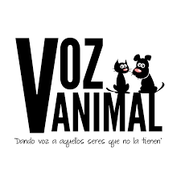</th>
        </tr>
    </thead>
    <tbody>
        <tr>
            <td rowspan="2" align="justify">Perfil</td>
            <td align="justify">Overview</td>
            <td align="justify">Plataforma digital que facilita adopciones responsables, brindando fichas con información médica clara y confiable, además de herramientas de gestión para refugios y rescatistas.</td>
            <td align="justify">ONG consolidada que promueve adopciones, campañas de esterilización y programas educativos, respaldada por alianzas corporativas.</td>
            <td align="justify">Plataforma web que conecta adoptantes con rescatistas y albergues a través de perfiles digitales de mascotas.</td>
            <td align="justify">ONG enfocada en rescate, rehabilitación y adopción de animales abandonados, con fuerte presencia en redes sociales y campañas de sensibilización.</td>
        </tr>
        <tr>
            <td align="justify">Ventaja competitiva</td>
            <td align="justify">Información médica transparente y centralizada, junto con herramientas digitales simples que fortalecen la confianza y aceleran el proceso de adopción.</td>
            <td align="justify">Reconocimiento institucional, confianza pública y red de aliados estratégicos.</td>
            <td align="justify">Interfaz simple, rápida y enfocada en digitalización para facilitar la conexión entre adoptantes y rescatistas.</td>
            <td align="justify">Alto compromiso social, rescates directos y campañas virales que movilizan a la comunidad.</td>
        </tr>
        <tr>
            <td rowspan="5" align="justify">Perfil de Marketing</td>
            <td align="justify">Mercado Objetivo</td>
            <td align="justify">Adoptantes responsables en Lima Metropolitana y protectores/refugios independientes.</td>
            <td align="justify">Público general sensibilizado con la causa animal y potenciales donantes.</td>
            <td align="justify">Adoptantes y albergues (formales o informales) que buscan visibilidad digital.</td>
            <td align="justify">Familias, voluntarios y activistas interesados en el bienestar animal.</td>
        </tr>
        <tr>
            <td align="justify">Estrategias de Marketing</td>
            <td align="justify">Campañas en redes sociales, difusión de historias de adopción y alianzas con influencers y veterinarias.</td>
            <td align="justify">Campañas masivas en medios, presencia en eventos y merchandising solidario.</td>
            <td align="justify">Difusión digital mediante redes sociales, blog y convenios con refugios.</td>
            <td align="justify">Activismo digital, publicaciones emocionales y campañas virales en redes.</td>
        </tr>
        <tr>
            <td align="justify">Productos & Servicios</td>
            <td align="justify">Plataforma digital con fichas de mascotas, gestión de refugios, guías de donación y sistema de agendamiento.</td>
            <td align="justify">Adopciones, apadrinamiento, donaciones, campañas de esterilización y educación.</td>
            <td align="justify">Publicación de mascotas en adopción, contacto directo vía web, registro básico.</td>
            <td align="justify">Rescate y rehabilitación, campañas de salud, adopciones y denuncias de maltrato.</td>
        </tr>
        <tr>
            <td align="justify">Precios & Costos</td>
            <td align="justify">Gratuito para adoptantes. Planes premium futuros para refugios y rescatistas.</td>
            <td align="justify">Gratuito, financiado mediante donaciones y auspiciadores.</td>
            <td align="justify">Gratuito; sostenibilidad basada en convenios con refugios y protectores.</td>
            <td align="justify">Gratuito; depende de donaciones puntuales y voluntariado.</td>
        </tr>
        <tr>
            <td align="justify">Canales de distribución</td>
            <td align="justify">Plataforma web adaptativa; app móvil en desarrollo.</td>
            <td align="justify">Web optimizada, con presencia activa en Instagram y Facebook.</td>
            <td align="justify">Plataforma web responsive; sin aplicación móvil.</td>
            <td align="justify">Redes sociales (Facebook, Instagram) y sitio web básico.</td>
        </tr>
        <tr>
            <td rowspan="4" align="justify">Análisis SWOT</td>
            <td align="justify">Fortalezas</td>
            <td align="justify">Transparencia, centralización de información y experiencia de usuario enfocada en confianza.</td>
            <td align="justify">Marca reconocida, aliados corporativos y confianza del público.</td>
            <td align="justify">Simplicidad en la adopción y fuerte enfoque digital.</td>
            <td align="justify">Gran alcance en redes sociales, reputación positiva y activismo fuerte.</td>
        </tr>
        <tr>
            <td align="justify">Debilidades</td>
            <td align="justify">Nueva marca que requiere posicionarse y generar confianza.</td>
            <td align="justify">Puede resultar impersonal al no involucrar directamente a refugios en cada proceso.</td>
            <td align="justify">Poca personalización y falta de garantías en seguimiento post-adopción.</td>
            <td align="justify">Saturación de casos y baja trazabilidad en algunos rescates.</td>
        </tr>
        <tr>
            <td align="justify">Oportunidades</td>
            <td align="justify">Mayor interés en adopción responsable y digitalización del proceso. Posibilidad de alianzas con veterinarias y expansión regional.</td>
            <td align="justify">Escalar a provincias, lanzar app propia e incluir nuevas funcionalidades online.</td>
            <td align="justify">Desarrollar seguimiento post-adopción y ampliar alianzas con marcas afines.</td>
            <td align="justify">Profesionalizar procesos y ampliar su red de apoyo comunitario.</td>
        </tr>
        <tr>
            <td align="justify">Amenazas</td>
            <td align="justify">Desconfianza inicial y saturación del mercado de adopción informal.</td>
            <td align="justify">Aparición de plataformas más tecnológicas y descentralizadas.</td>
            <td align="justify">Competencia alta y baja rentabilidad.</td>
            <td align="justify">Volatilidad de donaciones y alta dependencia del voluntariado.</td>
        </tr>
    </tbody>
</table>

### 2.1.2. Estrategias y tácticas frente a competidores

Para consolidarse frente a la competencia y alcanzar un posicionamiento sólido en el mercado limeño, **Adopta!** pondrá en marcha estrategias basadas en sus ventajas competitivas y en la identificación de oportunidades que aún no han sido cubiertas por otras organizaciones.  

### Estrategia de diferenciación tecnológica
La plataforma web de **Adopta!** facilitará la interacción entre adoptantes y protectores, priorizando la transparencia y el bienestar animal. Se proyecta la incorporación progresiva de herramientas como historial médico digital y alertas de seguimiento, lo que marcará una diferencia frente a iniciativas como Voz Animal o Wukta.  

### Alianzas estratégicas 
En el mediano plazo, se buscará establecer convenios con clínicas veterinarias y refugios formalmente constituidos, con el objetivo de fortalecer la credibilidad de los perfiles de adopción y brindar acceso a servicios veterinarios con costos preferenciales. Estas alianzas se implementarán de manera gradual en las siguientes fases de la plataforma.  

### Campañas digitales con enfoque educativo y emocional
Las redes sociales serán un canal clave para sensibilizar sobre la adopción responsable. Se dará prioridad a contenidos educativos, testimonios de adopciones exitosas y material visual que refuerce el vínculo entre los usuarios y los animales, ampliando el impacto de la plataforma.  

### Captación y fidelización de protectores
**Adopta!** ofrece a los protectores herramientas digitales para publicar perfiles de animales y gestionar solicitudes de adopción. También se contempla el uso de incentivos no monetarios, como reconocimientos digitales o apoyo en la difusión de campañas, para fortalecer su compromiso.  

### Gestión de riesgos y validación de adopciones
Ante los riesgos asociados a la informalidad y el exceso de publicaciones en redes sociales, **Adopta!** implementará un sistema de validación y seguimiento para cada proceso de adopción, reforzando la confianza de la comunidad y previniendo devoluciones o casos de maltrato.  

## 2.2. Entrevistas

<div align="justify">

### 2.2.1. Diseño de entrevistas

Como parte de la validación del modelo de negocio de Adopta!, se realizaron entrevistas semiestructuradas dirigidas a dos segmentos principales: protectores o rescatistas que gestionan animales en situación de abandono, y personas interesadas en adoptar mascotas.

**Segmento 1: Protectores**
### Datos generales
- ¿Cuál es tu nombre?  
- ¿Cuánto tiempo dedicas al rescate o protección animal?  
- ¿Trabajas de forma independiente o vinculado a un refugio?  
- ¿Cuál es el número promedio de animales que rescatas por mes?  

### Operaciones y herramientas
- ¿Cómo gestionas actualmente los procesos de adopción?  
- ¿Qué medios utilizas para difundir los casos?  
- ¿Qué información sueles recopilar del animal antes de darlo en adopción?  
- ¿Qué dificultades enfrentas para encontrar adoptantes responsables?  
- ¿Has usado alguna plataforma web o app para este fin?  

### Expectativas
- ¿Qué funcionalidades digitales serían útiles para ti (seguimiento, historial, etc.)?  
- ¿Qué tipo de soporte o incentivo te motivaría a usar una nueva plataforma?  
- ¿Cuáles son tus principales frustraciones en el proceso de adopción?  
- ¿Qué esperas de los adoptantes para garantizar el bienestar del animal?  

**Segmento 2: Adoptantes**

#### Datos generales
- ¿Cuál es tu nombre?  
- ¿Qué edad tienes?  
- ¿En qué distrito resides?  
- ¿Cuál es tu ocupación?  
- ¿Vives solo/a o con tu familia?  

#### Motivaciones y comportamientos
- ¿Qué te motivó a considerar la adopción de una mascota?  
- ¿Has adoptado antes? ¿Cómo fue tu experiencia?  
- ¿Qué tipo de mascota te gustaría adoptar (raza, edad, tamaño)?  
- ¿Qué medios utilizas para buscar mascotas en adopción?  
- ¿Qué aspectos valoras más antes de adoptar (salud, comportamiento, historia)?  

#### Miedos, expectativas y canales
- ¿Qué dudas o miedos tienes respecto al proceso de adopción?  
- ¿Qué haría que confíes plenamente en una plataforma digital de adopción?  
- ¿Qué redes sociales o plataformas digitales usas con más frecuencia?  
- ¿Te gustaría recibir seguimiento post-adopción o apoyo luego de adoptar?  


### 2.2.2. Registro de entrevistas


<div align="justify">

Se realizarán tres entrevistas por cada segmento, alcanzando un total de seis en conjunto. Cada una se presentará en formato MP4 y será individual, dado que las preguntas y respuestas difieren según el perfil de cada entrevistado.

**Segmento Objetivo #1: Personal de Refugios y Rescatistas de Animales (Administradores, Cuidadores y Voluntarios)**
<table>
<colgroup>
</colgroup>
<thead>
  <tr>
    <th colspan="2"><div align="center">Entrevista #1<br></div></th>
  </tr>
</thead>
<tbody>
  <tr>
    <td>Nombre</td>
    <td>Jhon</td>
  </tr>
  <tr>
    <td>Apellidos</td>
    <td>Pinto</td>
  </tr>
  <tr>
    <td>Edad</td>
    <td>22 años</td>
  </tr>
  <tr>
    <td>Distrito</td>
    <td>Ate</td>
  </tr>
  <tr>
    <td>Aplicaciones Usadas</td>
    <td>Facebook, WhatsApp, Instagram</td>
  </tr>
  <tr>
    <td>Motivación</td>
    <td>Desde pequeño me ha interesado el bienestar animal. Ahora, como estudiante universitario, dedico parte de mi tiempo a rescatar perros y gatos abandonados, buscando que encuentren un hogar responsable.</td>
  </tr>
  <tr>
    <td>Frustración</td>
    <td>A veces es difícil encontrar adoptantes responsables y muchas personas no cumplen con los compromisos después de la adopción. También me frustra no contar con herramientas digitales que faciliten el seguimiento.</td>
  </tr>
  <tr>
    <td>Tecnologías</td>
    <td>Celular, laptop</td>
  </tr>
  <tr>
    <td>Browsers</td>
    <td>Google Chrome</td>
  </tr>
  <tr>
    <td>Entrevistador</td>
    <td>Christian Espinoza</td>
  </tr>
  <tr>
    <td>Evidencia</td>
    <td><div align="center"></div></td>
  </tr>
  <tr>
    <td>Link</td>
    <td><p><a target="_blank" href="https://upcedupe-my.sharepoint.com/:v:/g/personal/u202213208_upc_edu_pe/EVkE4I7MGQxFmfPHqMveONYBswKegvuN9yhQHzQpGOukzA?nav=eyJyZWZlcnJhbEluZm8iOnsicmVmZXJyYWxBcHAiOiJPbmVEcml2ZUZvckJ1c2luZXNzIiwicmVmZXJyYWxBcHBQbGF0Zm9ybSI6IldlYiIsInJlZmVycmFsTW9kZSI6InZpZXciLCJyZWZlcnJhbFZpZXciOiJNeUZpbGVzTGlua0NvcHkifX0&e=caeD0e" title="Title">Ver Entrevista</a></p></td> 
  </tr>
  <tr>
    <td>Duración<br></td>
    <td>3:51 min</td>
  </tr>
  <tr>
    <td>Resumen</td>
    <td style="text-align: justify;">
    Jhon Pinto, estudiante universitario de 22 años y rescatista de animales en Ate, dedica su tiempo libre a salvar perros y gatos en situación de abandono. En promedio rescata entre 3 a 5 animales por mes, los cuales difunde a través de Facebook, WhatsApp e Instagram para buscar adoptantes. Nunca ha utilizado una plataforma especializada, pero considera importante que una herramienta digital incluya historial del animal, validación de adoptantes y seguimiento post-adopción. Sus principales dificultades son la falta de compromiso de algunos adoptantes y la ausencia de soporte para garantizar el bienestar del animal tras la entrega. Espera que la tecnología pueda ayudar a mejorar la transparencia y responsabilidad en todo el proceso de adopción.</td>
  </tr>
</tbody>
</table>


<br/>

<table>
<colgroup>
</colgroup>
<thead>
  <tr>
    <th colspan="2"><div align="center">Entrevista #2<br></div></th>
  </tr>
</thead>
<tbody>
  <tr>
    <td>Nombre</td>
    <td>Alejandra</td>
  </tr>
  <tr>
    <td>Apellidos</td>
    <td>Ramirez</td>
  </tr>
  <tr>
    <td>Edad</td>
    <td>25</td>
  </tr>
  <tr>
    <td>Distrito</td>
    <td>Huaycán</td>
  </tr>
  <tr>
    <td>Aplicaciones Usadas</td>
    <td>Facebook, WhatsApp</td>
  </tr>
  <tr>
    <td>Motivación</td>
    <td>Llevo casi 4 años dedicada al rescate de perros en situación de calle. Mi motivación es darles una segunda oportunidad y encontrarles un hogar responsable donde sean tratados como miembros de la familia.</td>
  </tr>
  <tr>
    <td>Frustración</td>
    <td>Las personas muchas veces solo buscan perros de raza o no cumplen con los compromisos de cuidado. También me frustra cuando adoptantes devuelven o abandonan al perrito nuevamente.</td>
  </tr>
  <tr>
    <td>Tecnologías</td>
    <td>Celular</td>
  </tr>
  <tr>
    <td>Browsers</td>
    <td>Google Chrome</td>
  </tr>
  <tr>
    <td>Entrevistador</td>
    <td>Harrison Payesa</td>
  </tr>
  <tr>
    <td>Evidencia</td>
    <td><div align="center"></div></td>
  </tr>
  <tr>
    <td>Link</td>
    <td><p><a target="_blank" href="https://upcedupe-my.sharepoint.com/:v:/g/personal/u202221024_upc_edu_pe/EUDkrkSqlqBIvRShQkAQxKUBZHhzG0G6DLpM5a7ZLBuNIg?nav=eyJyZWZlcnJhbEluZm8iOnsicmVmZXJyYWxBcHAiOiJPbmVEcml2ZUZvckJ1c2luZXNzIiwicmVmZXJyYWxBcHBQbGF0Zm9ybSI6IldlYiIsInJlZmVycmFsTW9kZSI6InZpZXciLCJyZWZlcnJhbFZpZXciOiJNeUZpbGVzTGlua0NvcHkifX0&e=QwtEUp" title="Title">Ver Entrevista</a></p></td> 
  </tr>
  <tr>
    <td>Duración<br></td>
    <td> 5:04 </td>
  </tr>
  <tr>
    <td>Resumen</td>
    <td style="text-align: justify;">
    Alejandra Ramírez, rescatista independiente en Huaycán, lleva casi 4 años dedicados al rescate de perros en situación de calle. En promedio rescata entre 4 y 6 perritos al mes, gestionando las adopciones manualmente a través de Facebook y WhatsApp. Antes de entregarlos recopila datos básicos como edad, temperamento y estado de salud. Nunca ha usado una plataforma digital especializada, pero considera muy útil una herramienta que permita registrar historial de vacunas, esterilización y seguimiento post-adopción. Sus principales dificultades son encontrar adoptantes responsables, el desinterés por perros sin raza y el incumplimiento de compromisos de cuidado. Espera que los adoptantes vean a los animales como parte de la familia y se comprometan con su bienestar a largo plazo.</td>
  </tr>
</tbody>
</table>

---

**Segmento Objetivo #2: Adoptantes Potenciales (Personas interesadas en adoptar animales)**

<table>
<colgroup>
</colgroup>
<thead>
  <tr>
    <th colspan="2"><div align="center">Entrevista #1<br></div></th>
  </tr>
</thead>
<tbody>
  <tr>
    <td>Nombre</td>
    <td>Álvaro</td>
  </tr>
  <tr>
    <td>Apellidos</td>
    <td>Acero</td>
  </tr>
  <tr>
    <td>Edad</td>
    <td>24 años</td>
  </tr>
  <tr>
    <td>Distrito</td>
    <td>La Molina</td>
  </tr>
  <tr>
    <td>Aplicaciones Usadas</td>
    <td>Instagram, TikTok, Facebook</td>
  </tr>
  <tr>
    <td>Motivación</td>
    <td>Siempre me han gustado los perros y ahora que vivo solo quiero compañía. Además, me motiva la idea de darle un hogar a un perrito que lo necesite.</td>
  </tr>
  <tr>
    <td>Frustración</td>
    <td>Me preocupa que el perrito tenga enfermedades que no me informen desde el inicio o que luego no se adapte a vivir en un departamento.</td>
  </tr>
  <tr>
    <td>Tecnologías</td>
    <td>Celular, laptop</td>
  </tr>
  <tr>
    <td>Browsers</td>
    <td>Google Chrome</td>
  </tr>
  <tr>
    <td>Entrevistador</td>
    <td>Christian Espinoza</td>
  </tr>
  <tr>
    <td>Evidencia</td>
    <td><div align="center"></div></td>
  </tr>
  <tr>
    <td>Link</td>
    <td><p><a target="_blank" href="https://upcedupe-my.sharepoint.com/:v:/g/personal/u202213208_upc_edu_pe/EawCTTHMUWxFh29ohhHwO8ABWlcGJZHV-KMcEBqkhroo4Q?nav=eyJyZWZlcnJhbEluZm8iOnsicmVmZXJyYWxBcHAiOiJPbmVEcml2ZUZvckJ1c2luZXNzIiwicmVmZXJyYWxBcHBQbGF0Zm9ybSI6IldlYiIsInJlZmVycmFsTW9kZSI6InZpZXciLCJyZWZlcnJhbFZpZXciOiJNeUZpbGVzTGlua0NvcHkifX0&e=piEtME" title="Title">Ver Entrevista</a></p></td>
  </tr>
  <tr>
    <td>Duración<br></td>
    <td>3:03 min</td>
  </tr>
  <tr>
    <td>Resumen</td>
    <td style="text-align: justify;">
    Álvaro Acero, estudiante de Ingeniería Industrial de 24 años que reside en La Molina y vive solo, busca adoptar un perro mediano, joven pero no cachorro, como compañía en su departamento. Nunca ha adoptado antes, pero ha tenido mascotas en casa de sus padres. Utiliza principalmente Instagram, TikTok y Facebook para buscar información sobre adopciones. Valora principalmente la salud, el comportamiento y la historia del animal, y espera que la plataforma digital ofrezca información clara, validación de refugios y seguimiento post-adopción. Manifiesta interés en recibir apoyo inicial tras la adopción para garantizar la adaptación y el cuidado del perrito.</td>
  </tr>
</tbody>
</table>

<br/>

<table>
<colgroup>
</colgroup>
<thead>
  <tr>
    <th colspan="2"><div align="center">Entrevista #2<br></div></th>
  </tr>
</thead>
<tbody>
  <tr>
    <td>Nombre</td>
    <td>Camila</td>
  </tr>
  <tr>
    <td>Apellidos</td>
    <td>Paredes</td>
  </tr>
  <tr>
    <td>Edad</td>
    <td>21 años</td>
  </tr>
  <tr>
    <td>Distrito</td>
    <td>San Juan de Lurigancho</td>
  </tr>
  <tr>
    <td>Aplicaciones Usadas</td>
    <td>Facebook, Instagram, TikTok</td>
  </tr>
  <tr>
    <td>Motivación</td>
    <td>Siempre me han gustado los animales. Quiero darle un hogar a un perrito que lo necesite en lugar de comprar uno, porque siento que adoptar es un acto de amor y responsabilidad.</td>
  </tr>
  <tr>
    <td>Frustración</td>
    <td>Me preocupa que no me den toda la información real del perrito (salud o conducta) y que el proceso de adopción sea demasiado complicado o burocrático.</td>
  </tr>
  <tr>
    <td>Tecnologías</td>
    <td>Celular, laptop</td>
  </tr>
  <tr>
    <td>Browsers</td>
    <td>Google Chrome</td>
  </tr>
  <tr>
    <td>Entrevistador</td>
    <td>Harrison Payesa</td>
  </tr>
  <tr>
    <td>Evidencia</td>
    <td><div align="center"></div></td>
  </tr>
  <tr>
    <td>Link</td>
    <td><p><a target="_blank" href="https://upcedupe-my.sharepoint.com/:v:/g/personal/u202221024_upc_edu_pe/EdTBapRNLA1AqA5Q4qIUHlwBOpdAERrRh4iirG3ggYEcGw?nav=eyJyZWZlcnJhbEluZm8iOnsicmVmZXJyYWxBcHAiOiJPbmVEcml2ZUZvckJ1c2luZXNzIiwicmVmZXJyYWxBcHBQbGF0Zm9ybSI6IldlYiIsInJlZmVycmFsTW9kZSI6InZpZXciLCJyZWZlcnJhbFZpZXciOiJNeUZpbGVzTGlua0NvcHkifX0&e=Jddj0T" title="Title">Ver Entrevista</a></p></td>
  </tr>
  <tr>
    <td>Duración<br></td>
    <td>4:00</td>
  </tr>
  <tr>
    <td>Resumen</td>
    <td style="text-align: justify;">
    Camila Paredes, estudiante universitaria de 21 años en San Juan de Lurigancho, vive con su familia y busca adoptar un perrito mediano sin importar la raza. Ya tiene experiencia en adopción, pues anteriormente acogió un gato rescatado. Sus principales motivaciones son brindar amor y un hogar a un animal necesitado, priorizando que esté sano, vacunado, esterilizado y con buen temperamento. Actualmente busca mascotas en adopción a través de Facebook e Instagram, aunque también usa TikTok. Sus principales preocupaciones son que no le brinden información completa sobre el animal o que el proceso sea burocrático. Confía en que una plataforma digital sea útil si ofrece perfiles detallados de cada mascota, filtros de adoptantes y seguimiento post-adopción. Además, valora recibir orientación y acompañamiento en los primeros meses tras la adopción para garantizar el bienestar del animal.</td>
  </tr>
</tbody>
</table>

</div>

### 2.2.3. Análisis de entrevistas

Las entrevistas realizadas a protectores y rescatistas revelan que la gestión actual de adopciones se maneja de forma manual a través de redes sociales como Facebook y WhatsApp, lo que limita el seguimiento y control del proceso. Sus principales frustraciones giran en torno a la falta de compromiso de algunos adoptantes, la carencia de herramientas digitales para registrar historiales médicos y la dificultad de asegurar el bienestar del animal después de la entrega. En este sentido, valoran la posibilidad de contar con una plataforma que ofrezca perfiles completos de las mascotas, filtros de validación para adoptantes y un sistema de seguimiento post-adopción que aporte confianza y reduzca los riesgos de abandono.

Por su parte, los adoptantes entrevistados destacan que buscan mascotas principalmente en Instagram, TikTok y Facebook, pero manifiestan preocupaciones sobre la falta de información clara y transparente, especialmente en lo relacionado a salud y comportamiento. Sus expectativas apuntan a que la plataforma facilite perfiles detallados de cada mascota, brinde confianza en la validación de refugios y simplifique el proceso de adopción sin burocracia. Además, consideran valioso recibir orientación inicial tras la adopción para asegurar la adaptación y cuidado adecuado de la mascota.

## 2.3. *Needfinding*
Luego de identificar los segmentos objetivo —protectores de animales y personas interesadas en adoptar— se llevaron a cabo entrevistas con representantes de ambos grupos, con el propósito de recopilar información clave sobre sus emociones, motivaciones, expectativas y necesidades. Esta sección presentará los esquemas de User Personas, User Task Matrix, User Journey Mapping y Empathy Mapping.

### 2.3.1. *User Personas*
Se muestran los perfiles de User Persona diseñados para cada público objetivo, construidos con base en las características de los usuarios ideales de cada segmento.

**Segmento Objetivo #1: Personal de Refugios y Rescatistas de Animales (Administradores, Cuidadores y Voluntarios)**


**Segmento Objetivo #2: Adoptantes Potenciales (Personas interesadas en adoptar animales)**


### 2.3.2. *User Task Matrix*
La elaboración de la matriz de tareas se basó en dos segmentos clave definidos a partir del análisis de entrevistas: los productores rurales tradicionales y aquellos tecnificados que cultivan productos de alto valor.

<b>Romina García (Rescatista)</b><br>
<div align="center">

| **TAREA DEL USUARIO**                              | **Frecuencia** | **Relevancia** |
|-----------------------------------------------------|----------------|----------------|
| Publicar animales rescatados en la plataforma       |     Alta       |      Alta      |
| Revisar y responder solicitudes de adopción         |     Alta       |      Alta      |
| Hacer seguimiento post-adopción a adoptantes        |     Media      |      Alta      |
| Organizar información médica de los animales        |     Media      |      Alta      |
| Difundir casos urgentes en redes sociales           |     Alta       |      Media     |
| Validar perfiles de adoptantes responsables         |     Media      |      Alta      |
| Coordinar con veterinarias o refugios aliados       |     Baja       |      Media     |
| Gestionar el historial de cada animal rescatado     |     Media      |      Alta      |

</div><br><br>

<b>Sofía Salazar (Adoptante potencial)</b><br>
<div align="center">

| **TAREA DEL USUARIO**                              | **Frecuencia** | **Relevancia** |
|-----------------------------------------------------|----------------|----------------|
| Buscar publicaciones de mascotas disponibles        |     Alta       |      Alta      |
| Revisar información médica e historial del animal   |     Media      |      Alta      |
| Completar el formulario de adopción                 |     Media      |      Alta      |
| Agendar visitas a refugios o con protectores        |     Media      |      Media     |
| Comunicarse con el protector o rescatista           |     Alta       |      Alta      |
| Recibir notificaciones sobre el proceso de adopción |     Alta       |      Media     |
| Consultar consejos o contenido educativo            |     Media      |      Media     |
| Participar en seguimiento post-adopción             |     Baja       |      Alta      |


</div><br><br>

### 2.3.3. *User Journey Mapping*

#### User Journey: Romina García, Protectora Independiente  

| **Fase del Journey**      | **Acción**                                                        | **Herramientas / Canales**      | **Emoción**             | **Punto de Dolor**                                                     |
|----------------------------|-------------------------------------------------------------------|---------------------------------|-------------------------|------------------------------------------------------------------------|
| **Rescate**                | Encuentra un animal en situación crítica y busca darle auxilio    | Calle, red de voluntarios       | 🟡 Preocupada            | Carece de apoyo logístico y atención veterinaria inmediata             |
| **Evaluación del Animal**  | Lo lleva a un veterinario o cubre gastos con recursos propios     | Clínica veterinaria, WhatsApp   | 🟠 Estresada             | Altos costos, ausencia de historial médico, gestión poco estructurada  |
| **Difusión para Adopción** | Comparte fotos e historia en redes sociales                      | Instagram, Facebook, Telegram   | 🟡 Esperanzada           | Alcance limitado, respuestas poco confiables o comentarios negativos  |
| **Filtrado de Adoptantes** | Revisa mensajes y aplica filtros con entrevistas o formularios    | Google Forms, llamadas, WhatsApp| 🟠 Ansiosa               | Dificultad para validar identidad e intenciones de adoptantes          |
| **Adopción Final**         | Coordina entrega en punto acordado y da seguimiento inicial      | WhatsApp                        | 🟢 Satisfecha (a veces)  | Algunos adoptantes incumplen compromisos o desaparecen                 |
| **Contacto Posterior**     | Intenta mantener comunicación sin un sistema formal              | Mensajes directos, recordatorios| 🟠 Frustrada             | Falta de continuidad, pérdida de contacto y riesgo de abandono         |

#### User Journey: Sofía Salazar, Adoptante Potencial  

| **Fase del Journey**       | **Acción**                                                        | **Herramientas / Canales**      | **Emoción**             | **Punto de Dolor**                                                      |
|-----------------------------|-------------------------------------------------------------------|---------------------------------|-------------------------|-------------------------------------------------------------------------|
| **Motivación Inicial**      | Decide adoptar una mascota por amor y compromiso personal         | Conversaciones, redes sociales  | 🟢 Entusiasmada          | No sabe cómo iniciar el proceso ni a qué refugios acudir                |
| **Búsqueda**                | Explora perfiles de animales en distintas redes sociales          | Instagram, TikTok, Facebook     | 🟡 Interesada            | Información incompleta, poca claridad médica o de antecedentes          |
| **Contacto con Protectores**| Envía mensajes privados o completa formularios de adopción        | DM, WhatsApp, Google Forms      | 🟠 Insegura              | Duda de la seriedad de la plataforma y recibe respuestas tardías        |
| **Toma de Decisión**        | Evalúa qué mascota adoptar según fotos e historias breves         | Redes sociales, chats           | 🟡 Dudosa                | Carece de orientación experta o acompañamiento durante la elección      |
| **Adopción**                | Coordina encuentro y recibe a la mascota                         | WhatsApp                        | 🟢 Emocionada            | En algunos casos no hay contrato ni garantía sobre la salud del animal  |
| **Etapa Posterior**         | Busca orientación o apoyo en caso de problemas                   | Chats, grupos, redes            | 🟠 Agobiada              | No recibe respuesta ni soporte de seguimiento post-adopción             |


### 2.3.4. *Empathy Mapping*

**Empathy map 1 - Segmento de: Personal de Refugios y Rescatistas de Animales (Administradores, Cuidadores y Voluntarios)**


**Empathy map 2 - Segmento de: Adoptantes Potenciales (Personas interesadas en adoptar animales)**


### 2.3.5. *As-is Scenario Mapping*

**As-is Scenario map 1 - Segmento de: Personal de Refugios y Rescatistas de Animales (Administradores, Cuidadores y Voluntarios)**


**As-is Scenario map 2 - Segmento de: Adoptantes Potenciales (Personas interesadas en adoptar animales)**


## 2.4. *Ubiquitous Language*

A continuación, se presentan los términos propios del dominio del negocio:

| **Término**                 | **Definición**                                                                 |
|---------------------------|--------------------------------------------------------------------------------|
| **Shelter**               | Lugar temporal donde se cuidan animales rescatados mientras esperan ser adoptados. |
| **Adopter**               | Persona que asume la responsabilidad de ofrecer un hogar permanente a una mascota. |
| **Medical History**       | Registro que resume el estado de salud del animal, incluyendo vacunas y tratamientos. |
| **Responsible Adoption**  | Proceso en el cual el adoptante se compromete de manera ética al cuidado integral de la mascota. |
| **Animal Welfare**        | Condición física y emocional de los animales, garantizada con alimentación, salud y trato adecuado. |
| **Protector**             | Persona u organización que rescata animales y gestiona su cuidado hasta encontrarles hogar. |
| **Post-Adoption Follow-up** | Etapa de control posterior para confirmar la adaptación del animal y el cumplimiento de compromisos. |
| **Adoption Request**      | Formulario inicial que completa el interesado para iniciar el proceso de adopción. |
| **Adoption Agreement**    | Documento legal que formaliza los deberes y derechos entre adoptante y rescatista. |
| **Digital Profile**       | Ficha en línea del animal con información básica, fotos y datos de salud visibles para adoptantes. |


<div style="page-break-after: always;"></div>

# Capítulo III: Requirements Specification

## 3.1. *To-Be Scenario Mapping*

**To-Be Scenario map 1 - Segmento de: Personal de Refugios y Rescatistas de Animales (Administradores, Cuidadores y Voluntarios)**


**To-Be Scenario map 2 - Segmento de: Adoptantes Potenciales (Personas interesadas en adoptar animales)**


## 3.2. *User Stories*

***Epics***

<table>
  <thead>
    <tr>
      <th>EPIC (ID)</th>
      <th>Título</th>
      <th>Descripción</th>
    </tr>
  </thead>
  <tbody>
    <tr>
      <td>01</td>
      <td>Experiencia del Usuario en la Landing Page</td>
      <td>Como visitante de la plataforma <b>Adopta!</b>, quiero tener una experiencia de usuario fluida y agradable al interactuar con la landing page, para que pueda comprender rápidamente la misión de la plataforma, registrarme sin complicaciones, explorar las mascotas disponibles para adopción y acceder a información útil, incluyendo preguntas frecuentes y políticas de privacidad.</td>
    </tr>
    <tr>
      <td>02</td>
      <td>Búsqueda y Filtrado de Mascotas</td>
      <td>Como usuario adoptante, quiero poder buscar y filtrar mascotas disponibles para adopción basadas en criterios como tamaño, tipo de mascota, necesidades especiales, ubicación y otros factores, para encontrar la mascota que mejor se adapte a mis necesidades y espacio en casa.</td>
    </tr>
    <tr>
      <td>03</td>
      <td>Gestión de Solicitudes de Adopción</td>
      <td>Como adoptante, quiero poder completar y gestionar mis solicitudes de adopción, proporcionando información sobre mi hogar, experiencia con animales y otros factores importantes, para que la plataforma pueda procesar mi solicitud y contactar con los refugios o rescatistas para organizar la visita.</td>
    </tr>
    <tr>
      <td>04</td>
      <td>Gestión del Perfil de Usuario</td>
      <td>Como usuario de <b>Adopta!</b>, quiero poder crear y gestionar mi perfil, que incluya mis datos personales, información sobre mis mascotas actuales (si las tengo) y mis preferencias de adopción, para asegurarme de que mis solicitudes y comunicaciones sean claras y efectivas.</td>
    </tr>
    <tr>
      <td>05</td>
      <td>Publicación de Mascotas</td>
      <td>Como refugio o rescatista, quiero poder registrar y publicar información sobre las mascotas disponibles para adopción, incluyendo fotos, descripciones emocionales, historial médico y necesidades especiales, para ayudar a que las mascotas encuentren un hogar adecuado.</td>
    </tr>
    <tr>
      <td>06</td>
      <td>Gestión de Visitas y Aprobación de Adopción</td>
      <td>Como refugio o rescatista, quiero poder gestionar las visitas de los adoptantes a las mascotas, programar citas y realizar la aprobación de la adopción, para asegurarme de que las mascotas estén en un ambiente adecuado y con adoptantes responsables.</td>
    </tr>
    <tr>
      <td>07</td>
      <td>Notificaciones de Estado de Solicitud</td>
      <td>Como adoptante, quiero recibir notificaciones sobre el estado de mi solicitud de adopción, incluyendo cuando mi solicitud ha sido recibida, procesada o aprobada, para estar al tanto del progreso y saber cuándo puedo esperar una respuesta.</td>
    </tr>
    <tr>
      <td>08</td>
      <td>Seguridad y Protección de Datos</td>
      <td>Como usuario de <b>Adopta!</b>, quiero que la plataforma garantice la seguridad de mis datos personales, incluidos los datos de adopción y mis interacciones, para que pueda confiar en que mi información está protegida durante todo el proceso de adopción.</td>
    </tr>
    <tr>
      <td>09</td>
      <td>Gestión de Feedback y Reseñas</td>
      <td>Como adoptante, quiero poder dejar reseñas y comentarios sobre las mascotas adoptadas y el proceso de adopción, para compartir mi experiencia con otros usuarios y mejorar la transparencia de la plataforma.</td>
    </tr>
    <tr>
      <td>10</td>
      <td>Desarrollo de Funcionalidades</td>
      <td>Como equipo de desarrollo, queremos implementar funcionalidades clave en la plataforma, como el sistema de adopción, gestión de perfiles, notificaciones y seguridad de datos, para garantizar una experiencia fluida y segura para todos los usuarios de <b>Adopta!</b>.</td>
    </tr>
    <tr>
      <td>11</td>
      <td>Implementación de Verificación de Identidad</td>
      <td>Como desarrollador, quiero implementar un sistema de verificación de identidad para refugios y adoptantes (como Onfido o soluciones locales), para asegurarme de que los usuarios sean quienes dicen ser y garantizar la seguridad en las adopciones.</td>
    </tr>
  </tbody>
</table>


***User Stories***

<table>
  <thead>
    <tr>
      <th>Storie ID</th>
      <th>Título</th>
      <th>Descripción</th>
      <th>Acceptance Criteria</th>
      <th>Epic ID</th>
    </tr>
  </thead>
  <tbody>
    <tr>
      <td>01</td>
      <td>Registro de cuenta</td>
      <td>Como usuario, quiero crear una cuenta para ingresar a la aplicación.</td>
      <td>
        Escenario 1: Registro correcto<br>
        Given el usuario ha ingresado datos válidos.<br>
        When presiona "Registrarse".<br>
        Then la cuenta debe ser creada exitosamente y el usuario redirigido a la página principal.<br><br>
        Escenario 2: Registro incorrecto<br>
        Given que el usuario no ha ingresado todos los datos obligatorios.<br>
        When presiona "Registrarse".<br>
        Then el sistema muestra un mensaje de error indicando los campos faltantes.
      </td>
      <td>1</td>
    </tr>
    <tr>
      <td>02</td>
      <td>Iniciar sesión</td>
      <td>Como usuario, quiero iniciar sesión para acceder a mis funciones.</td>
      <td>
        Escenario 1: Login exitoso<br>
        Given el usuario ha ingresado un correo y contraseña válidos.<br>
        When presiona "Iniciar sesión".<br>
        Then el usuario accede a su perfil.<br><br>
        Escenario 2: Login fallido<br>
        Given que el usuario ingresa un correo o contraseña incorrectos.<br>
        When presiona "Iniciar sesión".<br>
        Then el sistema muestra un mensaje de error indicando los datos incorrectos.
      </td>
      <td>1</td>
    </tr>
    <tr>
      <td>03</td>
      <td>Recuperar contraseña</td>
      <td>Como usuario, quiero recuperar mi contraseña en caso de olvidarla.</td>
      <td>
        Escenario 1: Solicitud de recuperación exitosa<br>
        Given que el usuario ha olvidado su contraseña.<br>
        When presiona "¿Olvidaste tu contraseña?".<br>
        Then se envía un correo con las instrucciones para recuperar la contraseña.<br><br>
        Escenario 2: Correo no registrado<br>
        Given que el correo proporcionado no está registrado.<br>
        When presiona "¿Olvidaste tu contraseña?".<br>
        Then el sistema muestra un mensaje indicando que el correo no está asociado a una cuenta.
      </td>
      <td>1</td>
    </tr>
    <tr>
      <td>04</td>
      <td>Buscar mascotas</td>
      <td>Como adoptante, quiero buscar mascotas por filtros para encontrar una adecuada.</td>
      <td>
        Escenario 1: Filtro de búsqueda exitoso<br>
        Given que el usuario accede a la sección de búsqueda.<br>
        When aplica los filtros.<br>
        Then se muestran mascotas que cumplen con los criterios seleccionados.<br><br>
        Escenario 2: No se encuentran resultados<br>
        Given que el usuario aplica filtros muy específicos.<br>
        When presiona "Buscar".<br>
        Then el sistema muestra un mensaje indicando que no se encontraron resultados.
      </td>
      <td>2</td>
    </tr>
    <tr>
      <td>05</td>
      <td>Ver perfil de mascota</td>
      <td>Como adoptante, quiero ver información detallada de una mascota.</td>
      <td>
        Escenario 1: Visualización de perfil<br>
        Given que el usuario selecciona una mascota.<br>
        When accede al perfil de la mascota.<br>
        Then el perfil muestra información detallada como edad, raza, comportamiento e historial médico.
      </td>
      <td>2</td>
    </tr>
    <tr>
      <td>06</td>
      <td>Guardar mascota favorita</td>
      <td>Como adoptante, quiero guardar mascotas favoritas para revisarlas luego.</td>
      <td>
        Escenario 1: Agregar a favoritos<br>
        Given que el usuario visualiza una mascota.<br>
        When presiona "Favorito".<br>
        Then la mascota se guarda en su lista de favoritos.<br><br>
        Escenario 2: Mascota ya en favoritos<br>
        Given que la mascota ya está en la lista de favoritos.<br>
        When presiona "Favorito" nuevamente.<br>
        Then el sistema muestra un mensaje indicando que ya está en la lista de favoritos.
      </td>
      <td>3</td>
    </tr>
    <tr>
      <td>07</td>
      <td>Solicitar adopción</td>
      <td>Como adoptante, quiero enviar una solicitud para adoptar una mascota.</td>
      <td>
        Escenario 1: Solicitud enviada exitosamente<br>
        Given que el usuario ha completado el formulario de solicitud.<br>
        When presiona "Enviar solicitud".<br>
        Then la solicitud es enviada al refugio con los datos del adoptante.<br><br>
        Escenario 2: Solicitud incompleta<br>
        Given que el usuario no ha completado todos los campos obligatorios del formulario.<br>
        When presiona "Enviar solicitud".<br>
        Then el sistema muestra un mensaje de error solicitando completar los campos faltantes.
      </td>
      <td>3</td>
    </tr>
    <tr>
      <td>08</td>
      <td>Editar perfil del adoptante</td>
      <td>Como usuario, quiero editar mis datos personales.</td>
      <td>
        Escenario 1: Edición exitosa<br>
        Given que el usuario está autenticado.<br>
        When modifica su información.<br>
        When presiona "Guardar cambios".<br>
        Then los cambios se guardan correctamente y se muestra un mensaje de confirmación.<br><br>
        Escenario 2: Edición fallida<br>
        Given que el usuario ha intentado ingresar datos inválidos.<br>
        When presiona "Guardar cambios".<br>
        Then el sistema muestra un mensaje de error indicando los datos incorrectos.
      </td>
      <td>1</td>
    </tr>
    <tr>
      <td>09</td>
      <td>Registrarse como refugio</td>
      <td>Como refugio, quiero registrarme para publicar mascotas.</td>
      <td>
        Escenario 1: Registro exitoso<br>
        Given que el usuario ha ingresado los datos del refugio.<br>
        When presiona "Registrarse".<br>
        Then se crea su cuenta con el rol de refugio y es redirigido a su panel.<br><br>
        Escenario 2: Registro fallido<br>
        Given que el usuario no ha ingresado todos los datos obligatorios.<br>
        When presiona "Registrarse".<br>
        Then el sistema muestra un mensaje de error indicando los campos faltantes.
      </td>
      <td>4</td>
    </tr>
    <tr>
      <td>10</td>
      <td>Registrarse como adoptante</td>
      <td>Como adoptante, quiero registrarme para solicitar la adopción de mascotas.</td>
      <td>
        Escenario 1: Registro exitoso<br>
        Given que el usuario ha ingresado los datos requeridos como adoptante.<br>
        When presiona "Registrarse".<br>
        Then se crea su cuenta con el rol de adoptante y es redirigido a su panel.<br><br>
        Escenario 2: Registro fallido<br>
        Given que el usuario no ha ingresado todos los datos obligatorios.<br>
        When presiona "Registrarse".<br>
        Then el sistema muestra un mensaje de error indicando los campos faltantes.
      </td>
      <td>4</td>
    </tr>
    <tr>
      <td>11</td>
      <td>Registrarse como rescatista</td>
      <td>Como rescatista, quiero registrarme para publicar mascotas que están en búsqueda de adopción.</td>
      <td>
        Escenario 1: Registro exitoso<br>
        Given que el usuario ha ingresado los datos requeridos como rescatista.<br>
        When presiona "Registrarse".<br>
        Then se crea su cuenta con el rol de rescatista y es redirigido a su panel.<br><br>
        Escenario 2: Registro fallido<br>
        Given que el usuario no ha ingresado todos los datos obligatorios.<br>
        When presiona "Registrarse".<br>
        Then el sistema muestra un mensaje de error indicando los campos faltantes.
      </td>
      <td>4</td>
    </tr>
    <tr>
      <td>12</td>
      <td>Publicar mascota en adopción</td>
      <td>Como refugio, quiero registrar mascotas disponibles para adopción.</td>
      <td>
        Escenario 1: Publicación exitosa<br>
        Given que el refugio está autenticado.<br>
        When completa el formulario de nueva mascota.<br>
        When presiona "Publicar".<br>
        Then la mascota aparece publicada en la plataforma.<br><br>
        Escenario 2: Publicación fallida<br>
        Given que el refugio ha dejado campos obligatorios vacíos.<br>
        When presiona "Publicar".<br>
        Then el sistema muestra un mensaje de error solicitando completar los campos faltantes.
      </td>
      <td>4</td>
    </tr>
    <tr>
      <td>13</td>
      <td>Editar información de mascota</td>
      <td>Como refugio, quiero editar los datos de una mascota publicada.</td>
      <td>
        Escenario 1: Edición exitosa<br>
        Given que el refugio accede a su panel.<br>
        When modifica los datos de una mascota.<br>
        Then los cambios se guardan correctamente y se muestra un mensaje de confirmación.
      </td>
      <td>4</td>
    </tr>
    <tr>
      <td>14</td>
      <td>Ver solicitudes de adopción</td>
      <td>Como refugio, quiero ver solicitudes de adopción recibidas.</td>
      <td>
        Escenario 1: Visualizar solicitudes<br>
        Given que el refugio tiene mascotas publicadas.<br>
        When accede a su panel de solicitudes.<br>
        Then ve la lista de interesados con su información.
      </td>
      <td>5</td>
    </tr>
    <tr>
      <td>15</td>
      <td>Responder solicitud de adopción</td>
      <td>Como refugio, quiero aceptar o rechazar solicitudes recibidas.</td>
      <td>
        Escenario 1: Aceptar solicitud<br>
        Given que el refugio ha revisado una solicitud de adopción.<br>
        When presiona "Aceptar".<br>
        Then el adoptante es notificado y la solicitud cambia de estado a "Aceptada".<br><br>
        Escenario 2: Rechazar solicitud<br>
        Given que el refugio ha revisado una solicitud de adopción.<br>
        When presiona "Rechazar".<br>
        Then el adoptante es notificado y la solicitud cambia de estado a "Rechazada".
      </td>
      <td>5</td>
    </tr>
    <tr>
      <td>16</td>
      <td>Ver historial médico de mascota</td>
      <td>Como adoptante, quiero ver el historial médico de una mascota.</td>
      <td>
        Escenario 1: Acceso al historial<br>
        Given que el usuario accede al perfil de la mascota.<br>
        When navega a la sección de salud.<br>
        Then se muestra el historial médico disponible.
      </td>
      <td>2</td>
    </tr>
    <tr>
      <td>17</td>
      <td>Ver mascotas adoptadas</td>
      <td>Como refugio, quiero ver un historial de mascotas adoptadas.</td>
      <td>
        Escenario 1: Historial de adopciones<br>
        Given que el refugio ha aprobado adopciones.<br>
        When accede a su historial.<br>
        Then ve una lista de mascotas adoptadas con fecha y adoptante.
      </td>
      <td>5</td>
    </tr>
    <tr>
      <td>18</td>
      <td>Gestionar usuarios (admin)</td>
      <td>Como administrador, quiero gestionar cuentas de usuarios.</td>
      <td>
        Escenario 1: Acceso a gestión<br>
        Given que el administrador ha iniciado sesión.<br>
        When entra al módulo de gestión.<br>
        Then puede ver, editar o eliminar cuentas según su rol.
      </td>
      <td>6</td>
    </tr>
    <tr>
      <td>19</td>
      <td>Ver recomendaciones de adopción</td>
      <td>Como adoptante, quiero recibir recomendaciones de mascotas según mi perfil.</td>
      <td>
        Escenario 1: Recomendación automática<br>
        Given que el usuario ha completado su perfil.<br>
        When accede a la página de inicio.<br>
        Then se muestran recomendaciones personalizadas basadas en sus preferencias y búsquedas.
      </td>
      <td>2</td>
    </tr>
    <tr>
      <td>20</td>
      <td>Ver preferencias de adopción</td>
      <td>Como adoptante, quiero poder actualizar mis preferencias de adopción.</td>
      <td>
        Escenario 1: Actualización exitosa<br>
        Given que el usuario está autenticado.<br>
        When actualiza sus preferencias.<br>
        Then el sistema guarda los cambios y muestra un mensaje de confirmación.
      </td>
      <td>2</td>
    </tr>
    <tr>
      <td>21</td>
      <td>Ver detalles de solicitud</td>
      <td>Como adoptante, quiero ver detalles sobre el estado de mi solicitud.</td>
      <td>
        Escenario 1: Solicitud aceptada<br>
        Given que el adoptante tiene una solicitud aceptada.<br>
        When accede a la solicitud.<br>
        Then ve el estado "Aceptada" y los detalles correspondientes.
      </td>
      <td>3</td>
    </tr>
    <tr>
      <td>22</td>
      <td>Eliminar mascota favorita</td>
      <td>Como adoptante, quiero poder eliminar una mascota de mi lista de favoritos.</td>
      <td>
        Escenario 1: Eliminación exitosa<br>
        Given que la mascota está en favoritos.<br>
        When presiona "Eliminar de favoritos".<br>
        Then la mascota se elimina de la lista.<br><br>
        Escenario 2: Lista vacía<br>
        Given que no hay mascotas en favoritos.<br>
        When accede a la sección.<br>
        Then el sistema muestra un mensaje indicando que la lista está vacía.
      </td>
      <td>3</td>
    </tr>
    <tr>
      <td>23</td>
      <td>Ver historial de solicitudes enviadas</td>
      <td>Como adoptante, quiero ver todas mis solicitudes enviadas para hacer seguimiento.</td>
      <td>
        Escenario 1: Historial disponible<br>
        Given que el adoptante ha enviado solicitudes.<br>
        When accede a su historial.<br>
        Then ve la lista de solicitudes con su estado actual.<br><br>
        Escenario 2: Sin solicitudes<br>
        Given que no ha enviado ninguna solicitud.<br>
        When accede al historial.<br>
        Then el sistema muestra un mensaje indicando que no hay solicitudes registradas.
      </td>
      <td>3</td>
    </tr>
    <tr>
      <td>24</td>
      <td>Actualizar contraseña</td>
      <td>Como usuario, quiero actualizar mi contraseña desde mi perfil para mayor seguridad.</td>
      <td>
        Escenario 1: Actualización exitosa<br>
        Given que el usuario está autenticado.<br>
        When ingresa la nueva contraseña válida.<br>
        Then el sistema guarda el cambio y muestra confirmación.<br><br>
        Escenario 2: Actualización fallida<br>
        Given que la contraseña no cumple requisitos.<br>
        When intenta guardarla.<br>
        Then el sistema muestra un mensaje de error.
      </td>
      <td>1</td>
    </tr>
    <tr>
      <td>25</td>
      <td>Ver lista de mascotas recientemente publicadas</td>
      <td>Como adoptante, quiero ver las mascotas más recientes publicadas para no perder oportunidades.</td>
      <td>
        Escenario 1: Publicaciones disponibles<br>
        Given que existen nuevas mascotas.<br>
        When accede a la sección.<br>
        Then se muestran las más recientes en primer lugar.<br><br>
        Escenario 2: Sin publicaciones recientes<br>
        Given que no se han registrado mascotas nuevas.<br>
        When accede a la sección.<br>
        Then el sistema indica que no hay nuevas publicaciones.
      </td>
      <td>2</td>
    </tr>
    <tr>
      <td>26</td>
      <td>Desactivar cuenta</td>
      <td>Como usuario, quiero poder desactivar mi cuenta si ya no deseo usar la aplicación.</td>
      <td>
        Escenario 1: Desactivación exitosa<br>
        Given que el usuario está autenticado.<br>
        When confirma la acción.<br>
        Then la cuenta se desactiva y no puede iniciar sesión.<br><br>
        Escenario 2: Cancelar desactivación<br>
        Given que el usuario inició la acción.<br>
        When presiona "Cancelar".<br>
        Then el sistema conserva su cuenta activa.
      </td>
      <td>1</td>
    </tr>
    <tr>
      <td>27</td>
      <td>Ver estadísticas básicas de adopción</td>
      <td>Como administrador, quiero ver estadísticas básicas de adopciones realizadas en la plataforma.</td>
      <td>
        Escenario 1: Estadísticas disponibles<br>
        Given que existen datos de adopciones.<br>
        When accede al panel.<br>
        Then visualiza gráficos o números con datos básicos.<br><br>
        Escenario 2: Sin datos disponibles<br>
        Given que no hay adopciones registradas.<br>
        When accede al panel.<br>
        Then se muestra un mensaje indicando que no existen estadísticas aún.
      </td>
      <td>6</td>
    </tr>
  </tbody>
</table>


## 3.3. *Product Backlog*

Con el fin de optimizar la estimación de esfuerzo y facilitar la priorización de tareas, hemos estructurado el product backlog utilizando la escala de Fibonacci (1, 2, 3, 5, 8). Esta metodología nos permite representar de forma proporcional la complejidad relativa de cada ítem, promoviendo decisiones más ágiles y colaborativas durante las sesiones de planificación.

<div align = "justify">

| Storie ID | Título                              | Descripción                                                                                       | Acceptance Criteria | Epic ID |
|-----------|-------------------------------------|---------------------------------------------------------------------------------------------------|---------------------|---------|
| 01        | Registro de cuenta                  | Como usuario, quiero crear una cuenta para ingresar a la aplicación.                              | Escenario 1: Registro correcto (datos válidos, redirige a página principal).<br>Escenario 2: Registro incorrecto (faltan datos, muestra error). | 1 |
| 02        | Iniciar sesión                      | Como usuario, quiero iniciar sesión para acceder a mis funciones.                                 | Escenario 1: Login exitoso (credenciales válidas, accede al perfil).<br>Escenario 2: Login fallido (datos incorrectos, muestra error). | 1 |
| 03        | Recuperar contraseña                | Como usuario, quiero recuperar mi contraseña en caso de olvidarla.                                | Escenario 1: Solicitud exitosa (envía correo con instrucciones).<br>Escenario 2: Correo no registrado (muestra error). | 1 |
| 04        | Buscar mascotas                     | Como adoptante, quiero buscar mascotas por filtros para encontrar una adecuada.                   | Escenario 1: Filtro exitoso (muestra resultados).<br>Escenario 2: Sin resultados (muestra mensaje informativo). | 2 |
| 05        | Ver perfil de mascota               | Como adoptante, quiero ver información detallada de una mascota.                                  | Escenario 1: Visualización de perfil (edad, raza, comportamiento, historial médico). | 2 |
| 06        | Guardar mascota favorita            | Como adoptante, quiero guardar mascotas favoritas para revisarlas luego.                         | Escenario 1: Agregar a favoritos (se guarda en la lista).<br>Escenario 2: Ya está en favoritos (muestra aviso). | 3 |
| 07        | Solicitar adopción                  | Como adoptante, quiero enviar una solicitud para adoptar una mascota.                             | Escenario 1: Solicitud enviada (datos completos).<br>Escenario 2: Incompleta (muestra error de campos faltantes). | 3 |
| 08        | Editar perfil del adoptante         | Como usuario, quiero editar mis datos personales.                                                 | Escenario 1: Edición exitosa (se guarda y confirma).<br>Escenario 2: Datos inválidos (muestra error). | 1 |
| 09        | Registrarse como refugio            | Como refugio, quiero registrarme para publicar mascotas.                                          | Escenario 1: Registro exitoso (crea cuenta refugio).<br>Escenario 2: Fallido (faltan datos). | 4 |
| 10        | Registrarse como adoptante          | Como adoptante, quiero registrarme para solicitar la adopción de mascotas.                        | Escenario 1: Registro exitoso (crea cuenta adoptante).<br>Escenario 2: Fallido (faltan datos). | 4 |
| 11        | Registrarse como rescatista         | Como rescatista, quiero registrarme para publicar mascotas.                                       | Escenario 1: Registro exitoso (crea cuenta rescatista).<br>Escenario 2: Fallido (faltan datos). | 4 |
| 12        | Publicar mascota en adopción        | Como refugio, quiero registrar mascotas disponibles para adopción.                                | Escenario 1: Publicación exitosa (se publica mascota).<br>Escenario 2: Fallida (faltan campos). | 4 |
| 13        | Editar información de mascota       | Como refugio, quiero editar los datos de una mascota publicada.                                   | Escenario 1: Edición exitosa (se guardan cambios y confirma). | 4 |
| 14        | Ver solicitudes de adopción         | Como refugio, quiero ver solicitudes de adopción recibidas.                                       | Escenario 1: Visualizar solicitudes (lista de interesados). | 5 |
| 15        | Responder solicitud de adopción     | Como refugio, quiero aceptar o rechazar solicitudes recibidas.                                    | Escenario 1: Aceptar solicitud (notifica y cambia a “Aceptada”).<br>Escenario 2: Rechazar (notifica y cambia a “Rechazada”). | 5 |
| 16        | Ver historial médico de mascota     | Como adoptante, quiero ver el historial médico de una mascota.                                    | Escenario 1: Acceso al historial (sección salud en perfil). | 2 |
| 17        | Ver mascotas adoptadas              | Como refugio, quiero ver un historial de mascotas adoptadas.                                      | Escenario 1: Historial de adopciones (lista con fecha y adoptante). | 5 |
| 18        | Gestionar usuarios (admin)          | Como administrador, quiero gestionar cuentas de usuarios.                                         | Escenario 1: Gestión (ver, editar, eliminar cuentas según rol). | 6 |
| 19        | Ver recomendaciones de adopción     | Como adoptante, quiero recibir recomendaciones de mascotas según mi perfil.                       | Escenario 1: Recomendación automática (según perfil y búsquedas). | 2 |
| 20        | Ver preferencias de adopción        | Como adoptante, quiero poder actualizar mis preferencias de adopción.                             | Escenario 1: Actualización exitosa (guarda cambios y confirma). | 2 |
| 21        | Ver detalles de solicitud           | Como adoptante, quiero ver detalles sobre el estado de mi solicitud.                              | Escenario 1: Solicitud aceptada (muestra estado y detalles). | 3 |
| 22        | Eliminar mascota favorita           | Como adoptante, quiero poder eliminar una mascota de mi lista de favoritos.                       | Escenario 1: Eliminación exitosa (se elimina).<br>Escenario 2: Lista vacía (muestra mensaje). | 3 |
| 23        | Ver historial de solicitudes enviadas| Como adoptante, quiero ver todas mis solicitudes enviadas.                                        | Escenario 1: Historial disponible (lista con estados).<br>Escenario 2: Sin solicitudes (muestra aviso). | 3 |
| 24        | Actualizar contraseña               | Como usuario, quiero actualizar mi contraseña desde mi perfil.                                    | Escenario 1: Exitosa (se guarda y confirma).<br>Escenario 2: Fallida (no cumple requisitos). | 1 |
| 25        | Ver mascotas recientemente publicadas| Como adoptante, quiero ver las mascotas más recientes.                                            | Escenario 1: Publicaciones disponibles (ordenadas por fecha).<br>Escenario 2: Sin publicaciones (muestra aviso). | 2 |
| 26        | Desactivar cuenta                   | Como usuario, quiero poder desactivar mi cuenta.                                                  | Escenario 1: Desactivación exitosa (cuenta inactiva).<br>Escenario 2: Cancelar (conserva cuenta activa). | 1 |
| 27        | Ver estadísticas básicas de adopción| Como administrador, quiero ver estadísticas básicas de adopciones.                                | Escenario 1: Estadísticas disponibles (gráficos o números).<br>Escenario 2: Sin datos (muestra aviso). | 6 |

</div>


## 3.4. *Impact Mapping*

El impact map es una herramienta estratégica que ayuda a alinear el desarrollo de una aplicación con los objetivos empresariales. Parte de un objetivo clave, identifica los comportamientos esperados de los usuarios, define las acciones necesarias dentro de la app y determina las funcionalidades que las habilitan. Esto permite evaluar el impacto de cada característica y construir un plan de acción enfocado, asegurando que cada mejora contribuya directamente al logro de metas.

**Impact Mapping de Segmento 1: Personal de Refugios y Rescatistas de Animales (Administradores, Cuidadores y Voluntarios) y Segmento 2: Adoptantes Potenciales (Personas interesadas en adoptar animales)**


# Capítulo IV: *Product Design*

## 4.1. *Style Guidelines*
### 4.1.1. General Style Guidelines

**Overview:**  
El diseño web es una parte fundamental de nuestro proyecto. Debe ser consistente con lo que queremos transmitir como empresa, así como agradable y fácil de procesar por los usuarios.

**Brand Name:**  
**“Huellitas Conectadas”** busca transmitir empatía, ternura y compromiso con el bienestar animal. El nombre surge de nuestro deseo de tender un puente entre adoptantes, refugios y rescatistas, conectando a las mascotas en situación de vulnerabilidad con hogares responsables. Representa una comunidad unida por el amor a los animales, la acción solidaria y la tecnología como herramienta de cambio positivo.

<p align="center">
    
</p>

---

**¿Qué debe tener?**
- Colores cálidos y naturales (verde, beige, naranja suave, terracota, arena).
- Tipografía redondeada, clara y amigable.
- Diseño simple, minimalista y moderno.

**¿Qué no debe tener?**
- Colores brillantes o estridentes que rompan la armonía.
- Tipografías recargadas o poco legibles.

---

**Typography:**
- **Fuente principal:** *Open Sans*  
  Elegimos *Open Sans* para todo el landing y la interfaz porque transmite claridad y modernidad, manteniendo una excelente legibilidad en cualquier dispositivo. Su estilo limpio y amigable crea una experiencia accesible para todos los usuarios, alineándose con los valores de confianza y cercanía de nuestra plataforma.

<p align="center">
    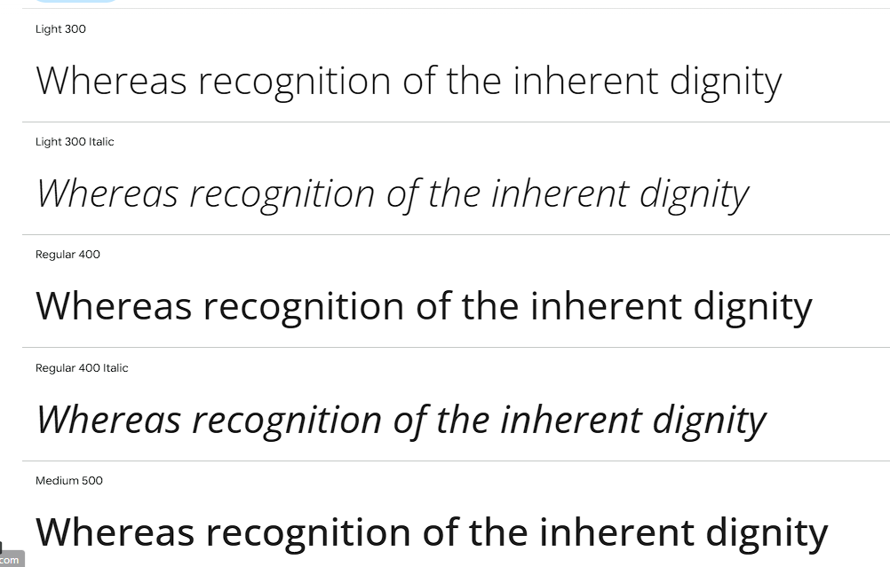
</p>
---

**Buttons:**
- Estilo minimalista con esquinas redondeadas.
- Colores principales extraídos de la paleta:

<p align="center">
    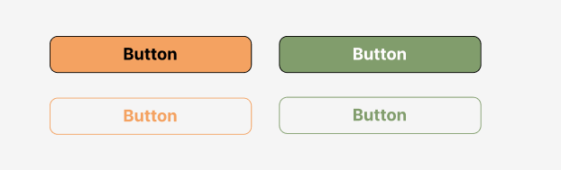
</p>
---

**Paleta de Colores:**  
La selección de la paleta de colores de **Huellitas Conectadas** se fundamenta en principios estratégicos que refuerzan la identidad visual y la funcionalidad de la plataforma:

- 🌿 Verde claro: **#A3B18A**
- 🪶 Beige claro: **#EDE6DB**
- 🟠 Naranja: **#F4A261**
- 🌱 Verde oscuro: **#588157**
- 🧡 Terracota: **#D5896F**
- 🏜️ Arena: **#DDB892**

<p align="center">
    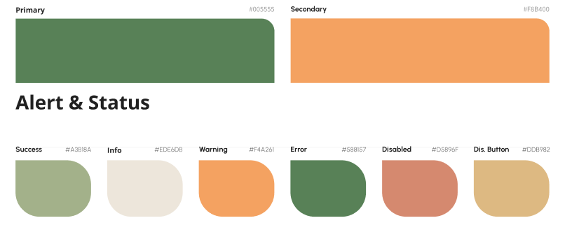
</p>

Estos colores transmiten **calidez, confianza y naturaleza**, reforzando la empatía y el propósito social de la startup.

---

### 4.1.2. Web Style Guidelines

**Huellitas Conectadas** se compromete a ofrecer una interfaz web que no solo sea atractiva, sino también adaptable a distintos dispositivos, priorizando la **usabilidad, accesibilidad y coherencia visual**.

**Lineamientos principales:**
- **Responsive Design:** La plataforma debe adaptarse perfectamente a computadoras, tablets y móviles.
- **Accesibilidad:** Uso de contrastes adecuados, tipografía legible y navegación simple para garantizar que cualquier persona pueda interactuar con la web sin barreras.
- **Consistencia visual:** Los colores, botones, tipografías e íconos deben seguir los mismos estándares en todas las secciones.
- **Minimalismo funcional:** Evitar sobrecarga de elementos visuales; cada componente debe cumplir un propósito claro.
- **Experiencia unificada:** Adoptantes, refugios y rescatistas deben percibir una misma identidad coherente en todas las páginas y dispositivos.

<p align="center">
    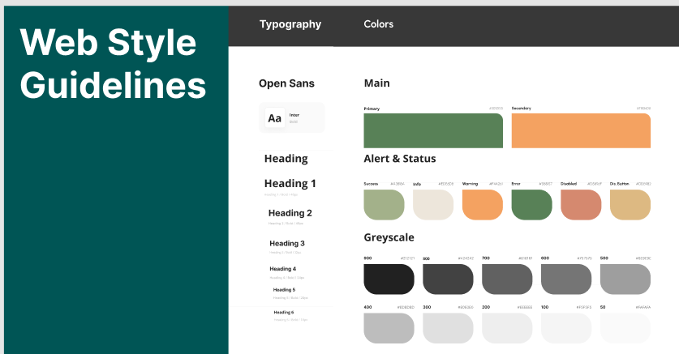
</p>

### 4.1.3. *Mobile Style Guidelines*
#### 4.1.3.1 *iOS Mobile Style Guidelines*

**Huellitas Conectadas** en su versión iOS mantiene una línea de diseño inspirada en las **Human Interface Guidelines (HIG)** de Apple, asegurando una experiencia nativa, intuitiva y consistente.  

**Lineamientos principales:**
- **Tipografía:** Uso de *San Francisco* como tipografía principal, garantizando legibilidad y armonía visual en dispositivos Apple.  
- **Navegación:** Barras inferiores (*tab bars*) para facilitar el acceso a secciones clave como inicio, búsqueda, adopciones y perfil.  
- **Gestos nativos:** Soporte para gestos de deslizamiento, retroceso y notificaciones push integradas en el ecosistema iOS.  
- **Minimalismo visual:** Predominio de espacios en blanco, íconos simples y colores de la paleta oficial de la aplicación.  
- **Consistencia con iOS:** Uso de componentes estándar (botones, menús y alertas) adaptados al look & feel de Apple.  

---

#### 4.1.3.2 *Android Mobile Style Guidelines*

La versión Android de **Huellitas Conectadas** se ajusta a los principios de **Material Design**, lo que garantiza coherencia, escalabilidad y facilidad de uso en una amplia gama de dispositivos.  

**Lineamientos principales:**
- **Tipografía:** Uso de *Roboto* como tipografía predeterminada para mantener claridad y compatibilidad con Android.  
- **Navegación:** Implementación de *bottom navigation bars* y menús tipo *drawer* en función de la jerarquía de contenidos.  
- **Interactividad:** Animaciones sutiles y transiciones fluidas para reforzar la sensación de respuesta inmediata.  
- **Componentes Material Design:** Botones flotantes (FAB), tarjetas (*cards*) y chips aplicados de forma coherente con la paleta de colores.  
- **Consistencia con Android:** Adaptación a diferentes resoluciones y tamaños de pantalla mediante un diseño responsivo nativo.  


## 4.2. Information Architecture
La arquitectura de información (IA) en **Huellitas Conectadas** busca reducir la carga cognitiva, facilitar el descubrimiento de funcionalidades y guiar al usuario en su journey de adopción o gestión de refugio. Se articula en cinco pilares:

---

### 4.2.1. Organization Systems
Nuestro objetivo con **Huellitas Conectadas** es ofrecer una experiencia clara, accesible y emocionalmente conectada en nuestra página web y aplicación móvil. La estructura visual está diseñada para responder a las necesidades de nuestros dos segmentos clave: **adoptantes y voluntarios solidarios**.


📌 **Sistema de adoptante**

Este sistema está pensado para personas comprometidas con el bienestar animal.

- En **Inicio**, se presenta una galería de animales en adopción con perfiles destacados, mostrando fotos, historias breves y datos relevantes como edad, tamaño y estado de salud, permitiendo una conexión inmediata. También se incluyen llamados a la acción para apadrinar o colaborar, destacando casos urgentes o especiales.
- La sección de **Adopciones** permite aplicar filtros por ubicación, tipo de mascota, edad y necesidades especiales. Cada ficha de animal incluye un botón de **"Solicitar Adopción"** y una estimación del tiempo de respuesta de los refugios.
- En **Perfil**, los usuarios gestionan sus solicitudes de adopción y notificaciones personalizadas.
- La estructura incluye accesos a **ubicaciones de donación** que priorizan la facilidad y la confianza en cada aporte.


 <p align="center">
    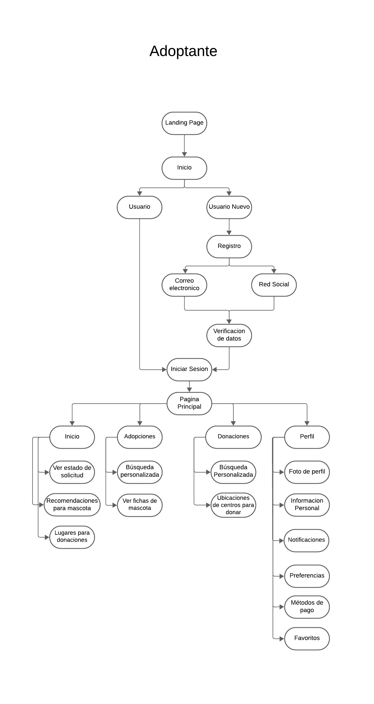
</p>
---

📌 **Sistema de refugio/rescatista**

Este segmento está diseñado para apoyar a **refugios y rescatistas**.

- En **Inicio**, pueden destacar animales recién rescatados o en busca urgente de hogar.
- En **Publicaciones**, los refugios crean y editan fichas de adopción, agregando estado de salud, vacunas, comportamiento e imágenes/videos.
- La sección de **Gestión de Adopciones** brinda herramientas para hacer seguimiento de solicitudes, ordenarlas por estado (pendiente, en proceso, finalizada) y registrar observaciones.
- En **Perfil**, los refugios configuran información de contacto, ubicación, redes sociales y métodos de recepción de donaciones.

Con estas herramientas, **Huellitas Conectadas** busca reducir la carga administrativa y aumentar la efectividad de quienes están al frente del rescate y cuidado de animales.


  <p align="center">
    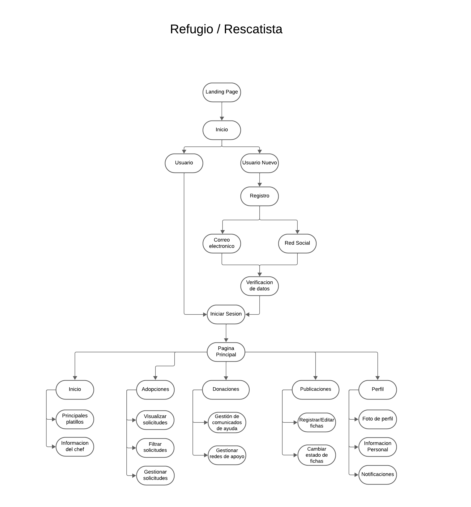
</p>

---

### 4.2.2. Labeling Systems
El equipo de **Huellitas Conectadas** optó por utilizar etiquetas claras, sencillas y coherentes con el propósito social de la plataforma.

- **Inicio**: Casos destacados de animales en busca de adopción. Incluye nombre, edad, raza y estado de salud.
- **Adopciones**: Catálogo completo de animales disponibles. Filtros por tipo, tamaño, edad, ubicación o necesidades especiales.
- **Donaciones**: Opciones de apoyo (monetarias o insumos) con información clara sobre el destino de los aportes.
- **Publicaciones**: Imágenes, videos y descripciones detalladas con posibilidad de edición.
- **Perfil**: Personalización de experiencia: datos de contacto, foto de perfil, preferencias, notificaciones, métodos de donación.

---

### 4.2.3. SEO Tags and Meta Tags

**Inicio**
- Title: Huellitas Conectadas - Adopta con Amor
- Meta Description: Descubre casos destacados de animales en busca de hogar. Conoce su historia y ayuda a transformar vidas con un solo clic.
- Keywords: adopción animal, casos urgentes, refugios, rescatistas, animales en adopción
- Author: Equipo de Huellitas Conectadas

**Adopciones**
- Title: Animales en Adopción - Huellitas Conectadas
- Meta Description: Explora nuestro catálogo de animales disponibles para adopción. Filtra por características y encuentra a tu nuevo mejor amigo.
- Keywords: adopciones, perros en adopción, gatos en adopción, filtro por edad, filtro por ubicación
- Author: Equipo de Huellitas Conectadas

**Donaciones**
- Title: Ayuda a un Refugio - Donaciones en Huellitas Conectadas
- Meta Description: Dona insumos o dinero para apoyar a refugios y rescatistas. Conoce sus necesidades y colabora desde donde estés.
- Keywords: donaciones, ayuda a animales, insumos para refugios, apoyar rescatistas, apadrina un animal
- Author: Equipo de Huellitas Conectadas

**Publicaciones**
- Title: Historias y Rescates - Blog de Huellitas Conectadas
- Meta Description: Lee historias reales de rescate, adopción y solidaridad. Comparte contenido y mantente al día con nuestras novedades.
- Keywords: historias de rescate, publicaciones de animales, adopciones exitosas, contenido solidario
- Author: Equipo de Huellitas Conectadas

**Perfil**
- Title: Tu Perfil en Huellitas Conectadas
- Meta Description: Personaliza tu perfil, gestiona tus datos y recibe notificaciones sobre adopciones y campañas. Un espacio solo para ti.
- Keywords: perfil de usuario, configuración de cuenta, notificaciones, preferencias de adopción, gestión de donaciones
- Author: Equipo de Huellitas Conectadas

---

### 4.2.4. Searching Systems
El sistema de búsqueda de **Huellitas Conectadas** está diseñado para facilitar la exploración de animales en adopción, oportunidades de ayuda y contenido relevante.

**Opciones de Búsqueda Generales**
- **Barra de Búsqueda**: Disponible en todas las secciones principales, acepta palabras clave (nombre, especie, ubicación, refugio).
- **Búsqueda Avanzada**: Filtros por tamaño, edad, estado de salud, tipo de ayuda o zona geográfica.

**Filtros por Sección**
- **Adopciones**: Tipo de animal, tamaño, edad, ubicación, necesidades especiales.
- **Donaciones**: Tipo de donación, refugio destinatario, urgencia.
- **Publicaciones**: Nombre del animal, tipo de publicación, fecha, refugio.
- **Perfil**: Actividad reciente, notificaciones, configuraciones.

**Presentación de Datos**
- **Diseño**: Resultados en tarjetas visuales con fotos e información clave.
- **Interactividad**: Vista detallada con opciones de acción inmediata (adoptar, donar, contactar).

---

### 4.2.5. Navigation Systems
La navegación en **Huellitas Conectadas** ha sido diseñada para que cualquier persona —ya sea rescatista, adoptante o donante— pueda moverse por la plataforma de forma fluida.

**Estructura Principal**
- Menú superior fijo: Inicio, Adopciones, Donaciones, Publicaciones, Perfil.
- Iconos representativos (huella para Adopciones, caja de regalo para Donaciones, etc.).

**Accesibilidad y Usabilidad**
- Navegación por tarjetas con resúmenes de animales o publicaciones.
- Enlaces contextuales dentro de cada ficha hacia contenido relacionado.
- Botones, indicadores de progreso y colores distintivos para guiar al usuario.

**Filtros y Búsqueda Avanzada**
- Filtros desplegables en Adopciones y Donaciones.
- Barra de búsqueda global con resultados dinámicos en tiempo real.

## 4.3. *Landing Page UI Design*
### 4.3.1. *Landing Page Wireframe*

- **Encabezado** con logo, menú y botón de llamada a la acción.
- **Sección "¿Quiénes somos?"** con imagen y descripción.
- **Beneficios** de adoptar con la plataforma.
- **Testimonios** de adoptantes y refugios.
- **CTA final:**
    - "Únete como adoptante"
    - "Registra tu refugio"

<p align="center">
    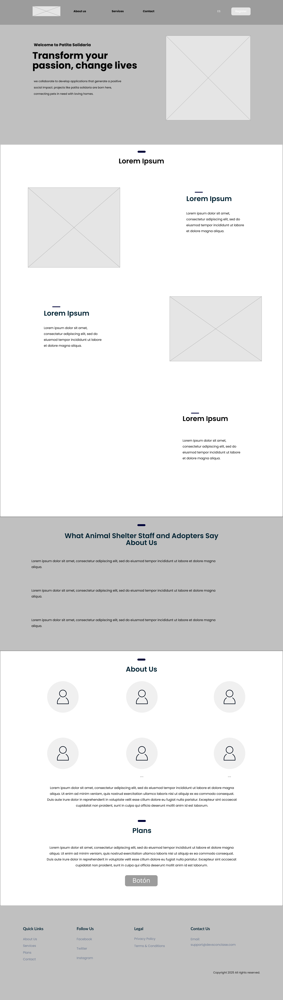
</p>

### 4.3.2. *Landing Page Mock-up*
- Diseño visual con colores cálidos, imágenes reales de mascotas y testimonios con marco gráfico. Botones destacados y secciones bien diferenciadas visualmente.

<p align="center">
    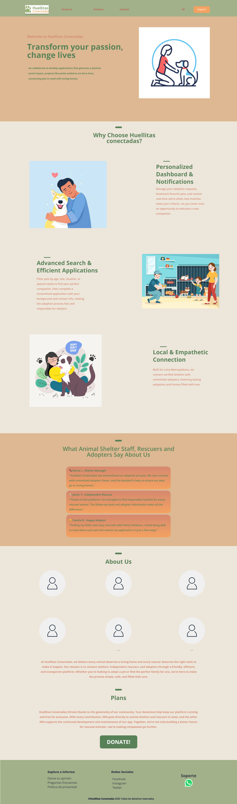
</p>

## 4.4. *Mobile Applications UX/UI Design*
### 4.4.1. *Mobile Applications Wireframes*

<p align="center">
    
</p>

### 4.4.2. *Mobile Applications Wireflow Diagrams*

<p align="center">
    
</p>


### 4.4.3. *Mobile Applications Mock-ups*

<p align="center">
    
</p>

<p align="center">
    
</p>

<p align="center">
    
</p>

<p align="center">
    
</p>

### 4.4.4. *Mobile Applications User Flow Diagrams*
<p align="center">
    
</p>

<p align="center">
    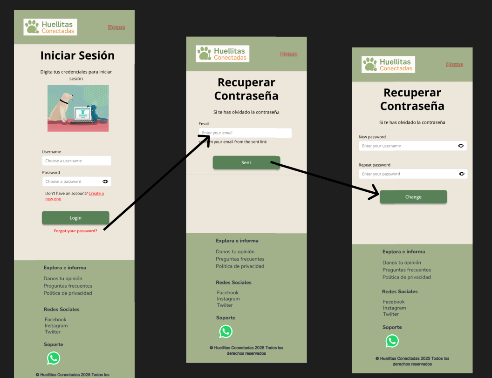
</p>

## 4.5. *Mobile Applications Prototyping*
### 4.5.1. *Android Mobile Applications Prototyping*

<p align="center">
    
</p>

### 4.5.2. *iOS Mobile Applications Prototyping*

<p align="center">
    
</p>


## 4.6. *Web Applications UX/UI Design*
### 4.6.1. *Web Applications Wireframes*
- Web application login wireframe: Este wireframe muestra la pantalla de inicio de sesión de la aplicación web, con campos para correo electrónico y contraseña, y botón para iniciar sesión.

<p align="center">
    
</p>

- Incorrect password Wireframe:

<p align="center">
    
</p>

- Reset password Wireframe: digitas tu correo vinculado a tu cuenta, luego lo confirmas mediante un enlace mandado al correo digitado que requiere el cambio (debe existir una cuenta para hacerlo, sino no saldrá nada en el correo) y podrás seguir con el cambio de contraseña.

<p align="center">
    
</p>

- Reset password Wireframe #2:

<p align="center">
    
</p>

- Web application registration wireframe: Este wireframe muestra la pantalla de registro de la aplicación web, con campos para nombre, correo electrónico, contraseña, tipo de usuario que va a usar la aplicación (adopter y animal shelter/rescue) y botón para registrarse.

<p align="center">
    
</p>

- Web application Adopters: Este wireframe muestra la pantalla de bienvenida, animales disponibles para adopción, una barra en la que se puede acceder a la landing page desde home, al buscador de mascotas, tu perfil y un apartado para donaciones, también aparece el formulario para que puedan aceptarte más rápido a la hora de solcitar adoptar a una mascota. Por último, está la sección de poder ve las reviews y nuestras redes sociales como startup.

<p align="center">
    
</p>

- Web application Rescuers and Animal Shelters: Este wireframe muestra la pantalla de bienvenida y más opciones para que el rescatista o refugio pueda ubicarse fácilmente a donde quiere ir.

<p align="center">
    
</p>

- View Profile Wireframe: Este wireframe muestra tu perfil y puedes editarlo a tu gusto para que los demás sepan más acerca de ti. Para los dos casos es igual el diseño.

<p align="center">
    
</p>

- Profile Edit Wireframe:

<p align="center">
    
</p>

- Delete account Wireframe:

<p align="center">
    
</p>

- Buscar mascotas disponibles:

<p align="center">
    
</p>

- Ver información de la mascota que se quiere adoptar:

<p align="center">
    
</p>

- Editar información de la mascota (para rescatistas y refugios):

<p align="center">
    
</p>

- Ver y agregar animalitos publicados (para rescatistas y refugios):

<p align="center">
    
</p>

- Ver tu historial de mascotas adoptadas y aprobadas: lista de mascotas adoptadas con fecha y adoptante (para rescatistas y refugios)

  - historial completo:
  
  <p align="center">
    
</p>

- historial detallado específico de una mascota en concreto:

 <p align="center">
    
</p>

### 4.6.2. *Web Applications Wireflow Diagrams*

##### User Goal: Registro e Inicio de Sesión

User Persona: Adoptantes y rescatistas/refugio

Explicación del Flujo:

El usuario accede a la aplicación desplegada y visualiza un formulario que solicita su correo electrónico y contraseña. Una vez que se ingresan las credenciales, el sistema valida la información. Si la autenticación es exitosa, el usuario es redirigido a la página principal de su perfil. Si las credenciales son incorrectas, el sistema muestra un mensaje de error y permanece en la pantalla de inicio de sesión. En ese momento, el usuario tiene la opción de reintroducir sus credenciales o seleccionar “Olvidé mi contraseña” para iniciar el proceso de restablecimiento.

<p align="center">
    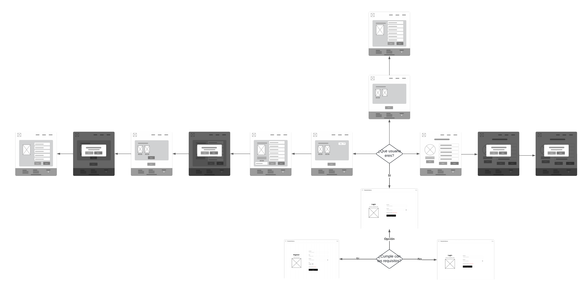
</p>

##### User Goal: Navegación Rápida a Funciones Principales
User Persona: Adoptantes y rescatistas/refugio

Explicación del Flujo:

El usuario puede navegar de manera rápida e intuitiva por las secciones principales de la plataforma. Si es adoptante, podrá acceder a su "perfil" y editarlo con toda la información posible para que los rescatistas o refugios puedan tenerle mayor confianza. Además, puede buscar y filtrar las mascotas que quiera adoptar, puede ver recomendaciones de animales basado en búsquedas anteriores y preferencias, puede actualizar sus preferencias de adopción, puede ver el estado del proceso de adopción y puede ver el historial médico de cualquier mascota de su interés. Si es rescatista o del refugio, tienen la opción de publicar una mascota que requiere dueño, editar dicha información, borrar si es necesario o si tuvieron algún error. También pueden ver el historial de las mascotas que ya han sido adoptadas y limpiar dicho historial si quiere, ver solicitudes de adopción recibidas y rechazarlas o aceptar las solicitudes según convenga.

<p align="center">
    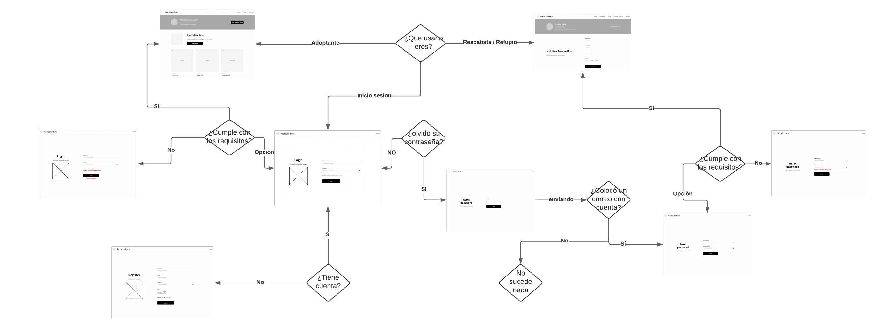
</p>

### 4.6.3. *Web Applications Mock-ups*

<p align="left">Iniciar Sesión</p>

<br/>

<p align="left">Registro</p>

<br/>

<p align="left">Ver perfil rescatista</p>

<br/>

<p align="left">Ver perfil adoptante</p>

<br/>

<p align="left">Registrar mascota</p>

<br/>

<p align="left">Buscar mascota</p>

<br/>

<p align="left">Ver perfil del actual dueño de la mascota anteriormente publicada</p>

<br/>

### 4.6.4. *Web Applications User Flow Diagrams*

- **Goal: El usuario quiere adoptar una mascota**

<p align="center">
    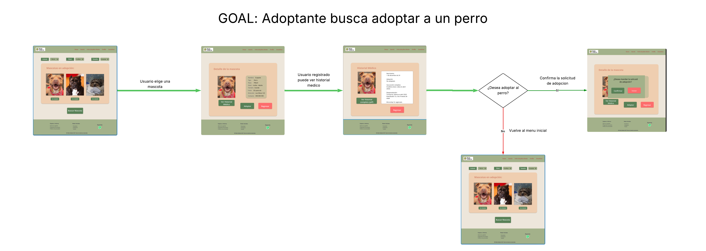
</p>

- **Goal: El usuario registra una mascota para su adopción**

<p align="center">
    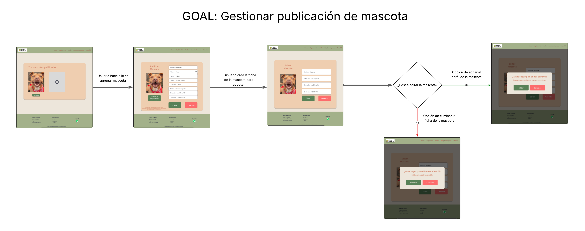
</p>

## 4.7. *Web Applications Prototyping*


## 4.8. *Domain-Driven Software Architecture*
### 4.8.1. *Software Architecture Context Diagram*
A través del diagrama de contexto, la plataforma Huellitas Conectadas muestra de manera clara cómo se relaciona con los distintos actores y servicios externos. Su propósito principal es facilitar la adopción de mascotas en Perú, creando un puente entre adoptantes, refugios y rescatistas. Dentro de este esquema se identifican actores clave: el Adoptante, que explora opciones de mascotas y realiza donaciones, y el Refugio o Rescatista, que administra perfiles de animales y responde a solicitudes. También se incluyen integraciones fundamentales, como la Pasarela de Pago para procesar aportes, el Servicio de Mapas para ubicar refugios, el Servicio de Correo Electrónico para enviar notificaciones y las Redes Sociales para promover la adopción. Gracias a esta representación de alto nivel, se comprende cómo Huellitas Conectadas se articula con su entorno digital y humano para cumplir su misión.

<p align="center">
    
</p>

### 4.8.2. *Software Architecture Container Diagrams*

El diagrama de contenedores detalla la organización interna del sistema y la manera en que sus componentes técnicos trabajan en conjunto para brindar una experiencia integral. La Aplicación Web, construida en React, ofrece a los usuarios la posibilidad de navegar por los perfiles de mascotas, gestionar procesos de adopción y realizar donaciones. Esta interfaz se conecta con una API en Node.js, que sirve de enlace entre la capa visual y los servicios del backend. La información esencial sobre usuarios, mascotas, refugios, adopciones y donaciones se almacena en una Base de Datos PostgreSQL. Además, se contemplan contenedores adicionales como el Servicio de Mapas (Google Maps API), encargado de mostrar ubicaciones, y el Servicio de Correo Electrónico (SendGrid), que permite enviar notificaciones. Gracias a esta representación, se obtiene una visión clara de cómo cada parte técnica se integra para dar soporte al ecosistema de Huellitas Conectadas.

<p align="center">
    
</p>

### 4.8.3. *Software Architecture Components Diagrams*
El diagrama de componentes de Huellitas Conectadas muestra la estructura interna de la API, encargada de coordinar la lógica de negocio de la plataforma. Esta API, desarrollada en Node.js, está conformada por varios módulos especializados que atienden dominios específicos. El módulo de Gestión de Usuarios administra la autenticación y los perfiles; Gestión de Mascotas permite realizar operaciones CRUD sobre los perfiles de animales; Gestión de Adopciones se ocupa de todo el proceso de solicitudes y aprobaciones; y Gestión de Donaciones procesa y registra los aportes económicos. La interacción entre estos módulos sigue una lógica funcional clara: los usuarios gestionan sus datos, las mascotas se vinculan con solicitudes de adopción y las adopciones pueden complementarse con donaciones. Esta segmentación evidencia un diseño orientado al dominio, donde cada componente mantiene una responsabilidad bien definida y contribuye al funcionamiento integral de la plataforma.

<p align="center">
    
</p>

## 4.9. *Software Object-Oriented Design*
### 4.9.1. *Class Diagrams*

<p align="center">
    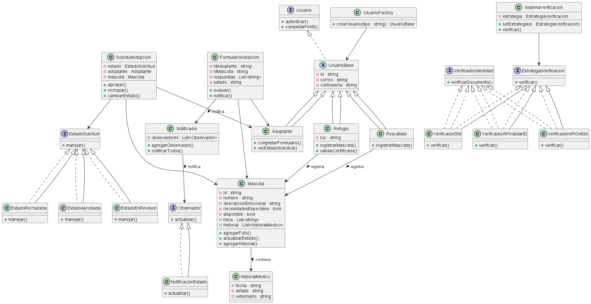
</p>

### 4.9.2. *Class Dictionary*

## SolicitudAdopcion
| Elemento | Descripción |
|----------|-------------|
| **Responsabilidad** | Gestiona las solicitudes de adopción entre adoptantes y mascotas. |
| **Atributos** | `estado: EstadoSolicitud`, `adoptante: Adoptante`, `mascota: Mascota` |
| **Métodos** | `aprobar()`, `rechazar()`, `cambiarEstado()` |
| **Relaciones** | Depende de **EstadoSolicitud**, se relaciona con **Adoptante** y **Mascota** |

---

## EstadoSolicitud (Interface)
| Elemento | Descripción |
|----------|-------------|
| **Responsabilidad** | Define el comportamiento de los distintos estados de una solicitud. |
| **Atributos** | *N/A* |
| **Métodos** | `manejar()` |
| **Relaciones** | Implementado por **EstadoRechazada**, **EstadoAprobada**, **EstadoEnRevision** |

### EstadoRechazada
| Elemento | Descripción |
|----------|-------------|
| **Responsabilidad** | Representa el estado de una solicitud rechazada. |
| **Métodos** | `manejar()` |
| **Relaciones** | Implementa **EstadoSolicitud** |

### EstadoAprobada
| Elemento | Descripción |
|----------|-------------|
| **Responsabilidad** | Representa el estado de una solicitud aprobada. |
| **Métodos** | `manejar()` |
| **Relaciones** | Implementa **EstadoSolicitud** |

### EstadoEnRevision
| Elemento | Descripción |
|----------|-------------|
| **Responsabilidad** | Representa el estado en proceso de evaluación. |
| **Métodos** | `manejar()` |
| **Relaciones** | Implementa **EstadoSolicitud** |

---

## FormularioAdopcion
| Elemento | Descripción |
|----------|-------------|
| **Responsabilidad** | Captura y almacena las respuestas del adoptante en el proceso de adopción. |
| **Atributos** | `idAdoptante: string`, `idMascota: string`, `respuestas: List<string>`, `estado: string` |
| **Métodos** | `evaluar()`, `notificar()` |
| **Relaciones** | Asociado con **Adoptante** y **Mascota** |

---

## Notificador
| Elemento | Descripción |
|----------|-------------|
| **Responsabilidad** | Implementa el patrón Observer para informar sobre cambios. |
| **Atributos** | `observadores: List<Observador>` |
| **Métodos** | `agregarObservador()`, `notificarTodos()` |
| **Relaciones** | Notifica a instancias de **Observador** |

---

## Observador (Interface)
| Elemento | Descripción |
|----------|-------------|
| **Responsabilidad** | Define el método a implementar para recibir notificaciones. |
| **Métodos** | `actualizar()` |
| **Relaciones** | Implementado por **NotificacionEstado** |

### NotificacionEstado
| Elemento | Descripción |
|----------|-------------|
| **Responsabilidad** | Implementación concreta de un observador de estado. |
| **Métodos** | `actualizar()` |
| **Relaciones** | Implementa **Observador** |

---

## Mascota
| Elemento | Descripción |
|----------|-------------|
| **Responsabilidad** | Representa a una mascota dentro de la plataforma. |
| **Atributos** | `id: string`, `nombre: string`, `descripcionEmocional: string`, `necesidadesEspeciales: bool`, `disponible: bool`, `fotos: List<string>`, `historial: List<HistorialMedico>` |
| **Métodos** | `agregarFoto()`, `actualizarEstado()`, `agregarHistorial()` |
| **Relaciones** | Contiene varios **HistorialMedico**, asociado a **SolicitudAdopcion** |

---

## HistorialMedico
| Elemento | Descripción |
|----------|-------------|
| **Responsabilidad** | Almacena registros médicos de las mascotas. |
| **Atributos** | `fecha: string`, `detalle: string`, `veterinario: string` |
| **Relaciones** | Pertenece a una **Mascota** |

---

## Usuario (Interface)
| Elemento | Descripción |
|----------|-------------|
| **Responsabilidad** | Define operaciones básicas de un usuario. |
| **Métodos** | `autenticar()`, `completarPerfil()` |
| **Relaciones** | Implementado por **UsuarioBase** |

---

## UsuarioBase (Abstract)
| Elemento | Descripción |
|----------|-------------|
| **Responsabilidad** | Clase base para diferentes tipos de usuario. |
| **Atributos** | `id: string`, `correo: string`, `contrasena: string` |
| **Relaciones** | Superclase de **Adoptante**, **Refugio** y **Rescatista** |

---

## Adoptante
| Elemento | Descripción |
|----------|-------------|
| **Responsabilidad** | Usuario que solicita la adopción de mascotas. |
| **Atributos** | *(heredados de UsuarioBase)* |
| **Métodos** | `completarFormulario()`, `verEstadoSolicitud()` |
| **Relaciones** | Hereda de **UsuarioBase**, asociado a **SolicitudAdopcion** |

---

## Refugio
| Elemento | Descripción |
|----------|-------------|
| **Responsabilidad** | Entidad que gestiona animales y valida su documentación. |
| **Atributos** | *(heredados de UsuarioBase)*, `ruc: string` |
| **Métodos** | `registrarMascota()`, `validarCertificado()` |
| **Relaciones** | Hereda de **UsuarioBase**, registra **Mascotas** |

---

## Rescatista
| Elemento | Descripción |
|----------|-------------|
| **Responsabilidad** | Usuario que registra animales rescatados. |
| **Atributos** | *(heredados de UsuarioBase)* |
| **Métodos** | `registrarMascota()` |
| **Relaciones** | Hereda de **UsuarioBase** |

---

## UsuarioFactory
| Elemento | Descripción |
|----------|-------------|
| **Responsabilidad** | Aplica el patrón Factory para instanciar usuarios. |
| **Métodos** | `crearUsuario(tipo: string): UsuarioBase` |
| **Relaciones** | Devuelve instancias de **UsuarioBase** (Adoptante, Refugio, Rescatista) |

---

## SistemaVerificacion
| Elemento | Descripción |
|----------|-------------|
| **Responsabilidad** | Gestiona la verificación de usuarios mediante distintas estrategias. |
| **Atributos** | `estrategia: EstrategiaVerificacion` |
| **Métodos** | `setEstrategia(e: EstrategiaVerificacion)`, `verificar()` |
| **Relaciones** | Usa implementaciones de **EstrategiaVerificacion** |

---

## EstrategiaVerificacion (Interface)
| Elemento | Descripción |
|----------|-------------|
| **Responsabilidad** | Define la estrategia de validación de usuarios. |
| **Métodos** | `verificar()` |
| **Relaciones** | Implementada por **VerificadorIdentidad**, **VerificadorDNI**, **VerificadorAPIValidarID**, **VerificadorAPIOnfido** |

### VerificadorIdentidad
| Elemento | Descripción |
|----------|-------------|
| **Responsabilidad** | Verifica documentos de identidad de forma directa. |
| **Métodos** | `verificarDocumento()` |
| **Relaciones** | Implementa **EstrategiaVerificacion** |

### VerificadorDNI
| Elemento | Descripción |
|----------|-------------|
| **Responsabilidad** | Verifica la identidad con DNI local. |
| **Métodos** | `verificar()` |
| **Relaciones** | Implementa **EstrategiaVerificacion** |

### VerificadorAPIValidarID
| Elemento | Descripción |
|----------|-------------|
| **Responsabilidad** | Valida la identidad usando una API externa. |
| **Métodos** | `verificar()` |
| **Relaciones** | Implementa **EstrategiaVerificacion** |

### VerificadorAPIOnfido
| Elemento | Descripción |
|----------|-------------|
| **Responsabilidad** | Verifica documentos mediante el servicio Onfido. |
| **Métodos** | `verificar()` |
| **Relaciones** | Implementa **EstrategiaVerificacion** |


## 4.10. *Database Design*
### 4.10.1. *Relational/Non-Relational Database Diagram*

<p align="center">
    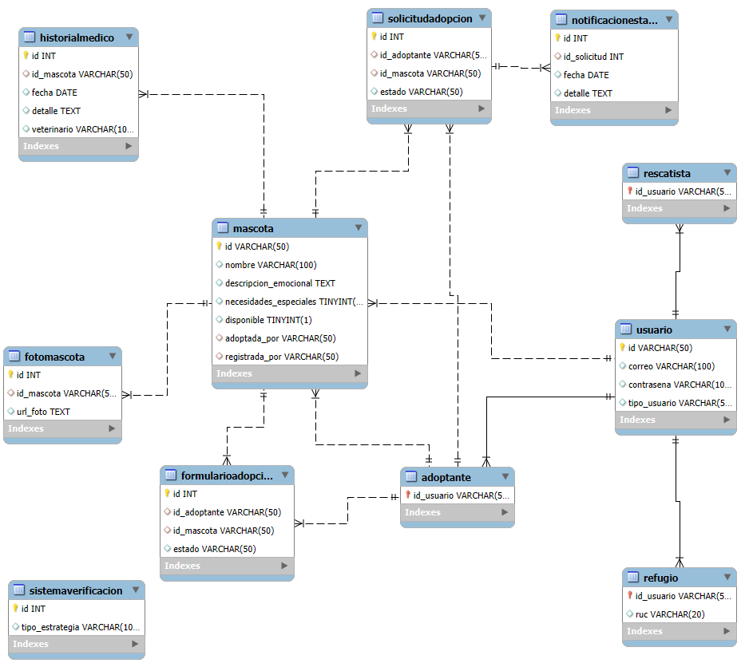
</p>

# Capítulo V: *Product Implementation*
## 5.1. *Software Configuration Management*

La gestión de la configuración del software es fundamental para nuestro trabajo, ya que nos ayuda a controlar de manera exacta los componentes de nuestro proyecto, como el código fuente, los documentos de diseño y los recursos digitales. De esta manera, aseguramos que todos los miembros del equipo utilicen la misma versión de los archivos, lo que facilita la cooperación entre desarrolladores, diseñadores y otros profesionales involucrados.

### 5.1.1. *Software Development Environment Configuration*

- Project Management 
     - Zoom

     Una plataforma de videollamadas utilizada para realizar y grabar la exposición final, permitiendo registrar la presentación del equipo de forma clara y accesible.

    - Trello

    Una herramienta de gestión de tareas basada en tableros, que permite organizar y coordinar el trabajo del equipo en tiempo real mediante listas, tarjetas y etiquetas.

    Imagen de evidencia de uso:

    <p align="center">


- Requirements Management 

    - Structurizr

    Se trata de una suite de herramientas que posibilita la creación colaborativa de modelos C4 para representar de forma gráfica nuestros productos.

- Product UX/UI Design

    - Figma 

    Herramienta visual que facilita la creación de wireframes y mockups.

    Imagen de evidencia de uso:
    <p align="center">
        
    - Lucidchart

    Una herramienta colaborativa que posibilita la creación conjunta de wireframes flow y mockups flow.

    Imagen de evidencia de uso:
    <p align="center">
    
- Software Development 

    - HTML5

    Lenguaje de etiquetado orientado a crear páginas web.

    Imagen de evidencia de uso

    <p align="center">

    - CSS 

    Lenguaje de diseño gráfico utilizado para dar formato al código escrito en HTML.

    Imagen de evidencia de uso

    <p align="center">

- Software Documentation

    - Github

    Plataforma utilizada para el alojamiento de versiones del código fuente de un proyecto. Es una herramienta ampliamente popular en el trabajo colaborativo de programadores.

- Software Documentation

    - Github Pages

    Una plataforma que posibilita la realización de despliegues simples directamente desde un repositorio de GitHub.


### 5.1.2. *Source Code Management*


- Gitflow Implementation:

Implementamos el flujo de trabajo gitflow para el control de versiones con branches(ramas) para trabajar paralelamente.

<p align="center">

**Main branch**

La rama principal de desarrollo del proyecto es la Master branch. En esta rama reside el código que actualmente se encuentra en producción.

Notación: main

**Conventional Commits**

"Conventional Commits" es una convención para estructurar los mensajes de confirmación (commits) en un formato estándar y semántico. Este formato ayuda a comunicar claramente los cambios realizados en el código y facilita la generación de registros de cambios automáticos. Los "Conventional Commits" suelen seguir un formato que incluye un encabezado, un cuerpo opcional y un pie de página opcional, y se utilizan para describir de manera sucinta y clara los cambios realizados en el código, lo que facilita su seguimiento y comprensión por parte de los desarrolladores y otros miembros del equipo.
La estructura de un commit debe seguir las siguientes pautas:

```
git commit -m "<type>[optional scope]: <title>" -m "<description>"
```

**Tipos De Conventional Commits**

```
1. feat: Used to describe a new feature or functionality added to the code.
2. fix: Indicates a bug fix or solution to a problem.
3. docs: Employed for changes or improvements in code documentation.
4. style: Describes changes related to the code's formatting, such as whitespace, indentation, etc., that do not affect its functionality.
5. refactor: Used for modifications to the code that do not fix bugs or add new features, but rather improve its structure or readability.
6. test: Indicates the addition or modification of unit tests or functional tests.
7. chore: Used for changes in the build process or maintenance tasks that are not directly related to the code itself.
8. perf: Describes performance improvements in the code.
```

### 5.1.3. *Source Code Style Guide & Conventions*

- HTML

    - Use Lowercase Element Names: 

    Es recomendable utilizar minúsculas o lowercase para los nombres de los elementos HTML.

    - Close All HTML Elements:
    
    Es recomendable cerrar todos los elementos HTML correctamente.

    - Use Lowercase Attribute Names:

    Es recomendable utilizar minúsculas para los nombres de los atributos HTML.

    - Always Specify alt, width, and height for Images:

    Es recomendable seguir estas convenciones en caso de que la imagen no se pueda mostrar, lo que ayuda a mejorar la accesibilidad del contenido.

    - Spaces and Equal Signs:

    Se recomienda no utilizar espacios en blanco entre las entidades para mejorar la legibilidad.

- CSS

    - ID and Class Naming

    Es recomendable utilizar nombres de clases e id's significativos que expresen claramente el propósito del elemento.

    - ID and Class Name Style

    Se recomienda utilizar nombres cortos para nombrar ids o clases, pero lo suficientemente descriptivos para entender su propósito.

    - Shorthand Properties

    Se recomienda utilizar propiedades CSS de forma abreviada siempre que sea posible para hacer el código más eficiente y comprensible.

    - 0 and Units

    Es recomendable evitar especificar la unidad después del valor 0 en propiedades que lo permitan, ya que esto ayuda a reducir el tamaño del código y mejora su legibilidad.

    - Declaration Order

    Se recomienda ordenar las declaraciones en orden alfabético para facilitar el mantenimiento y la recordación del código.

- JAVASCRIPT

    - Use expanded syntax

    Cada línea de JavaScript debería estar en una nueva línea, con la llave de apertura en la misma línea de su declaración y la llave de cierre en una nueva línea al final.

    - Variable naming

    Para la declaración de variables, es recomendable utilizar las palabras reservadas let y const en lugar de var.

    - Function naming

    Para el nombre de las funciones, se recomienda utilizar lowerCamelCase.

### 5.1.4. *Software Deployment Configuration*

- Creación Landing Page: 

    1. Se crea un repositorio remoto en GitHub:

    <p align="center">

    2. Agregamos las configuraciones necesarias para el despliegue desde github pages:

    <p align="center">


## 5.2. *Product Implementation & Deployment*
### 5.2.1. *Sprint Backlogs*
Este sprint se enfocó en el desarrollo inicial , priorizando la implementación de funcionalidades clave que permitan validar la propuesta de valor con usuarios reales. Se trabajó en la construcción del backend con arquitectura DDD, el frontend con React, y la aplicación móvil nativa, además de completar la Landing Page. El equipo aplicó metodologías ágiles con reuniones diarias de sincronización y revisiones continuas para asegurar la calidad del código y la experiencia de usuario.

---

#### **Sprint 1**

**Sprint Planning Background:**

| Sprint # | Sprint 1 |
|----------|----------|
| **Sprint Planning Background** | |
| Date | 2025-09-19 |
| Time | 10:00 AM |
| Location | Reunión virtual vía Discord |
| Prepared By | Christian Espinoza |
| Attendees (to planning meeting) | Christian Espinoza, Harrison Payesa, César Navarro |
| **Sprint Goal & User Stories** | |
| Sprint 1 Goal | Implementar las funcionalidades base de autenticación, registro de usuarios, gestión de perfiles y publicación/búsqueda de mascotas |
| Sprint 1 Velocity | 34 Story Points |
| Sum of Story Points | 34 |

---

**Sprint Backlog 1:**

| Sprint # | Sprint 1 | | | | | | |
|----------|----------|---|---|---|---|---|---|
| **User Story** | **Work-Item / Task** | **Id** | **Title** | **Description** | **Estimation (Hours)** | **Assigned To** | **Status** |
| **US01 - Registro de cuenta** | | | | | | | |
| | Diseñar formulario de registro | T01 | Diseñar UI del formulario | Crear wireframe y mockup del formulario de registro con selección de rol (adoptante, refugio, rescatista) | 6 | Christian Espinoza | Done |
| | Implementar validación frontend | T02 | Validar campos obligatorios | Validar campos obligatorios (email, contraseña, confirmación contraseña, rol) en React con mensajes de error claros | 5 | Harrison Payesa | Done |
| | Crear endpoint de registro | T03 | Backend `/api/v1/auth/signup` | Desarrollar lógica de registro en Spring Boot con validaciones, hash de contraseñas con BCrypt y creación de roles | 7 | César Navarro | Done |
| | Integrar frontend con backend | T04 | Conectar formulario con API | Integrar llamada API desde React, manejar respuestas exitosas y errores, y redirigir según corresponda | 4 | Harrison Payesa | Done |
| | Crear pruebas unitarias | T05 | Tests de registro | Implementar tests con JUnit 5 para validar lógica de registro y casos edge | 5 | César Navarro | Done |
| **US02 - Iniciar sesión** | | | | | | | |
| | Diseñar pantalla de login | T06 | UI de inicio de sesión | Crear interfaz de inicio de sesión con campos email y contraseña, opción "recordar sesión" y link de recuperación | 4 | Christian Espinoza | Done |
| | Validar credenciales en frontend | T07 | Validación de formato | Validar formato de email y longitud mínima de contraseña antes de enviar al backend | 4 | Harrison Payesa | Done |
| | Implementar autenticación JWT | T08 | Backend `/api/v1/auth/signin` | Implementar lógica de autenticación JWT en Spring Boot con expiración de tokens y refresh tokens | 8 | César Navarro | Done |
| | Integrar JWT en frontend | T09 | Manejo de tokens | Almacenar token en localStorage, configurar interceptores axios para headers de autorización automáticos | 5 | Harrison Payesa | Done |
| | Implementar manejo de sesión | T10 | Gestión de sesión activa | Crear lógica para verificar token válido, renovar automáticamente y logout cuando expire | 6 | Harrison Payesa | Done |
| **US04 - Buscar mascotas** | | | | | | | |
| | Diseñar interfaz de búsqueda | T15 | UI con filtros | Crear interfaz con filtros visibles (tipo, tamaño, edad, ubicación, necesidades especiales) y resultados en grid | 6 | Christian Espinoza | Done |
| | Implementar filtros dinámicos | T16 | Lógica de filtrado | Lógica de filtrado dinámico con actualización en tiempo real sin recargar página | 8 | Harrison Payesa | In-Process |
| | Crear endpoint de búsqueda | T17 | Backend `/api/v1/pets/search` | Backend con query params múltiples, paginación y ordenamiento (más recientes, alfabético) | 7 | César Navarro | To-Review |
| | Optimizar consultas | T18 | Índices en base de datos | Implementar índices en PostgreSQL para mejorar performance de búsquedas | 5 | César Navarro | To-Review |
| **US05 - Ver perfil de mascota** | | | | | | | |
| | Diseñar vista detallada | T19 | UI del perfil completo | Interfaz con galería de fotos, información completa (edad, raza, comportamiento), historial médico expandible | 5 | Christian Espinoza | Done |
| | Crear endpoint de detalle | T20 | Backend `/api/v1/pets/{petId}` | API para obtener detalles completos de una mascota específica con relaciones cargadas | 6 | César Navarro | Done |
| | Implementar galería de imágenes | T21 | Carousel responsive | Componente carousel responsive con zoom y navegación táctil para móvil | 6 | Harrison Payesa | Done |
| | Conectar vista con API | T22 | Integración con backend | Integrar llamada API, renderizado de datos y manejo de estados de carga y error | 4 | Harrison Payesa | Done |
| **US12 - Publicar mascota en adopción** | | | | | | | |
| | Diseñar formulario de publicación | T26 | Interfaz para refugios | Interfaz para refugios con campos: nombre, tipo, raza, edad, tamaño, fotos múltiples, descripción emocional, historial médico | 5 | Christian Espinoza | Done |
| | Implementar validaciones | T27 | Validar formulario | Validar campos obligatorios, formatos de archivos de imagen (JPG, PNG), tamaño máximo 5MB | 6 | Harrison Payesa | Done |
| | Crear endpoint de registro | T28 | Backend `/api/v1/pets` | POST para registrar nueva mascota en base de datos con relación a usuario refugio/rescatista | 8 | César Navarro | Done |
| | Implementar carga de imágenes | T29 | Sistema de upload | Sistema de upload con Cloudinary/S3, generación de thumbnails y almacenamiento de URLs | 7 | César Navarro | Done |
| | Conectar formulario con API | T30 | Integración completa | Integrar formulario con endpoint, mostrar preview de imágenes, manejar progreso de carga | 4 | Harrison Payesa | Done |

---

**Observaciones del Sprint 1:**

- Se priorizaron User Stories críticas del Epic 01 (Autenticación) y Epic 02 (Búsqueda y Gestión de Mascotas)
- Todas las tareas respetaron el rango de 4-8 horas de estimación para facilitar seguimiento diario
- Se aplicó arquitectura DDD con bounded contexts claramente definidos
- Las tareas de frontend y backend se desarrollaron en paralelo para optimizar tiempos
- Se utilizó PostgreSQL como base de datos relacional con esquema normalizado
- Se implementaron pruebas unitarias con JUnit 5 para validar lógica de negocio crítica
- Se identificaron 2 tareas en estado "In-Process" y 2 en "To-Review" para próximo seguimiento

### 5.2.2. *Implemented Landing Page Evidence*

Se logró implementar la vista principal del sistema web “Huellitas Conectadas”.

- **Landing Page principal (index.html)**: incluye secciones de bienvenida, quienes somos, beneficios, perfiles de usuarios y llamado a la acción.

<p align="center">


---

### 5.2.3. *Implemented Frontend-Web Application Evidence*

- Durante este Sprint trabajamos el desarrollo del frontend del sistema web “Huellitas conectadas” utilizando el entorno de desarrollo WebStorm, siguiendo los principios de Domain-Driven Design (DDD) para organizar la estructura y responsabilidades del sistema. Se lograron implementar de forma funcional las vistas principales orientadas a brindar una experiencia inicial clara y amigable para los usuarios adoptantes.

- Inicio de Sesión:

<p align="center">
    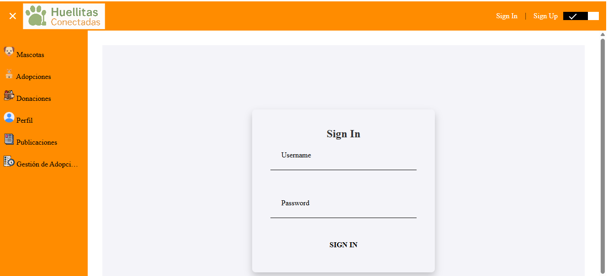
</p>
- Página de búsqueda de mascotas (mascotas.html): galería con tarjetas dinámicas de mascotas, filtros por características, y campo de búsqueda.
<p align="center">
    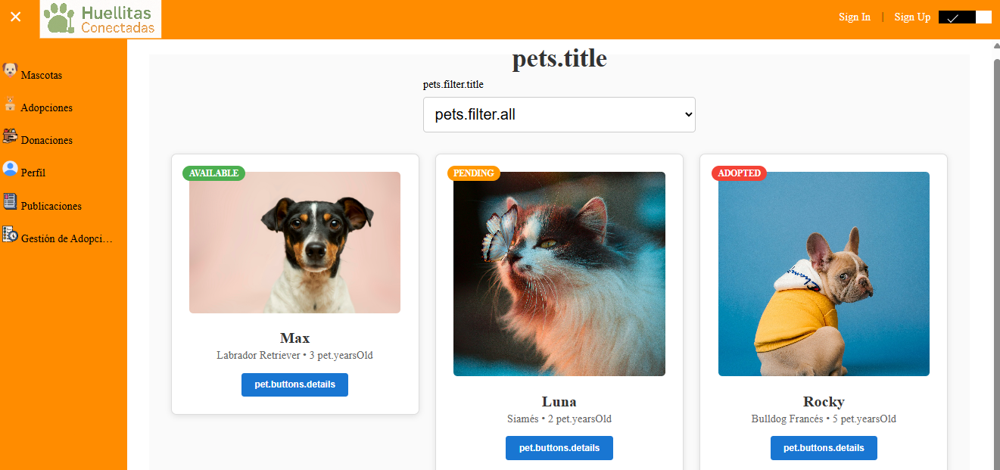
</p>
- Perfiles individuales de mascotas (guapisimo.html, luna.html, etc.): fichas con información detallada y botones de contacto:
<p align="center">
    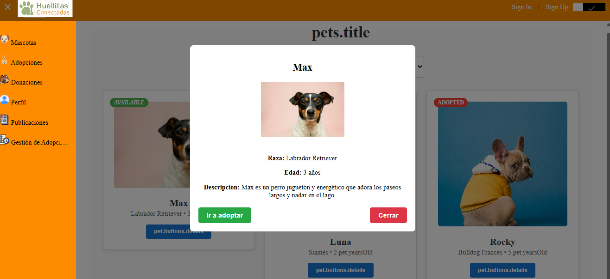
</p>


### 5.2.4. *Acuerdo de Servicio - SaaS*

El presente Acuerdo de Servicio establece las condiciones que regulan el acceso y la utilización de la plataforma Huellitas Conectadas, ofrecida bajo la modalidad de Software como Servicio (SaaS). Al registrarse, acceder o hacer uso de nuestros servicios, el usuario reconoce y acepta cumplir con los términos y condiciones aquí dispuestos.

### 1. Definiciones
- **Plataforma:** Hace referencia a la solución digital **Huellitas Conectadas** y sus funcionalidades.  
- **Usuarios:** Personas naturales o jurídicas que acceden a la plataforma en calidad de adoptantes, refugios o rescatistas.  
- **Servicios Gratuitos:** Funciones esenciales de adopción disponibles sin costo para todos los usuarios.  
- **Servicios de Pago:** Funciones premium que incluyen mayor visibilidad de mascotas, reportes detallados y otros beneficios.  
- **Aliados Comerciales:** Veterinarias, marcas o empresas asociadas que ofrezcan productos o servicios a través de la plataforma.  

### 2. Derechos del Usuario
- Acceder y utilizar las funcionalidades básicas de adopción sin costo.  
- Publicar, gestionar y solicitar adopciones conforme a las políticas de uso responsable.  
- Optar por servicios de pago adicionales para acceder a beneficios premium.  
- Recibir información clara y transparente sobre precios, condiciones y cambios en el servicio.  

### 3. Obligaciones del Usuario
- Brindar información veraz y actualizada en el registro y uso de la plataforma.  
- Respetar los principios de **adopción responsable** promovidos por Huellitas Conectadas.  
- No utilizar la plataforma para fines fraudulentos, comerciales no autorizados o actividades ilícitas.  
- Cumplir con las normativas de bienestar animal aplicables en el Perú.  

### 4. Derechos de Huellitas Conectadas
- Administrar, modificar o suspender servicios según lo requiera la evolución de la plataforma.  
- Establecer planes de monetización y actualizar precios de los servicios de pago, comunicándolo previamente a los usuarios.  
- Eliminar contenido que incumpla las políticas de uso o que afecte la seguridad, legalidad o bienestar animal.  
- Integrar alianzas con terceros para complementar la experiencia de los usuarios.  

### 5. Restricciones
- Queda prohibido manipular, copiar o distribuir sin autorización el software, diseño, marca o contenidos de la plataforma.  
- No se permite el uso de la plataforma para fines distintos a los relacionados con adopciones, rescates o bienestar animal.  
- Cualquier intento de vulnerar la seguridad o infraestructura de **Huellitas Conectadas** será motivo de suspensión inmediata y acciones legales.  

### 6. Responsabilidad y Garantías
- **Huellitas Conectadas** no garantiza la adopción efectiva de una mascota, ya que este proceso depende de la evaluación de refugios y rescatistas.  
- La plataforma actúa como un medio de conexión y no se hace responsable por acuerdos externos entre usuarios y terceros.  
- Los servicios se ofrecen “tal cual” (*as is*), sin garantías adicionales de disponibilidad absoluta o ausencia de errores.  

### 7. Modificaciones del Acuerdo
**Huellitas Conectadas** podrá actualizar este Acuerdo de Servicio en cualquier momento. Las modificaciones serán notificadas a los usuarios a través de la plataforma y entrarán en vigor en la fecha indicada.  

### 8. Legislación Aplicable
Este Acuerdo se rige por las leyes de la República del Perú. En caso de conflicto, las partes se someten a la jurisdicción de los tribunales competentes en la ciudad de Lima.  

---


### 5.2.5. *Implemented Native-Mobile Application Evidence*

<p align="center">
    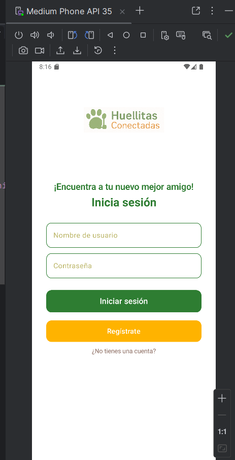
</p>

<p align="center">
    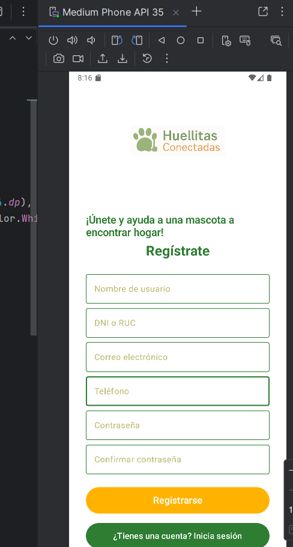
</p>

<p align="center">
    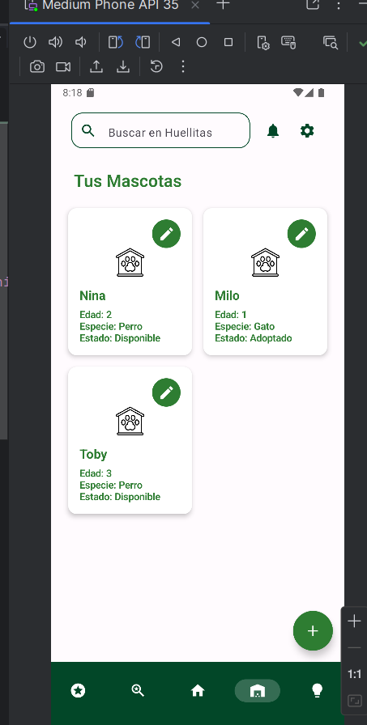
</p>

<p align="center">
    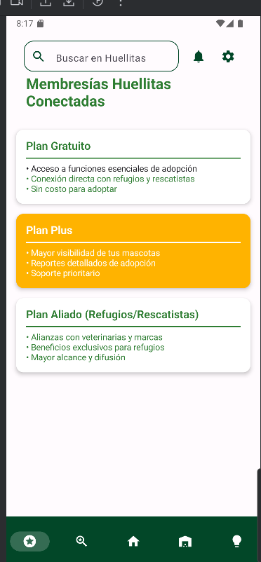
</p>


### 5.2.6. *Implemented RESTful API and/or Serverless Backend Evidence*

- Datos en bounded context Users
<p align="center">
    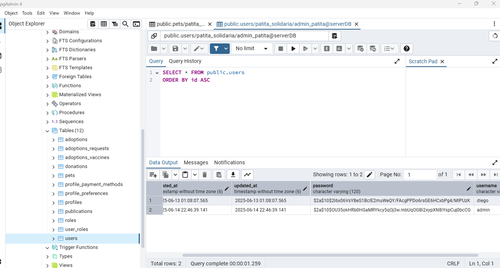
</p>

- Datos en bounded context Pets

<p align="center">
    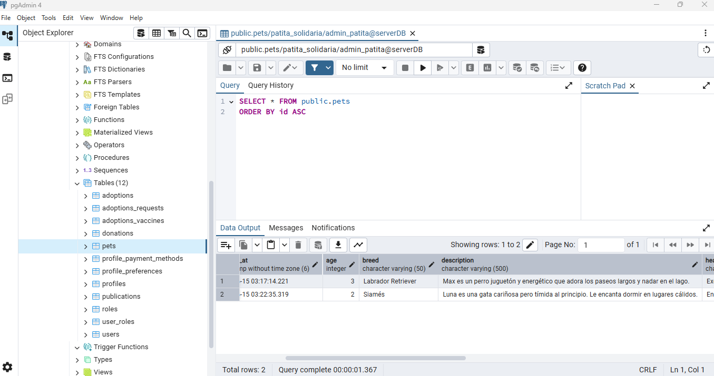
</p>

- Datos en bounded context Publications
<p align="center">
    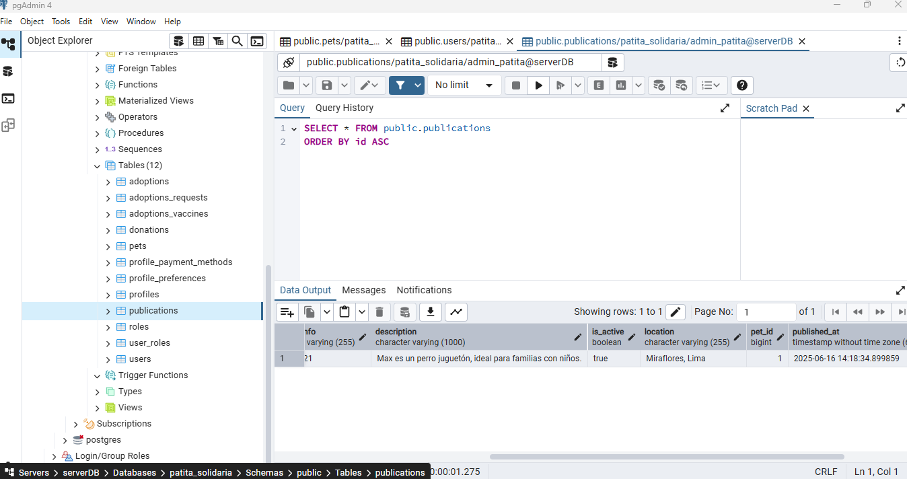
</p>

- Datos en bounded context Profiles

<p align="center">
    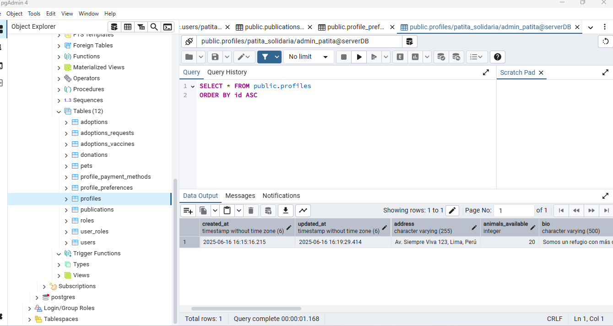
</p>

- Datos en bounded context Donations

<p align="center">
    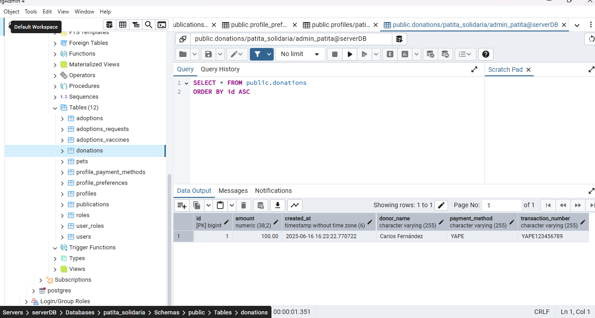
</p>

- Datos en bounded context Adoptions

<p align="center">
    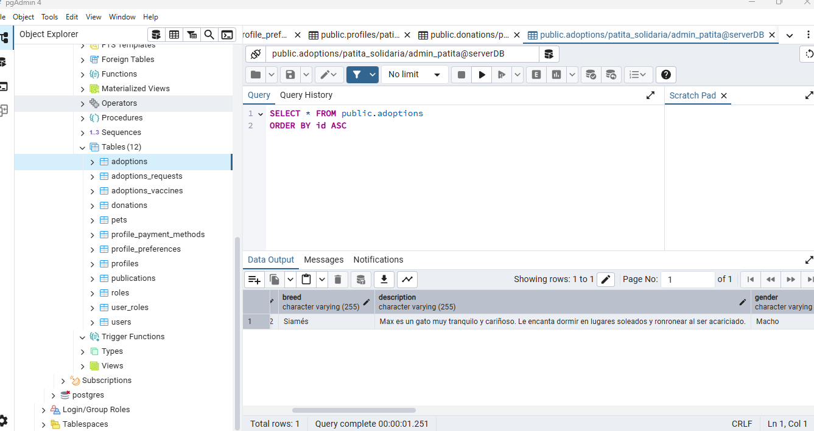
</p>

- Datos en bounded context Adoption Requests

<p align="center">
    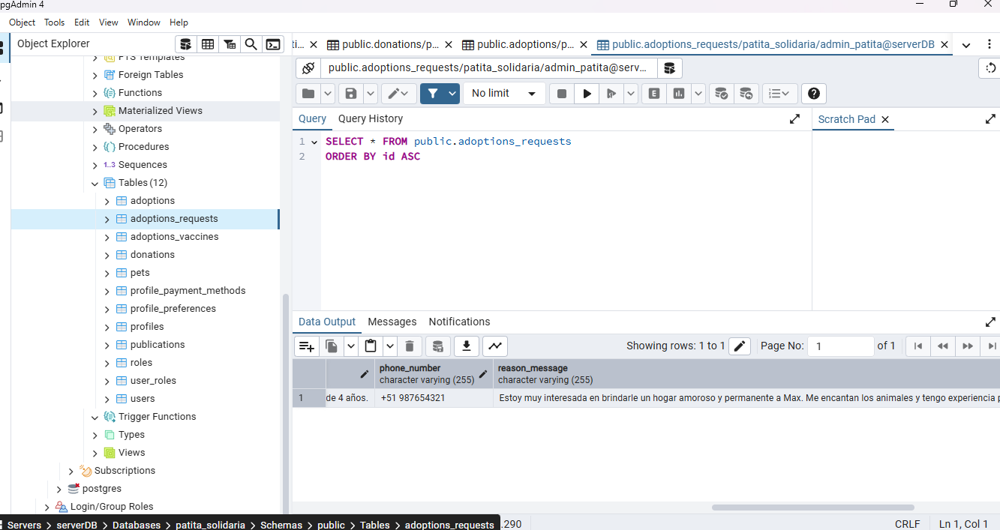
</p>


### 5.2.7. *RESTful API Documentation*

#### Bounded Contexts

- **Authentication** – Manejo de registros, inicio de sesión y autenticación JWT.
- **Profiles** – Gestión de perfiles (adoptantes, refugios, administradores).
- **Pets** – Registro y administración de mascotas disponibles para adopción.
- **Adoptions** – Gestión de adopciones, historial médico y vacunas.
- **Donations** – Registro de donaciones y métodos de pago.
- **Publications** – Publicaciones públicas de mascotas y contenido social.
- **Adoption Requests** – Solicitudes de adopción con seguimiento de estado.
- **Users** – Información general y roles del sistema.

#### 📡 API

Todos los endpoints están organizados siguiendo la convención RESTful bajo la ruta `/api/v1/` y están documentados según contexto.

#### ✅ Buenas Prácticas Aplicadas

- Uso de **Enums tipados** para valores restringidos.
- Colecciones embebidas con `@ElementCollection` en modelos.
- Separación clara de **entidades de dominio** y **DTOs**.
- Control de errores centralizado.
- **Mappers** para transformar entre recursos y entidades.
- Arquitectura lista para pruebas, integración y ampliación.

### 🐾 Authentication Bounded Context

**AuthenticationController**

| Tag            | HTTP Verbs | Endpoint                       | Summary       | Description                                   | OperationId |
|----------------|------------|--------------------------------|---------------|-----------------------------------------------|-------------|
| Authentication | POST       | /api/v1/authentication/sign-up | User Sign-Up  | Register a new user into the system           | SignUp      |
| Authentication | POST       | /api/v1/authentication/sign-in | User Sign-In  | Authenticate a user and return access token   | SignIn      |

---

### 🧑‍🤝‍🧑 Profiles Bounded Context

**ProfileController**

| Tag      | HTTP Verbs | Endpoint                     | Summary           | Description                           | OperationId    |
|----------|------------|------------------------------|-------------------|---------------------------------------|----------------|
| Profiles | GET        | /api/v1/profiles             | List profiles     | Retrieve all registered profiles      | GetAllProfiles |
| Profiles | POST       | /api/v1/profiles             | Create profile    | Register a new profile                | CreateProfile  |
| Profiles | GET        | /api/v1/profiles/{profileId} | Get profile by ID | Retrieve a profile by its ID          | GetProfileById |
| Profiles | PUT        | /api/v1/profiles/{profileId} | Update profile    | Update existing profile information   | UpdateProfile  |
| Profiles | DELETE     | /api/v1/profiles/{profileId} | Delete profile    | Remove a profile from the system      | DeleteProfile  |

---

### 🐶 Pets Bounded Context

**PetController**

| Tag   | HTTP Verbs | Endpoint             | Summary                | Description                                 | OperationId   |
|-------|------------|----------------------|------------------------|---------------------------------------------|---------------|
| Pets  | GET        | /api/v1/pets         | List all pets          | Retrieve all registered pets                | GetAllPets    |
| Pets  | POST       | /api/v1/pets         | Create a pet           | Register a new pet available for adoption   | CreatePet     |
| Pets  | GET        | /api/v1/pets/{petId} | Get pet by ID          | Retrieve pet details using its ID           | GetPetById    |
| Pets  | PUT        | /api/v1/pets/{petId} | Update pet information | Update details for a specific pet           | UpdatePet     |
| Pets  | DELETE     | /api/v1/pets/{petId} | Delete a pet           | Remove a pet from the system                | DeletePet     |

---

### 📢 Publications Bounded Context

**PublicationController**

| Tag          | HTTP Verbs | Endpoint                             | Summary               | Description                                | OperationId            |
|--------------|------------|--------------------------------------|-----------------------|--------------------------------------------|------------------------|
| Publications | GET        | /api/v1/publications                 | List publications     | Retrieve all pet publications              | GetAllPublications     |
| Publications | POST       | /api/v1/publications                 | Create publication    | Create a new publication for a pet         | CreatePublication      |
| Publications | GET        | /api/v1/publications/{publicationId} | Get publication by ID | Retrieve publication details               | GetPublicationById     |
| Publications | PUT        | /api/v1/publications/{publicationId} | Update publication    | Update existing publication                | UpdatePublication      |
| Publications | DELETE     | /api/v1/publications/{publicationId} | Delete publication    | Remove a publication from the system       | DeletePublication      |
| Publications | GET        | /api/v1/publications/pet/{petId}     | Get by pet ID         | Get all publications for a specific pet    | GetPublicationsByPetId |

---

### 🏠 Adoptions Bounded Context

**AdoptionController**

| Tag       | HTTP Verbs | Endpoint                          | Summary              | Description                                      | OperationId             |
|-----------|------------|-----------------------------------|----------------------|--------------------------------------------------|-------------------------|
| Adoptions | GET        | /api/adoptions                    | List all adoptions   | Get all adoption cases, optionally filtered      | GetAllAdoptions         |
| Adoptions | POST       | /api/adoptions                    | Create an adoption   | Register a new pet for adoption                  | CreateAdoption          |
| Adoptions | GET        | /api/adoptions/{id}               | Get adoption by ID   | Retrieve adoption record details                 | GetAdoptionById         |
| Adoptions | PUT        | /api/adoptions/{id}               | Update adoption      | Update existing adoption record                  | UpdateAdoption          |
| Adoptions | DELETE     | /api/adoptions/{id}               | Delete adoption      | Remove adoption record from the system           | DeleteAdoption          |
| Adoptions | PUT        | /api/adoptions/{id}/vaccines      | Update vaccination   | Update vaccination record for an adoption        | UpdateVaccinationRecord |
| Adoptions | GET        | /api/adoptions/by-vaccine         | Get by vaccine       | Retrieve adoptions filtered by vaccine name      | GetAdoptionsByVaccine   |

---

### 📩 Adoption Requests Bounded Context

**AdoptionRequestController**

| Tag              | HTTP Verbs | Endpoint                                  | Summary              | Description                                              | OperationId                  |
|------------------|------------|-------------------------------------------|----------------------|----------------------------------------------------------|------------------------------|
| AdoptionRequests | GET        | /api/adoption-requests                    | List requests        | Retrieve all adoption requests, optionally by status     | GetAllAdoptionRequests       |
| AdoptionRequests | POST       | /api/adoption-requests                    | Create request       | Submit a new adoption request                            | CreateAdoptionRequest        |
| AdoptionRequests | GET        | /api/adoption-requests/{id}              | Get request by ID    | Retrieve a specific adoption request by ID               | GetAdoptionRequestById       |
| AdoptionRequests | PUT        | /api/adoption-requests/{id}/status       | Update request status| Approve or reject an adoption request                    | UpdateAdoptionRequestStatus  |

---

### 💰 Donations Bounded Context

**DonationController**

| Tag       | HTTP Verbs | Endpoint                 | Summary         | Description                        | OperationId     |
|-----------|------------|--------------------------|-----------------|------------------------------------|-----------------|
| Donations | GET        | /api/v1/donations        | List donations  | Retrieve all donation records      | GetAllDonations |
| Donations | POST       | /api/v1/donations        | Create donation | Register a new donation            | CreateDonation  |
| Donations | PUT        | /api/v1/donations/{id}   | Update donation | Update existing donation details   | UpdateDonation  |
| Donations | DELETE     | /api/v1/donations/{id}   | Delete donation | Remove a donation from the system  | DeleteDonation  |

---

### 👥 Users Bounded Context

**UserController**

| Tag   | HTTP Verbs | Endpoint              | Summary         | Description                       | OperationId   |
|-------|------------|-----------------------|-----------------|-----------------------------------|---------------|
| Users | GET        | /api/v1/users         | List users      | Retrieve all system users         | GetAllUsers   |
| Users | GET        | /api/v1/users/{userId}| Get user by ID  | Retrieve user details by ID       | GetUserById   |

---

### 🔐 Roles Bounded Context

**RoleController**

| Tag   | HTTP Verbs | Endpoint           | Summary      | Description                        | OperationId   |
|-------|------------|--------------------|--------------|------------------------------------|---------------|
| Roles | GET        | /ap/v1/roles       | List roles   | Retrieve all available user roles  | GetAllRoles   |


### 5.2.8. *Team Collaboration Insights*
En esta primera entrega logramos avances significativos en el frontend, backend y la aplicación móvil, además de culminar el desarrollo de la Landing Page. El uso de GitHub como repositorio colaborativo permitió organizar el trabajo del equipo, registrar los commits de cada integrante y mantener un control claro de las contribuciones. Asimismo, las reuniones de coordinación facilitaron la resolución de dudas, la alineación de criterios y el aseguramiento de un resultado consistente y de calidad en esta etapa inicial.

<p align="center">
    
</p>

<p align="center">
    
</p>

<p align="center">
    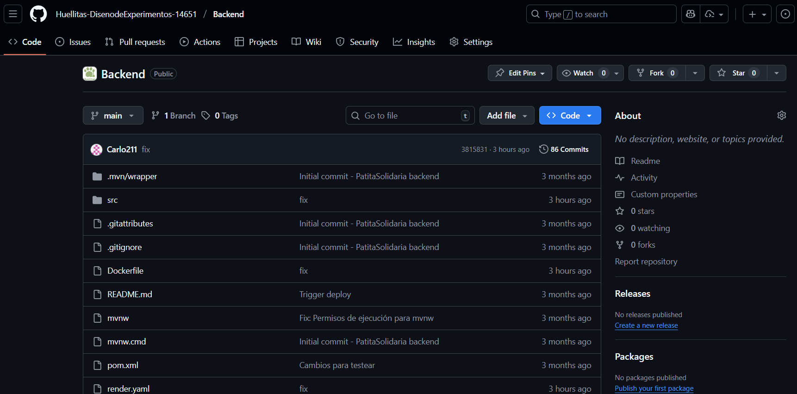
</p>

<p align="center">
    
</p>

<p align="center">
    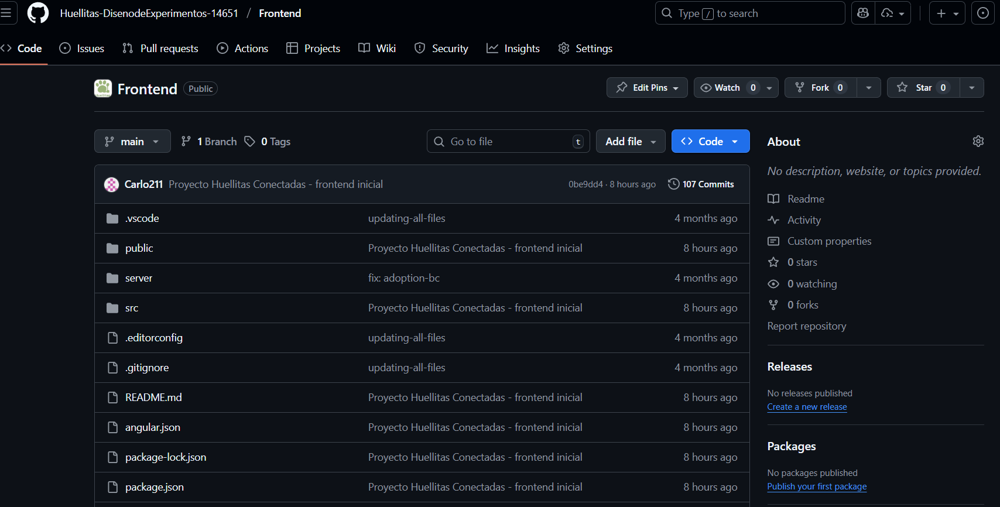
</p>

# Capítulo VI: *Product Verification & Validation*
## 6.1. *Testing Suites & Validation*
### 6.1.1. *Core Entities Unit Tests*
Para garantizar la fiabilidad de las entidades principales del sistema, se implementaron pruebas unitarias enfocadas en validar su comportamiento interno y consistencia de datos. Estas pruebas aseguran que los atributos, métodos y reglas de negocio básicas funcionen correctamente antes de integrarse con otros módulos.  

<p align="center">
    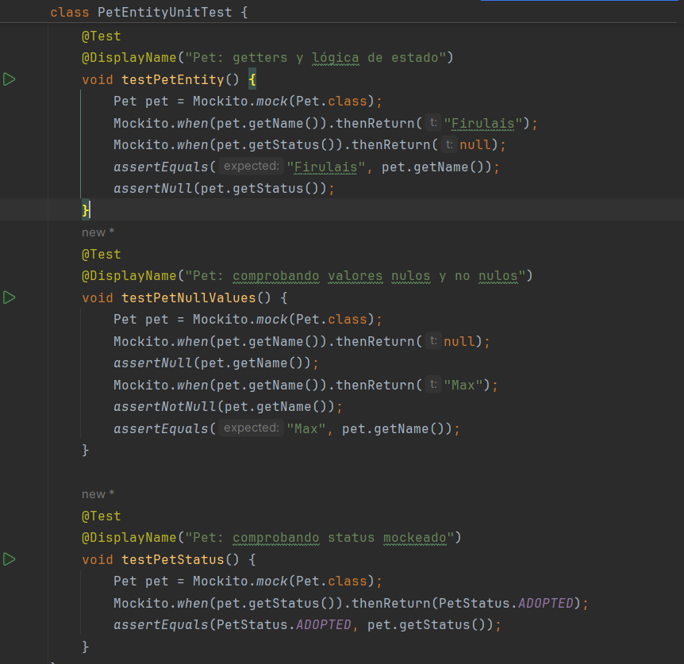
</p>

<p align="center">
    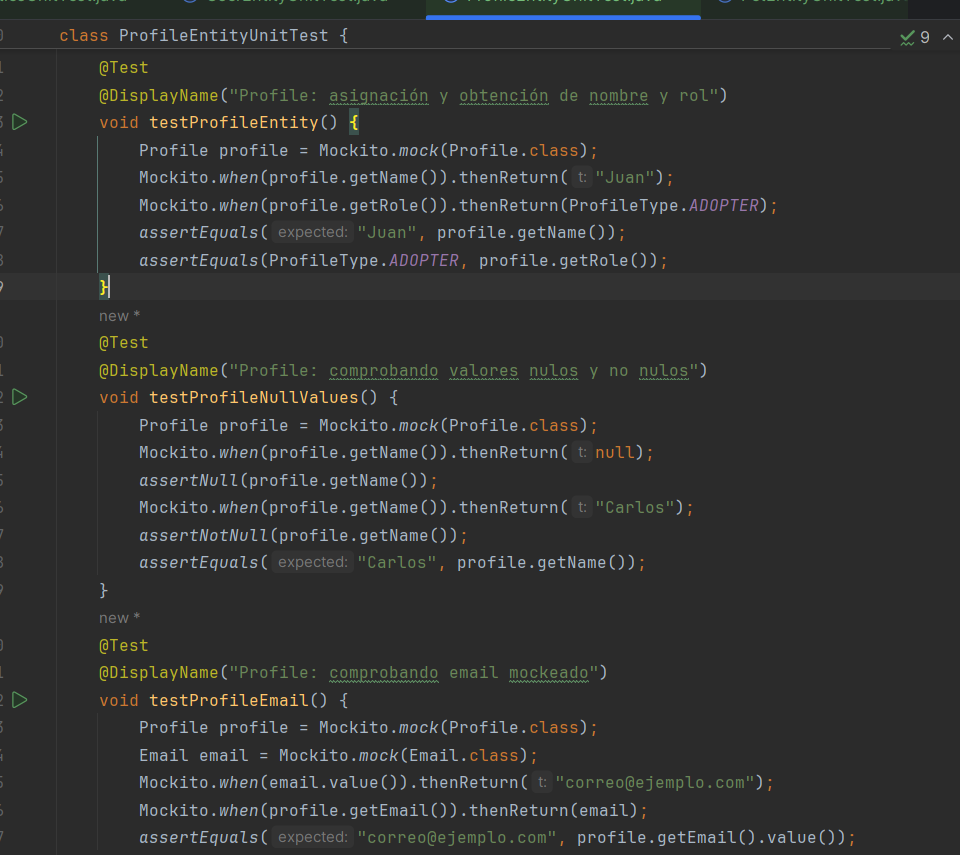
</p>

<p align="center">
    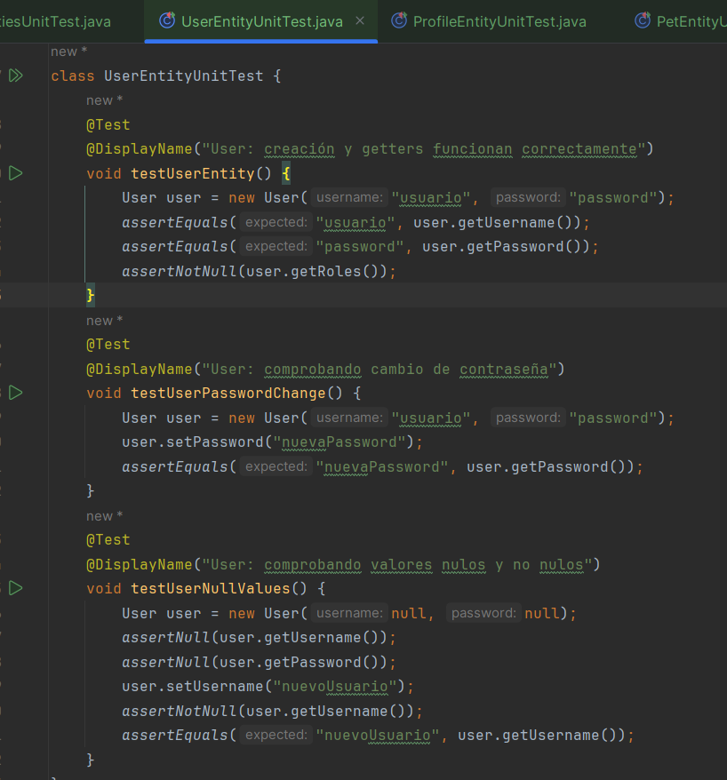
</p>

Estas pruebas unitarias verifican el comportamiento básico de las entidades principales del sistema: `User`, `Profile` y `Pet`.  
Se enfocan en comprobar que los atributos y métodos esenciales funcionen correctamente, incluyendo la creación de objetos, asignación y recuperación de valores, y validación de estados.  

A través de **JUnit 5** y **Mockito**, se aislaron las dependencias para asegurar que cada entidad opere de forma independiente y coherente.  
De esta manera, se garantiza que la lógica del dominio sea estable y confiable antes de avanzar a etapas de integración y validación más amplias.

### 6.1.2. *Core Integration Tests*
Para asegurar el correcto funcionamiento conjunto de los distintos módulos del sistema, se implementaron pruebas de integración centradas en verificar la comunicación entre componentes, repositorios y servicios. Estas pruebas permiten validar que el flujo de datos entre capas sea coherente y que la configuración del entorno de aplicación funcione correctamente antes del despliegue final.  


<p align="center">
    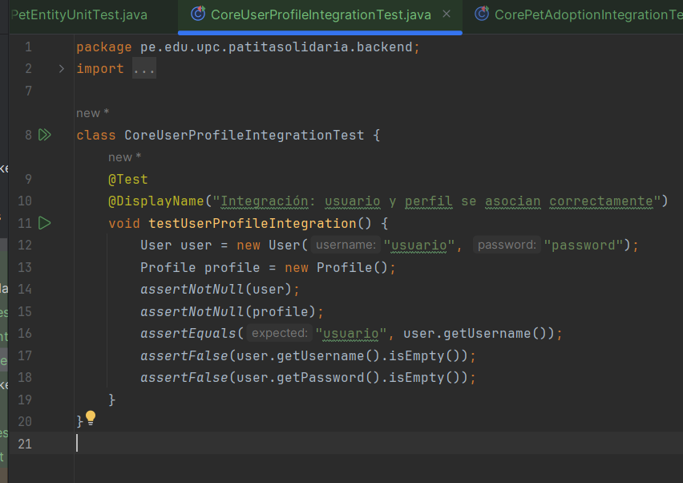
</p>


<p align="center">
    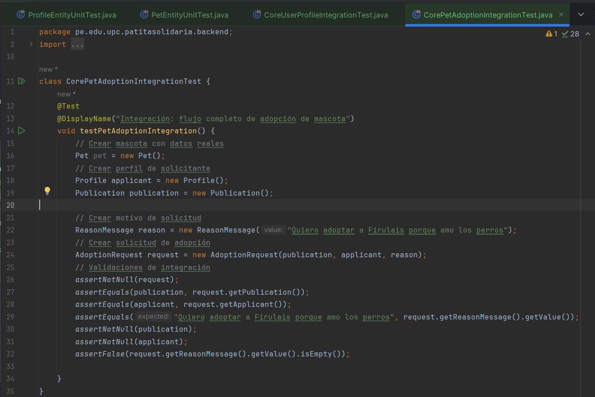
</p>

Estas pruebas de integración se enfocan en validar la correcta interacción entre las entidades principales del sistema, asegurando que los flujos entre módulos funcionen de forma coherente. Se evaluó el proceso completo de adopción de mascotas, verificando la relación entre publicaciones, perfiles y solicitudes, así como la asociación entre usuarios y perfiles dentro del dominio. Con ello, se garantiza que los componentes trabajen de manera integrada y mantengan la consistencia de los datos en los casos de uso reales.  


### 6.1.3. *Core Behavior-Driven Development*
Con el objetivo de validar el comportamiento funcional del sistema desde la perspectiva del usuario final, se desarrolló un escenario de prueba bajo el enfoque Behavior-Driven Development (BDD), utilizando la sintaxis Gherkin e implementación con Cucumber.

La funcionalidad evaluada corresponde al flujo de búsqueda de mascotas desde la perspectiva de un adoptante, incluyendo tanto el caso exitoso de búsqueda por filtros como el caso en el que no se encuentran resultados.

#### Feature: Buscar Mascotas

**Como adoptante**,  
**quiero** buscar mascotas por filtros,  
**para** encontrar una adecuada.

#### Scenario 1: Filtro de búsqueda exitoso
Given que el usuario accede a la sección de búsqueda  
When aplica los filtros  
Then se muestran mascotas que cumplen con los criterios seleccionados
##### Scenario 2: No se encuentran resultados
Given que el usuario aplica filtros muy específicos  
When presiona "Buscar"  
Then el sistema muestra un mensaje indicando que no se encontraron resultados

#### Evidencia de Ejecución
- Los escenarios del feature se ejecutaron correctamente.  
- Todas las pruebas pasaron sin errores.  
- Se ejecutaron **2 pruebas** del feature y **3 en total**, incluyendo el test del contexto **Spring Boot**.  
- **BUILD SUCCESS**, confirmando la correcta integración entre **Cucumber**, **JUnit Platform** y el **runner del proyecto**.

#### Herramientas y Artefactos
- **Gherkin / Cucumber:** Definición y ejecución de escenarios (`buscar_mascotas.feature`)  
- **Step Definitions:** Implementadas en Java (`BuscarMascotasStepDefinitions.java`)  
- **Runner:** Configurado con JUnit Platform (`CucumberTest.java`)  
- **Dependencias:** Integradas en `pom.xml` para compatibilidad entre Cucumber y JUnit Platform.

<p align="center">
    
</p>

#### Ejecutar solo el feature
.\mvnw.cmd -Dtest=CucumberTest test

#### Ejecutar toda la suite de pruebas
.\mvnw.cmd clean test

<p align="center">
    
</p>

### 6.1.4. *Core System Tests*

Para evaluar el rendimiento general y la optimización del sistema desde la perspectiva del usuario final, se realizaron pruebas utilizando Google PageSpeed Insights sobre la aplicación web desplegada (frontend).
Estas pruebas permitieron medir métricas clave de desempeño como Performance, Accessibility, Best Practices y SEO, verificando así la eficiencia del tiempo de carga, la usabilidad y la correcta implementación de estándares web.

<p align="center">
    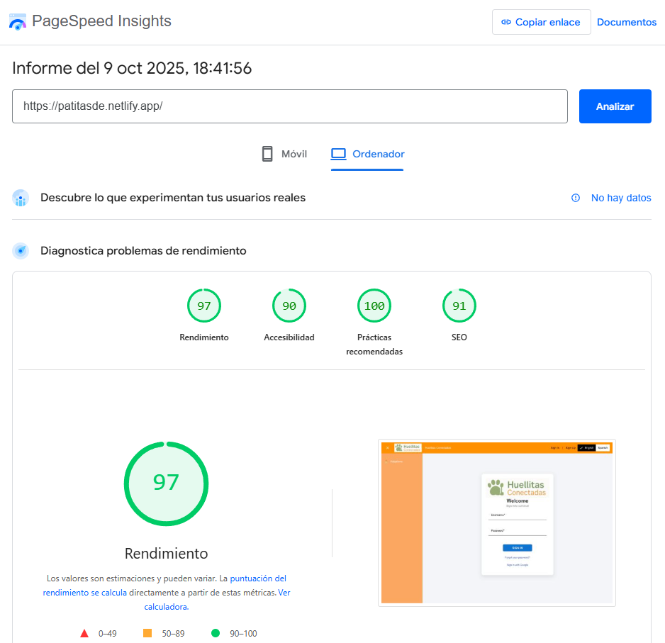
</p>

<p align="center">
    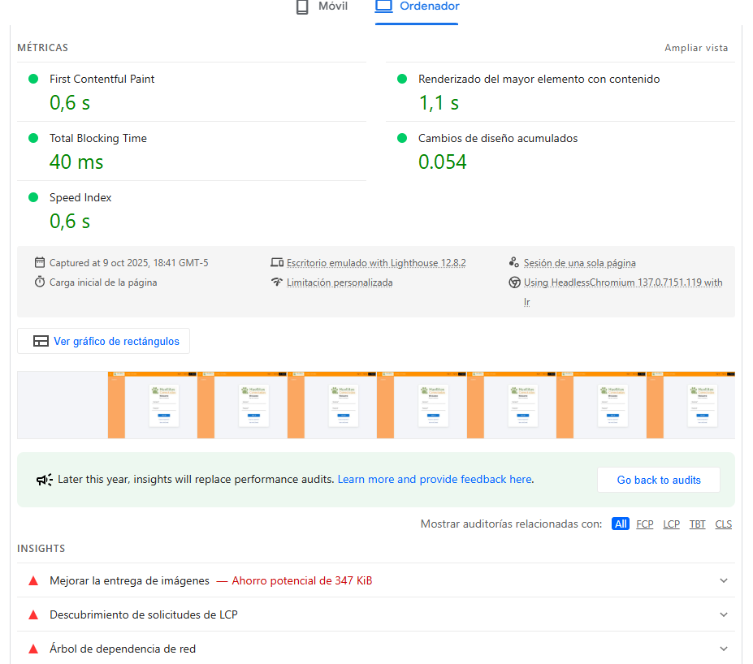
</p>

<p align="center">
    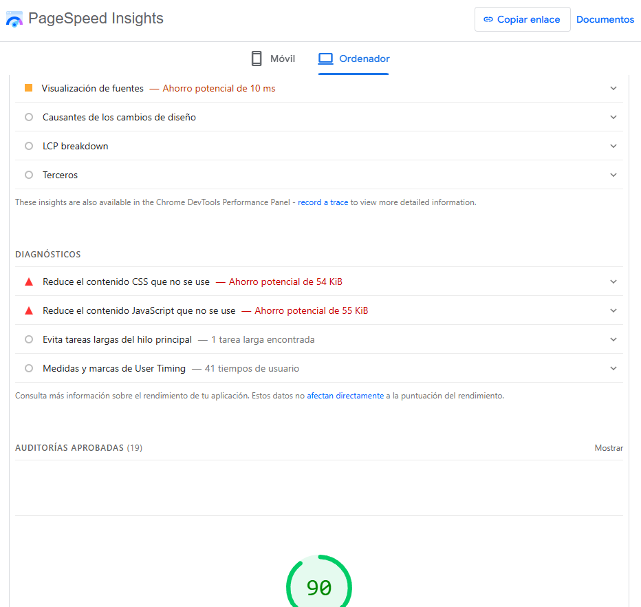
</p>

<p align="center">
    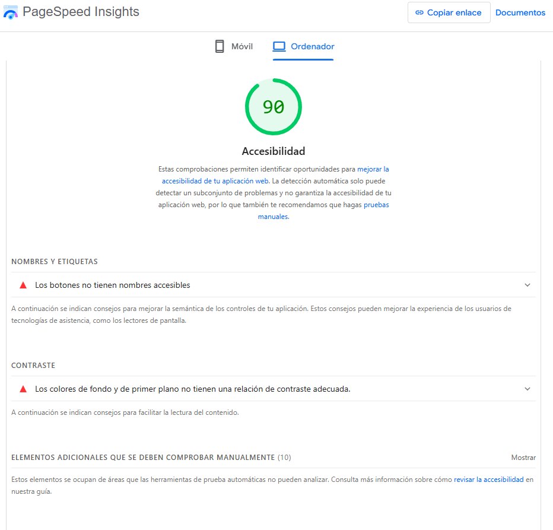
</p>

<p align="center">
    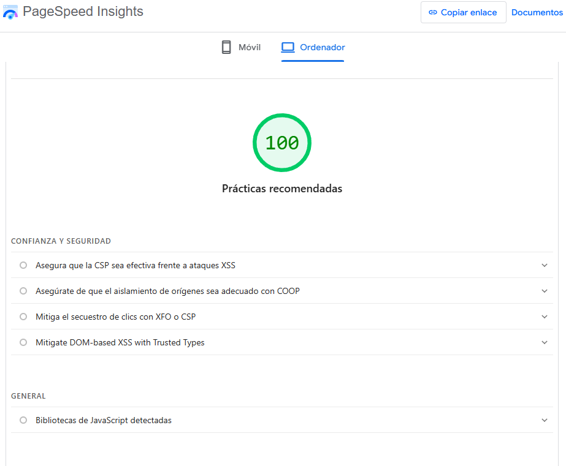
</p>

<p align="center">
    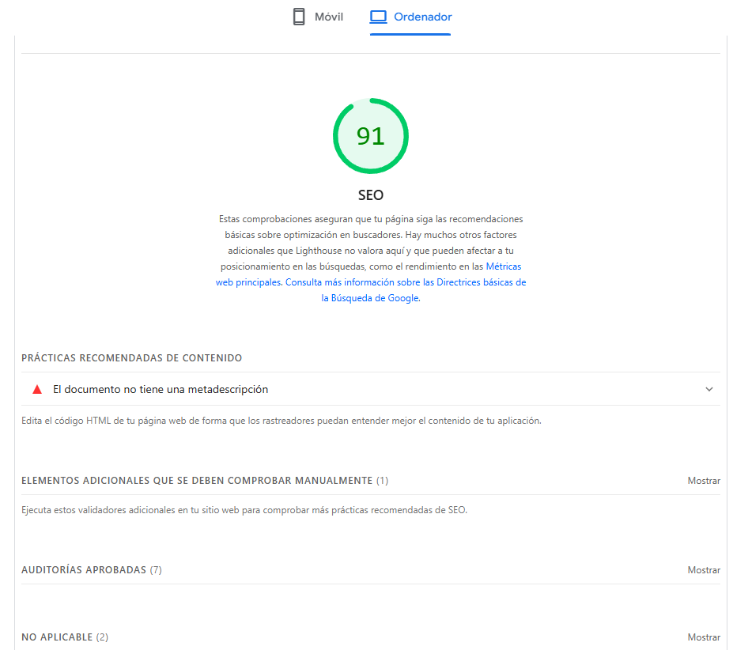
</p>

## 6.2. *Static testing & Verification*
### 6.2.1. *Static Code Analysis*
#### 6.2.1.1. *Coding standard & Code conventions*
Para garantizar la coherencia, legibilidad y mantenibilidad del código, se establecieron estándares de codificación alineados con las mejores prácticas de la industria. Estos estándares facilitan la colaboración del equipo, reducen errores y aseguran un desarrollo escalable y profesional a lo largo de todo el ciclo de vida del proyecto.

**Backend:**

El backend sigue convenciones de nomenclatura consistentes para facilitar la comprensión del código. Utilizando las siguientes reglas:
- **Nomenclatura:** PascalCase para clases (`UserController`, `AdoptionService`), camelCase para métodos y variables (`getUserById`, `petId`), UPPER_SNAKE_CASE para constantes (`MAX_PETS_PER_SHELTER`), y lowercase para paquetes (`com.huellitas.backend.profiles`).
- **Estructura de Bounded Contexts:** El proyecto está organizado bajo `src/main/java/com/huellitas/backend/`, con módulos diferenciados por dominio: authentication, profiles, pets, adoptions, donations, publications y shared. Esta estructura facilita el mantenimiento y la comprensión del sistema al separar responsabilidades claramente definidas.
- **Convenciones específicas:** Se utilizan anotaciones JPA estándar (`@Entity`, `@Table`, `@Id`) para las entidades de dominio. Existe una separación clara entre entidades y DTOs (Data Transfer Objects) para evitar acoplamientos innecesarios. Se emplea ModelMapper para transformar objetos entre capas, manteniendo la lógica de negocio aislada. Los repositorios extienden `JpaRepository`, las interfaces de servicios llevan el sufijo `Service`, y los controladores REST están anotados con `@RestController` bajo la ruta base `/api/v1/`.
- **Base de datos (PostgreSQL):** Las tablas se nombran en snake_case plural (`adoption_requests`, `medical_histories`), las columnas en snake_case (`created_at`, `pet_id`), las claves primarias siguen el patrón `tabla_id`, y las claves foráneas como `tabla_referenciada_id`. Esta convención facilita la lectura y el mantenimiento de las consultas SQL, además de mantener consistencia con las prácticas estándar de bases de datos relacionales.

**Frontend:**

Nos enfocamos en mantener un estilo coherente para asegurar una experiencia de usuario accesible:
- **HTML:** Se emplean elementos en lowercase, etiquetas correctamente cerradas y atributos en lowercase con valores entre comillas dobles. Las imágenes incluyen siempre los atributos `alt`, `width` y `height` para mejorar la accesibilidad y optimizar el SEO, garantizando que el contenido sea comprensible para usuarios con diferentes capacidades.
- **CSS:** Las clases e IDs se nombran en kebab-case (`.pet-card`, `#user-profile`), se prefieren propiedades abreviadas cuando sea posible para reducir código, las declaraciones siguen un orden alfabético para facilitar la lectura y el mantenimiento, y se omiten las unidades después del valor 0 para mantener un código más limpio y eficiente.
- **JavaScript:** Se usa `let` y `const` en lugar de `var` para una mejor gestión del scope y evitar problemas de hoisting. Los nombres de funciones siguen camelCase (`getUserProfile()`) para mantener consistencia con otras convenciones del lenguaje, y se aplica una sintaxis expandida con llaves de apertura en la misma línea de la declaración para mantener consistencia visual y legibilidad del código.
- **API RESTful:** Todos los endpoints siguen la estructura `/api/v1/` para versionado claro, los recursos se nombran en plural (`/api/v1/pets`, `/api/v1/adoptions`) siguiendo convenciones REST, los parámetros de ruta usan el formato `{resourceId}` (ejemplo: `/api/v1/pets/{petId}`), se utilizan los verbos HTTP estándar (GET, POST, PUT, DELETE) según la operación a realizar, y los códigos de respuesta son consistentes (200 OK para operaciones exitosas, 201 Created para recursos creados, 400 Bad Request para datos inválidos, 401 Unauthorized cuando se requiere autenticación, 404 Not Found para recursos no encontrados, y 500 Internal Server Error para errores del servidor).

**Control de versiones (Git):**

Se adoptó la metodología **Conventional Commits** para mantener un historial claro y consistente del proyecto, siguiendo el formato `<type>[optional scope]: <title>`. Los tipos de commit incluyen:
- `feat:` para nueva funcionalidad o características agregadas al sistema
- `fix:` para corrección de bugs o problemas identificados
- `docs:` para cambios en documentación o comentarios del código
- `style:` para formato de código sin cambios funcionales (espaciado, indentación)
- `refactor:` para refactorización de código que mejora su estructura sin cambiar funcionalidad
- `test:` para adición o modificación de pruebas unitarias o de integración
- `chore:` para tareas de mantenimiento del proyecto (actualización de dependencias, configuraciones)

**Herramientas de verificación:**

Para asegurar la calidad del código se emplean las siguientes herramientas especializadas:
- **Backend:** SonarQube realiza análisis estático del código Java, identificando vulnerabilidades de seguridad, code smells (malas prácticas) y áreas de mejora en cuanto a complejidad ciclomática y duplicación de código.
- **Frontend:** ESLint y Prettier validan y formatean automáticamente el código JavaScript y CSS, asegurando consistencia en el estilo y detectando posibles errores antes de la ejecución en navegadores.
- **Base de datos:** pgAdmin se utiliza para la validación y administración de los esquemas de PostgreSQL, permitiendo visualizar la estructura de tablas, relaciones y ejecutar consultas de prueba.
- **API:** Postman y Swagger se emplean para documentar, probar y validar los endpoints REST, facilitando la colaboración entre equipos de frontend y backend al proporcionar especificaciones claras de los contratos de API.

#### 6.2.1.2. *Code Quality & Code Security*
Para mantener el código seguro, se integraron validaciones automáticas en el pipeline y prácticas específicas en backend, frontend y base de datos. En cada Pull Request, el pipeline ejecuta: compilación y pruebas (Maven/JUnit 5), escenarios BDD (Cucumber), análisis estático y linters del frontend; los merges se bloquean si alguna verificación falla o si la cobertura cae bajo el umbral acordado.

- Reglas de calidad:
  - build: mvn -B clean verify con reporte de cobertura; umbral mínimo de cobertura y baja duplicación de código.
  - análisis estático: detección de complejidad, duplicación y malas prácticas; issues críticas deben resolverse antes de merge.
  - dependencias: escaneo de CVEs en cada release; no se permite publicar con vulnerabilidades altas; versiones fijadas (sin rangos abiertos).

- Controles de seguridad (backend Spring Boot):
  - autenticación y autorización con JWT de expiración corta y roles por endpoint; CORS restringido por origen y métodos.
  - contraseñas con BCrypt; secretos en variables de entorno; application-*.properties reales fuera del repositorio (.gitignore).
  - validación de entrada con Bean Validation (@Valid) en controladores; manejo centralizado de errores sin filtrar stack traces.
  - acceso a datos con JPA usando parámetros (sin concatenaciones); evitar N+1 con fetch joins cuando corresponda.
  - cabeceras de seguridad: HSTS, X-Content-Type-Options, X-Frame-Options y no-cache en respuestas sensibles.

- Frontend:
  - ESLint/Prettier en commit; prohibido eval/innerHTML sin sanitización; validación de formularios en cliente y servidor.
  - políticas de contenido (CSP) y SRI en recursos estáticos cuando aplique.

- Base de datos:
  - migraciones controladas (Flyway/Liquibase); esquema con constraints NOT NULL, FK y UNIQUE.
  - principio de mínimo privilegio para cuentas de aplicación; no exponer datos sensibles en logs o dumps.

- Revisión y evidencias:
  - PR checklist: pruebas actualizadas, amenazas consideradas, manejo de errores y sanitización verificados.
  - se publican reportes de pruebas y cobertura en el pipeline; se registra el resultado del escaneo de dependencias por release.
  - monitoreo post-despliegue con logs estructurados (intentos fallidos de login, accesos 401/403, patrones anómalos) y alertas.

### 6.2.2. *Reviews*
Se aplicó un proceso sistemático de revisiones estáticas al finalizar cada sprint y antes de merges relevantes para asegurar legibilidad, consistencia arquitectónica, seguridad y alineación con requisitos.

Tipos:
- Code Review: convenciones, ausencia de duplicación, manejo de excepciones.
- Architecture Review: separación por bounded contexts, capas (controller–service–repository), uso de patrones (DTO, Mapper, Factory, Strategy, State, Observer).
- Security/Data Review: sanitización, consultas parametrizadas, JWT, cabeceras, naming y constraints (FK, NOT NULL, UNIQUE).
- API Contract Review: rutas (/api/v1/), pluralización, códigos HTTP, mensajes de error uniformes.
- UX/UI Review: contraste, jerarquía visual, alt en imágenes.
- Performance Pre-Check: detección de N+1, bucles costosos, uso adecuado de LAZY/EAGER.
- Test Coverage Review: presencia mínima de pruebas en entidades y servicios críticos.
- Release Readiness: build limpio, escaneo dependencias, documentación actualizada.

Checklist resumido:
1. Sin métodos sobre el umbral interno de complejidad.
2. Sin TODO sin issue asociado.
3. Excepciones sin stack trace expuesto.
4. Sin secretos en commits.
5. Endpoint nuevo con prueba (happy path).
6. Mapper sin lógica de negocio.
7. Entidades solo con anotaciones JPA/validación.
8. DTO sin datos sensibles.
9. Error response estándar (timestamp, status, message, path).
10. Formularios con validaciones mínimas.

Hallazgos clave y acciones:
- Duplicación en construcción de respuestas → extracción a utilidades.
- Mensajes de error no uniformes → handler global centralizado.
- Falta de @Valid en dos endpoints → agregado y validación de BindingResult.
- Concatenación en logs → reemplazo por placeholders.
- Imágenes sin alt → corrección para accesibilidad.
- Ausencia de prueba de rechazo en solicitudes de adopción → prueba agregada.

Flujo:
Commit → PR (build + linters) → Checklist → Ajustes → Aprobación → Merge → Tag (si release).

Beneficios:
Menor retrabajo, mayor consistencia del API, reducción de riesgos de seguridad y base sólida para evolución.

## 6.3. *Validation Interviews*
### 6.3.1. *Diseño de Entrevistas*

#### Preguntas para Adoptantes

##### 1) Diseño general y navegación
1. ¿Desde la pantalla principal supiste claramente a dónde ir?
2. ¿Te perdiste navegando entre secciones? ¿En cuáles?
3. ¿Los íconos y botones resultaron intuitivos? ¿Cuál no entendiste?
4. ¿Qué botón o función agregarías para mejorar la experiencia?

##### 2) Sección de Mascotas
1. ¿Identificaste de inmediato que es la sección para ver mascotas en adopción?
2. ¿La información por mascota (nombre, edad, estado, etc.) es clara y suficiente?
3. ¿Fue fácil filtrar o buscar por tipo, tamaño, edad u otra característica?
4. ¿Qué cambiarías en la forma de presentar las tarjetas/listado?

##### 3) Proceso de Adopción
1. ¿Entendiste el propósito de la sección de adopciones?
2. ¿Te quedan claros los pasos a seguir para adoptar?
3. ¿Los pasos para enviar una solicitud te parecieron comprensibles?

##### 4) Donaciones
1. ¿Identificaste con facilidad la sección de donaciones?
2. ¿El diseño transmite confianza para realizar una donación?
3. ¿Qué te motivaría a donar con más frecuencia o recomendarlo?
4. ¿Qué mejorarías visual o funcionalmente?

##### 5) Seguridad, confianza y opinión general
1. ¿Confías en la plataforma para adoptar o donar? ¿Por qué?
2. ¿Qué elementos adicionales te harían sentir más seguro/a (p. ej., sellos, políticas, reseñas)?
3. ¿Qué parte te pareció más clara y cuál más confusa?
4. ¿Hubo algo innecesario o difícil de entender?
5. ¿Qué tan fácil fue moverte entre las secciones?

##### 6) Recomendación e interés futuro
1. ¿Recomendarías la aplicación a otras personas interesadas en adoptar o apoyar refugios?
2. ¿Qué falta para que sea más útil para alguien como tú?

---

#### Preguntas para Refugios / Cuidadores

##### 1) Diseño y navegación
1. ¿Cómo describirías el diseño y la distribución de elementos? ¿Es clara?
2. ¿Identificaste fácilmente qué secciones están pensadas para tu rol?
3. ¿Cambiarías la ubicación o el nombre de algún botón o sección?

##### 2) Publicaciones
1. ¿Fue simple encontrar cómo publicar una nueva mascota?
2. ¿La plantilla de publicación (datos, fotos, historial) te pareció completa?
3. ¿Qué mejorarías en el flujo o diseño de esta parte?

##### 3) Gestión de Adopciones
1. ¿Contaste con la información y controles necesarios para estados (pendiente, aceptada, rechazada)?
2. ¿Fue fácil filtrar o buscar solicitudes por estado u otros criterios?
3. ¿Qué cambios harías para que la gestión sea más eficiente?

##### 4) Percepción general y funcionalidades
1. ¿Qué parte del diseño consideras mejor lograda?
2. ¿Qué agregarías para facilitar tu labor (p. ej., recordatorios, plantillas, reportes)?
3. ¿Pudiste moverte por la plataforma sin perderte? ¿Qué sección te resultó más útil?
4. ¿Falta alguna función clave para tu día a día?

##### 5) Impacto e implementación
1. ¿Esta app podría facilitar la gestión del refugio? ¿En qué procesos?
2. ¿Qué barreras ves para su uso constante por cuidadores o refugios?
3. ¿La recomendarías a otros cuidadores o centros de adopción? ¿Por qué?

### 6.3.2. *Registro de Entrevistas*

<div align="justify">

**Segmento Objetivo #1: Personal de Refugios y Rescatistas de Animales (Administradores, Cuidadores y Voluntarios)**
<table>
<colgroup>
</colgroup>
<thead>
  <tr>
    <th colspan="2"><div align="center">Entrevista #1<br></div></th>
  </tr>
</thead>
<tbody>
  <tr>
    <td>Nombre</td>
    <td>Jhon</td>
  </tr>
  <tr>
    <td>Apellidos</td>
    <td>Pinto</td>
  </tr>
  <tr>
    <td>Edad</td>
    <td>22 años</td>
  </tr>
  <tr>
    <td>Distrito</td>
    <td>Ate</td>
  </tr>
  <tr>
    <td>Tecnologías</td>
    <td>Celular, laptop</td>
  </tr>

  <tr>
    <td>Entrevistador</td>
    <td>Christian Espinoza</td>
  </tr>
  <tr>
    <td>Evidencia</td>
    <td><div align="center"></div></td>
  </tr>
  <tr>
    <td>Link</td>
    <td><p><a target="_blank" href="https://upcedupe-my.sharepoint.com/:v:/g/personal/u202213208_upc_edu_pe/IQAlChXr5pf3Ta4YAdoYcb9xAQQ6OutlLV0lJu6tHeb5gw8?nav=eyJyZWZlcnJhbEluZm8iOnsicmVmZXJyYWxBcHAiOiJTdHJlYW1XZWJBcHAiLCJyZWZlcnJhbFZpZXciOiJTaGFyZURpYWxvZy1MaW5rIiwicmVmZXJyYWxBcHBQbGF0Zm9ybSI6IldlYiIsInJlZmVycmFsTW9kZSI6InZpZXcifX0%3D&e=FTeQdu" title="Title">https://upcedupe-my.sharepoint.com/:v:/g/personal/u202213208_upc_edu_pe/IQAlChXr5pf3Ta4YAdoYcb9xAQQ6OutlLV0lJu6tHeb5gw8?nav=eyJyZWZlcnJhbEluZm8iOnsicmVmZXJyYWxBcHAiOiJTdHJlYW1XZWJBcHAiLCJyZWZlcnJhbFZpZXciOiJTaGFyZURpYWxvZy1MaW5rIiwicmVmZXJyYWxBcHBQbGF0Zm9ybSI6IldlYiIsInJlZmVycmFsTW9kZSI6InZpZXcifX0%3D&e=FTeQdu</a></p></td> 
  </tr>
  <tr>
    <td>Duración<br></td>
    <td>7:09 min</td>
  </tr>
  <tr>
    <td>Resumen</td>
    <td style="text-align: justify;">
    Jhon Pinto, rescatista independiente, valora una plataforma que priorice la transparencia y el bienestar animal. Aunque encuentra la navegación clara, necesita información más completa: historial médico, estado de vacunación/esterilización y comportamiento. También requiere filtros más visibles por especie, un proceso de adopción con pasos claros de validación y seguimiento post-adopción, y reportes transparentes en donaciones. Considera útil la app para buscar y difundir, pero solo confiaría plenamente si garantiza trazabilidad y compromiso del adoptante.</td>
  </tr>
</tbody>
</table>

<br/>

<table>
<colgroup>
</colgroup>
<thead>
  <tr>
    <th colspan="2"><div align="center">Entrevista #2<br></div></th>
  </tr>
</thead>
<tbody>
  <tr>
    <td>Nombre</td>
    <td>Camila</td>
  </tr>
  <tr>
    <td>Apellidos</td>
    <td>Paredes</td>
  </tr>
  <tr>
    <td>Edad</td>
    <td>21 años</td>
  </tr>
  <tr>
    <td>Distrito</td>
    <td>San Juan de Lurigancho</td>
  </tr>
  <tr>
    <td>Tecnologías</td>
    <td>Celular, laptop</td>
  </tr>
  <tr>
    <td>Entrevistador</td>
    <td>Harrison Payesa</td>
  </tr>
  <tr>
    <td>Evidencia</td>
    <td><div align="center"></div></td>
  </tr>
  <tr>
    <td>Link</td>
    <td><p><a target="_blank" href="https://upcedupe-my.sharepoint.com/:v:/g/personal/u202221024_upc_edu_pe/EdTBapRNLA1AqA5Q4qIUHlwBOpdAERrRh4iirG3ggYEcGw?nav=eyJyZWZlcnJhbEluZm8iOnsicmVmZXJyYWxBcHAiOiJPbmVEcml2ZUZvckJ1c2luZXNzIiwicmVmZXJyYWxBcHBQbGF0Zm9ybSI6IldlYiIsInJlZmVycmFsTW9kZSI6InZpZXciLCJyZWZlcnJhbFZpZXciOiJNeUZpbGVzTGlua0NvcHkifX0&e=Jddj0T" title="Title">Ver Entrevista</a></p></td>
  </tr>
  <tr>
    <td>Duración<br></td>
    <td>4:00</td>
  </tr>
  <tr>
    <td>Resumen</td>
    <td style="text-align: justify;">
    Camila Paredes, estudiante con experiencia en adopción, encontró la plataforma "Huellitas Conectadas" con una navegación muy intuitiva, pero su principal preocupación es la falta de información clara sobre la salud de las mascotas; específicamente, exige que la plataforma indique de forma visible si el animal está vacunado y esterilizado. Además, para evitar su frustración con la burocracia, necesita que la plataforma detalle los pasos del proceso de adopción y los requisitos antes de iniciar la solicitud, sugiriendo agregar un chat directo para comunicación rápida y un sistema de seguimiento post-adopción para aumentar su confianza y la utilidad de la aplicación.</td>
  </tr>
</tbody>
</table>

</div>

**Segmento Objetivo #2: Adoptantes Potenciales (Personas interesadas en adoptar animales)**

<table>
<colgroup>
</colgroup>
<thead>
  <tr>
    <th colspan="2"><div align="center">Entrevista #1<br></div></th>
  </tr>
</thead>
<tbody>
  <tr>
    <td>Nombre</td>
    <td>Álvaro</td>
  </tr>
  <tr>
    <td>Apellidos</td>
    <td>Acero</td>
  </tr>
  <tr>
    <td>Edad</td>
    <td>24 años</td>
  </tr>
  <tr>
    <td>Distrito</td>
    <td>La Molina</td>
  </tr>
  <tr>
    <td>Tecnologías</td>
    <td>Celular, laptop</td>
  </tr>
  <tr>
    <td>Entrevistador</td>
    <td>Christian Espinoza</td>
  </tr>
  <tr>
    <td>Evidencia</td>
    <td><div align="center"></div></td>
  </tr>
  <tr>
    <td>Link</td>
    <td><p><a target="_blank" href="https://upcedupe-my.sharepoint.com/:v:/g/personal/u202213208_upc_edu_pe/IQAEEmI7ZuQHR5K7qoVDpdR1AdITH48H9ECuwLq-3FYfac4?nav=eyJyZWZlcnJhbEluZm8iOnsicmVmZXJyYWxBcHAiOiJTdHJlYW1XZWJBcHAiLCJyZWZlcnJhbFZpZXciOiJTaGFyZURpYWxvZy1MaW5rIiwicmVmZXJyYWxBcHBQbGF0Zm9ybSI6IldlYiIsInJlZmVycmFsTW9kZSI6InZpZXcifX0%3D&e=m3LXmI" title="https://upcedupe-my.sharepoint.com/:v:/g/personal/u202213208_upc_edu_pe/IQAEEmI7ZuQHR5K7qoVDpdR1AdITH48H9ECuwLq-3FYfac4?nav=eyJyZWZlcnJhbEluZm8iOnsicmVmZXJyYWxBcHAiOiJTdHJlYW1XZWJBcHAiLCJyZWZlcnJhbFZpZXciOiJTaGFyZURpYWxvZy1MaW5rIiwicmVmZXJyYWxBcHBQbGF0Zm9ybSI6IldlYiIsInJlZmVycmFsTW9kZSI6InZpZXcifX0%3D&e=m3LXmI">https://upcedupe-my.sharepoint.com/:v:/g/personal/u202213208_upc_edu_pe/IQAEEmI7ZuQHR5K7qoVDpdR1AdITH48H9ECuwLq-3FYfac4?nav=eyJyZWZlcnJhbEluZm8iOnsicmVmZXJyYWxBcHAiOiJTdHJlYW1XZWJBcHAiLCJyZWZlcnJhbFZpZXciOiJTaGFyZURpYWxvZy1MaW5rIiwicmVmZXJyYWxBcHBQbGF0Zm9ybSI6IldlYiIsInJlZmVycmFsTW9kZSI6InZpZXcifX0%3D&e=m3LXmI</a></p></td>
  </tr>
  <tr>
    <td>Duración<br></td>
    <td>7:39 min</td>
  </tr>
  <tr>
    <td>Resumen</td>
    <td style="text-align: justify;">
    Álvaro Acero considera la plataforma clara y fácil de navegar, pero insuficiente en información clave para adoptar con seguridad. Necesita ver historial médico, validación del refugio y un flujo completo del proceso de adopción, ya que solo encuentra el botón “Request adoption” sin requisitos ni pasos previos. Aunque los filtros funcionan, pide uno más visible para diferenciar perros y gatos, además de un botón de favoritos y un ícono que indique si existe información de salud. En donaciones requiere transparencia y reportes, y su confianza aumentaría con sellos de verificación y reseñas. Para él, la plataforma sería más útil si añadiera seguimiento post-adopción y mayor claridad en todo el proceso.</td>
  </tr>
</tbody>
</table>

<br/>

<table>
<colgroup>
</colgroup>
<thead>
  <tr>
    <th colspan="2"><div align="center">Entrevista #2<br></div></th>
  </tr>
</thead>
<tbody>
  <tr>
    <td>Nombre</td>
    <td>Camila</td>
  </tr>
  <tr>
    <td>Apellidos</td>
    <td>Paredes</td>
  </tr>
  <tr>
    <td>Edad</td>
    <td>21 años</td>
  </tr>
  <tr>
    <td>Distrito</td>
    <td>San Juan de Lurigancho</td>
  </tr>
  <tr>
    <td>Tecnologías</td>
    <td>Celular, laptop</td>
  </tr>
  <tr>
    <td>Entrevistador</td>
    <td>Harrison Payesa</td>
  </tr>
  <tr>
    <td>Evidencia</td>
    <td><div align="center"></div></td>
  </tr>
  <tr>
    <td>Link</td>
    <td><p><a target="_blank" href="https://upcedupe-my.sharepoint.com/:v:/g/personal/u202221024_upc_edu_pe/EdTBapRNLA1AqA5Q4qIUHlwBOpdAERrRh4iirG3ggYEcGw?nav=eyJyZWZlcnJhbEluZm8iOnsicmVmZXJyYWxBcHAiOiJPbmVEcml2ZUZvckJ1c2luZXNzIiwicmVmZXJyYWxBcHBQbGF0Zm9ybSI6IldlYiIsInJlZmVycmFsTW9kZSI6InZpZXciLCJyZWZlcnJhbFZpZXciOiJNeUZpbGVzTGlua0NvcHkifX0&e=Jddj0T" title="Title">Ver Entrevista</a></p></td>
  </tr>
  <tr>
    <td>Duración<br></td>
    <td>4:00</td>
  </tr>
  <tr>
    <td>Resumen</td>
    <td style="text-align: justify;">
    Camila Paredes, con experiencia previa en rescate de mascotas, busca adoptar un perro mediano, pero su interés principal es la confiabilidad de la plataforma, pues teme la burocracia y la información incompleta. Su enfoque digital es lograr una experiencia lo más ágil y transparente posible, pidiendo perfiles detallados que incluyan la garantía de que el animal esté sano, vacunado y esterilizado. Además, dado que valora la orientación, confía en que una plataforma sea útil si ofrece filtros de adoptantes rigurosos para asegurar buenos hogares y, crucialmente, si establece un seguimiento post-adopción claro y activo que brinde acompañamiento en los primeros meses. En esencia, busca una herramienta que valide tanto a los animales como a los adoptantes para minimizar riesgos y maximizar el bienestar.</td>
  </tr>
</tbody>
</table>
</div>

### 6.3.3. *Evaluaciones según heurísticas*

#### UX Heuristics & Principles Evaluation  
**Usability – Inclusive Design – Information Architecture**

**CARRERA:** Ingeniería de Software  
**CURSO:** Diseño de Experimentos de Ingeniería de Software  
**SECCIÓN:** 14651  
**PROFESORES:** Juan Carlos Tinoco Licas  
**AUDITOR:** ClinicCode (Dentify)  
**CLIENTE(S):** Christian Espinoza Saenz, Harrison Payesa Torres, César Navarro Correa  

---

**SITE o APP A EVALUAR:**  
Adopta! – Plataforma web y móvil de adopción responsable de mascotas

---

**TAREAS A EVALUAR:**  
El alcance de esta evaluación incluye la revisión de la usabilidad de las siguientes tareas:

1. Registro de usuario nuevo y selección de rol (Adoptante, Refugio, Rescatista)
2. Búsqueda de mascotas con filtros avanzados
3. Visualización de perfil detallado de mascota
4. Envío de solicitud de adopción
5. Publicación de mascota en adopción (Refugio/Rescatista)
6. Gestión de solicitudes de adopción recibidas
7. Visualización de historial médico de mascotas
8. Actualización de preferencias de adopción

No están incluidas en esta versión de la evaluación las siguientes tareas:

1. Sistema de donaciones a refugios
2. Chat en tiempo real entre adoptantes y refugios
3. Seguimiento post-adopción automatizado
4. Sistema de notificaciones push personalizadas
5. Integración con veterinarias externas

---

**ESCALA DE SEVERIDAD:**  
Los errores serán puntuados tomando en cuenta la siguiente escala de severidad:

| Nivel | Descripción |
|-------|-------------|
| 1 | Problema superficial: puede ser fácilmente superado por el usuario ó ocurre con muy poca frecuencia. No necesita ser arreglado a no ser que exista disponibilidad de tiempo. |
| 2 | Problema menor: puede ocurrir un poco más frecuentemente o es un poco más difícil de superar para el usuario. Se le debería asignar una prioridad baja resolverlo de cara al siguiente release. |
| 3 | Problema mayor: ocurre frecuentemente o los usuarios no son capaces de resolverlos. Es importante que sean corregidos y se les debe asignar una prioridad alta. |
| 4 | Problema muy grave: un error de gran impacto que impide al usuario continuar con el uso de la herramienta. Es imperativo que sea corregido antes del lanzamiento. |

---

**TABLA RESUMEN:**

| # | Problema | Escala de severidad | Heurística/Principio violada(o) |
|---|----------|---------------------|----------------------------------|
| 1 | Opciones de rol con fondo transparente que se sobreponen al formulario de registro | 2 | Usability: Visibilidad del estado del sistema |
| 2 | Campos ambiguos "Vacunación" y "Necesidades Especiales" al registrar una mascota | 3 | Usability: Correspondencia entre el sistema y el mundo real |
| 3 | Uso del mismo formulario para roles diferentes (Adoptante, Refugio, Rescatista) | 2 | Usability: Prevención de errores / Consistencia y estándares |
| 4 | No hay opción de regresar a búsqueda desde solicitud de adopción sin perder datos | 3 | Usability: Libertad y control del usuario |

---

**DESCRIPCIÓN DE PROBLEMAS:**

---

**PROBLEMA #1:** Opciones de rol con fondo transparente que se sobreponen al formulario de registro

**Severidad:** 2

**Heurística violada:** Usabilidad - Visibilidad del estado del sistema

**Problema:**  
Al momento de registrar un usuario nuevo, el menú desplegable para seleccionar el rol (Adoptante, Refugio o Rescatista) presenta opciones con fondo transparente, lo que hace que el texto de las opciones se mezcle con el contenido del formulario subyacente. Esto dificulta la lectura del nombre del rol, genera incertidumbre visual y puede llevar a que el usuario seleccione incorrectamente un rol que no corresponde a sus intenciones. El problema se agrava en dispositivos móviles donde el espacio es más reducido.

**Recomendación:**  
Corregir los estilos CSS del dropdown aplicando un fondo sólido (por ejemplo, #FFFFFF o #EDE6DB de la paleta) con sombra (`box-shadow`) para dar profundidad. Ajustar el `z-index` para asegurar que el menú se superponga correctamente sin ser cortado por otros contenedores. Además, habilitar `overflow: visible` en el contenedor padre cuando sea necesario y añadir estados de foco/hover con cambio de color de fondo (#A3B18A o #F4A261) para mejorar la legibilidad y la experiencia de selección tanto en desktop como en mobile.

---

**PROBLEMA #2:** Campos ambiguos "Vacunación" y "Necesidades Especiales" al registrar una mascota

**Severidad:** 3

**Heurística violada:** Usabilidad - Correspondencia entre el sistema y el mundo real

**Problema:**  
Al momento de que un refugio o rescatista publica una mascota en adopción, los campos "Vacunación" y "Necesidades Especiales" no especifican qué tipo de información espera la plataforma. Un usuario nuevo no sabe si debe escribir texto libre, indicar fechas específicas, colocar descripciones detalladas o simplemente responder "Sí/No". Esta ambigüedad lleva a respuestas inconsistentes entre diferentes usuarios (algunos escriben "todas", otros "completa", otros listan nombres de vacunas), lo que genera confusión en los adoptantes, datos de baja calidad que afectan las búsquedas y filtros, y dificulta procesos posteriores como verificación de historial médico o recomendaciones automáticas.

**Recomendación:**  
- Añadir textos de ayuda contextual (helper text) debajo de cada control explicando brevemente qué información se espera.
- Implementar validaciones en el cliente para prevenir envíos incompletos.
- Alinear en el backend los DTOs y enums correspondientes para evitar entradas libres inconsistentes.

---

**PROBLEMA #3:** Uso del mismo formulario para roles diferentes (Adoptante, Refugio, Rescatista)

**Severidad:** 2

**Heurísticas violadas:** Usabilidad - Prevención de errores / Consistencia y estándares

**Problema:**  
La plataforma muestra el mismo formulario de registro para todos los roles, aunque algunos campos son irrelevantes o confusos dependiendo del rol seleccionado. Por ejemplo:
- Campos como "Capacidad máxima de mascotas" o "Animales actualmente disponibles" parecen específicos para "Refugio", pero también se presentan al registrar un "Adoptante", generando confusión sobre si deben completarlos o dejarlos vacíos.
- De igual forma, "Tipo de Hogar" debería ser específico para "Adoptante" (casa, departamento, con jardín, etc.), pero también aparece en el registro de "Refugio" y "Rescatista", donde no tiene sentido funcional.

Esta falta de diferenciación aumenta la carga cognitiva del usuario, lo confunde sobre qué información es realmente necesaria para su rol, y genera posibles errores o información innecesaria en la base de datos que después afecta la calidad de los perfiles y las recomendaciones del sistema.

**Recomendación:**  
Implementar formularios dinámicos según el rol seleccionado:
- Diseñar tres variantes de formulario adaptadas a cada rol (Adoptante, Refugio, Rescatista), mostrando solo campos relevantes y solicitando únicamente la información correspondiente.
- Validar únicamente la información correspondiente a ese rol en el backend.
- Ocultar o deshabilitar campos no aplicables para reducir errores y mejorar la experiencia de usuario.

---

**PROBLEMA #4:** No hay opción de regresar a búsqueda desde solicitud de adopción sin perder datos

**Severidad:** 3

**Heurística violada:** Usabilidad - Libertad y control del usuario

**Problema:**  
Al momento de que un adoptante está completando el formulario de solicitud de adopción para una mascota específica, no existe un control claro (botón o enlace) que le permita regresar a la página de búsqueda de mascotas o al perfil de la mascota sin perder los datos que ya ingresó en el formulario. Si el usuario decide revisar otras opciones o comparar con otras mascotas antes de confirmar su solicitud, se ve obligado a:
- Abandonar el formulario completamente (perdiendo toda la información ingresada)
- O completar la solicitud aunque no esté completamente seguro, incrementando el número de solicitudes que luego son canceladas

Esto genera frustración en el usuario, incrementa el esfuerzo necesario para completar la tarea, y puede llevar a decisiones apresuradas que no benefician ni al adoptante ni al refugio.

**Recomendación:**  
Implementar las siguientes mejoras:
- Añadir un botón "Guardar borrador" que permita al usuario guardar temporalmente sus datos y regresar a la búsqueda.
- Considerar abrir el formulario de solicitud en un modal o panel lateral que permita cerrarlo y regresar sin perder contexto.
- Añadir un mensaje de confirmación si el usuario intenta salir del formulario sin guardar: "¿Estás seguro de que deseas salir? Los datos ingresados se perderán."

---

## 6.4 *Auditoría de Experiencias de Usuario*
### 6.4.1. *Auditoría realizada.*
#### 6.4.1.1 *Información del grupo auditado.*
| Campo | Detalle |
|------|---------|
| Nombre del grupo | ClinicCode (Producto: Dentify) |
| Integrantes | - Aponte Cruzado, Andrea Marielena<br>- Belahonia Miranda, Fabrisio<br>- Bohorquez Lerzundi, Gerardo Sebastian<br>- Cutiri Agüero, Fabrizio Alexander<br>- Berrocal Ramirez, Omar Christian |
#### 6.4.1.2 *Cronograma de auditoría realizada.*

| Fecha        | Actividad                                                                 | Responsable                          |
|--------------|---------------------------------------------------------------------------|--------------------------------------|
| 14-nov-2025  | Planificación, Revisión de Documentación (Requisitos y Arquitectura)      | Espinoza Saenz, Christian Renato     |
| 14-nov-2025  | Ejecución de Pruebas Heurísticas de Usabilidad (Interfaz Móvil y Web)     | Payesa Torres, Harrison Hubert       |
| 15-nov-2025  | Simulación de Flujos Críticos (Gestión de Pacientes, Odontograma)         | Navarro Correa, César Augusto        |
| 15-nov-2025  | Consolidación, Clasificación y Priorización de Hallazgos                  | Espinoza Saenz, Christian Renato     |
| 15-nov-2025  | Cierre de Auditoría y Entrega de Recomendaciones Finales                 | Payesa Torres, Harrison Hubert       |
#### 6.4.1.3. *Contenido de auditoría realizada.*
**Tareas evaluadas (alcance):**
- Ausencia de doble confirmación en modificación de datos sensibles.
- Poca visibilidad de recordatorios de citas y tratamientos pendientes.
- Incapacidad de operar la agenda o historial en modo offline.
- Falta de guía visual para el registro de diagramas dentales (odontograma).
- Dificultad en la generación de reportes financieros y de productividad.

**Descripción de problemas y recomendaciones:**

- PROBLEMA #1: Ausencia de doble confirmación en datos sensibles del paciente  
  Severidad: 4 (Crítica)  
  Heurística violada: Usabilidad – Prevención de errores  
  Problema: El sistema permite modificar o eliminar el historial clínico (p. ej., alergias, diagnósticos) o datos de facturación sin requerir una confirmación de doble paso ni registro de autenticación. Esto eleva el riesgo de errores médicos o pérdida de información financiera.  
  Recomendación: Implementar diálogos de confirmación obligatorios y un registro de auditoría (log) detallado para rastrear cambios en historial clínico y facturación.

- PROBLEMA #2: Poca visibilidad de recordatorios de citas y tratamientos pendientes  
  Severidad: 3 (Mayor)  
  Heurística violada: Usabilidad – Reconocimiento antes que recuerdo  
  Problema: El dashboard no resalta claramente citas canceladas, no-shows o tratamientos con seguimiento (recall), afectando la gestión de agenda y productividad.  
  Recomendación: Usar códigos de color y widgets de alerta en la vista principal para estados críticos; agregar filtro rápido “Citas de seguimiento pendientes”.

- PROBLEMA #3: Incapacidad de operar la agenda/historial en modo offline  
  Severidad: 3 (Mayor)  
  Heurística violada: Usabilidad – Coincidencia entre el sistema y el mundo real  
  Problema: La aplicación deja de ser funcional ante pérdida temporal de conectividad, impidiendo ver fichas agendadas o tomar notas clínicas.  
  Recomendación: Desarrollar modo de contingencia (offline) con acceso a agenda del día e historiales recientes y sincronización automática al restablecer conexión.

- PROBLEMA #4: Falta de guía visual para el registro del odontograma  
  Severidad: 2 (Menor)  
  Heurística violada: Usabilidad – Flexibilidad y eficiencia de uso  
  Problema: El módulo de odontograma carece de leyendas, tooltips o guías visuales que expliquen simbología y flujo de registro, ralentizando el trabajo clínico.  
  Recomendación: Integrar guía de simbología de acceso rápido y tooltips contextuales sobre el diagrama dental para describir uso y evitar errores.

- PROBLEMA #5: Dificultad en la generación de reportes financieros y de productividad  
  Severidad: 2 (Menor)  
  Heurística violada: Arquitectura de Información – ¿Es utilizable?  
  Problema: La generación de informes (facturación por dentista, ingresos por tratamiento) requiere muchos pasos y filtros poco intuitivos.  
  Recomendación: Crear sección “Reportes de Gestión” con plantillas predefinidas (p. ej., “Ingresos mensuales”) y simplificar exportación (Excel/CSV).

### 6.4.2. *Auditoría recibida.*
#### 6.4.2.1 *Información del grupo auditor.*
 Campo | Detalle |
|------|---------|
| Nombre de la Startup | Huellitas Conectadas |
| Producto | Adopta! |
| Integrantes | - Espinoza Saenz, Christian Renato – U202213208<br>- Payesa Torres, Harrison Hubert – U202221024<br>- Navarro Correa, César Augusto – U202310129 |

#### 6.4.2.2 *Cronograma de auditoría recibida.*
| Fecha       | Actividad                                                                                 | Responsable                                |
|------------|--------------------------------------------------------------------------------------------|--------------------------------------------|
| 14-nov-2025| Revision general del producto(Landing, Web y Mobile)                                     | Aponte Cruzado, Andrea Marielena           |
| 14-nov-2025| Evaluación de heuristicas                              | Belahonia Miranda, Fabrisio                |
| 15-nov-2025| Walkthrough y pruebas de flujos críticos (Búsqueda, Adopciones, Donaciones)                | Bohorquez Lerzundi, Gerardo Sebastian      |
| 15-nov-2025| Consolidación de hallazgos, clasificación y priorización                                   | Cutiri Agüero, Fabrizio Alexander          |
| 15-nov-2025| Presentación de resultados y entrega de informe con recomendaciones                        | Berrocal Ramirez, Omar Christian           |
#### 6.4.2.3 *Contenido de auditoría recibida*
**Tareas a Evaluar:**
El alcance de esta evaluación incluyó una revisión exhaustiva de la usabilidad en las siguientes tareas clave dentro de la aplicación web:
- Registro de usuarios y selección de rol
- Registro de mascotas y llenado de información relevante
- Registro de refugios y gestión de animales
- Coherencia entre publicaciones, animales registrados y solicitudes de adopción

**Descripción de Problemas:**

- Problema #01: Opciones de rol con fondo transparente que se sobreponen al formulario  
  - Severidad: 2  
  - Heurística violada: Visibilidad del estado del sistema  
  - Problema: Al registrar un usuario, el menú desplegable para seleccionar el rol presenta opciones con fondo transparente, lo que hace que el texto se mezcle con el contenido del formulario. Esto dificulta la lectura, genera incertidumbre y puede llevar a la selección incorrecta de un rol.  
  - Recomendación: Corregir estilos del dropdown: fondo sólido, sombra, z-index adecuado y evitar que contenedores recorten el menú.

- Problema #02: Campos ambiguos “Vacunación” y “Necesidades Especiales” al registrar una mascota  
  - Severidad: 3  
  - Heurística violada: Correspondencia entre el sistema y el mundo real  
  - Problema: Estos campos no especifican qué tipo de información espera la plataforma. El usuario nuevo no sabe si debe escribir texto, indicar fechas o colocar descripciones específicas. La falta de contexto lleva a respuestas inconsistentes, confusión y datos de baja calidad que pueden afectar procesos como adopción o búsqueda.  
  - Recomendación: Reemplazar campos ambiguos por opciones guiadas (checkboxes, radio buttons, listas predefinidas) y añadir pequeños textos de ayuda o ejemplos.

- Problema #03: Uso del mismo formulario para roles diferentes  
  - Severidad: 2  
  - Heurísticas violadas: Prevención de errores / Consistencia y estándares  
  - Problema: La plataforma muestra el mismo formulario para todos los roles, aunque algunos campos son irrelevantes o confusos dependiendo del rol seleccionado. Campos como “Capacidad máxima de mascotas” o “Animales actualmente disponibles” parecen ser específicos para “Refugio”, pero también se presentan al registrar un “Adoptante”. De igual forma, “Tipo de Hogar” debería ser específico para “Adoptante”, pero también aparece en “Refugio”. Esto aumenta la carga cognitiva, confunde al usuario y genera posibles errores o información innecesaria.  
  - Recomendación: Implementar formularios dinámicos según el rol seleccionado: mostrar solo campos relevantes y validar únicamente la información correspondiente a ese rol.

#### 6.4.2.4 *Resumen de modificaciones para subsanar hallazgos*
Se corrigió el selector de rol en el registro de usuarios aplicando estilos de fondo sólido, borde y sombra, además de ajustar el z-index y la posición del contenedor para evitar superposiciones con el formulario. Se habilitó overflow visible en el padre cuando corresponde y se añadieron estados de foco/hover para mejorar la legibilidad. Con ello, el menú dejó de mezclarse con el contenido y la selección del rol resultó clara en desktop y mobile.

Se reemplazaron los campos ambiguos “Vacunación” y “Necesidades Especiales” por controles guiados: en “Vacunación”, un selector con opciones estructuradas (Completa, Parcial, No aplica) y campo opcional de última fecha; en “Necesidades Especiales”, una lista de chequeo predefinida con opción “Otra” y texto complementario. Se añadieron ayudas contextuales (helper text) y validaciones en cliente; en el backend se alinearon DTO y enums para evitar entradas libres inconsistentes.

Se implementaron formularios dinámicos según rol (Adoptante, Refugio, Rescatista). El front muestra solo campos relevantes por rol y valida requisitos específicos (por ejemplo, “Capacidad máxima” solo para Refugio y “Tipo de hogar” solo para Adoptante). En el backend se agregaron validaciones diferenciadas por payload y se ignoraron campos no aplicables para reducir errores y carga cognitiva.

Adicionalmente, se reforzó la coherencia entre publicaciones, animales registrados y solicitudes: se validó que toda publicación esté asociada a una mascota existente y que las solicitudes apunten a estados válidos, evitando inconsistencias de datos. Tras los cambios, se reejecutaron pruebas heurísticas y smoke tests post-despliegue, confirmando la mitigación de los hallazgos.


# Capítulo VII: *DevOps Practices*
## 7.1. *Continuous Integration*
### 7.1.1. *Tools and Practices*
Para esta sección tuvimos en cuenta la **Integración Continua** como una práctica esencial dentro del desarrollo ágil.  
Esta metodología consiste en integrar los cambios de código en la rama principal del repositorio con frecuencia, activando automáticamente procesos de **compilación y pruebas**.  
De esta forma, se pueden detectar errores a tiempo, mantener la estabilidad del sistema y asegurar un flujo de desarrollo más confiable y eficiente.

En el proyecto se utilizaron distintas herramientas que apoyaron estas prácticas:

- **Control de versiones – GitHub:** para la gestión del código y colaboración entre desarrolladores.  
- **Pruebas automatizadas – JUnit 5:** para verificar continuamente el correcto funcionamiento del sistema.  
- **Automatización de flujos – GitHub Actions:** para ejecutar pruebas y validar integraciones con cada commit.  
- **Gestión y documentación – Trello:** para coordinar tareas, registrar avances y mantener trazabilidad del proyecto.

### 7.1.2. *Build & Test Suite Pipeline Components*
Para asegurar la calidad y estabilidad del sistema, se implementó una secuencia automatizada que compila, prueba, analiza y empaqueta la aplicación antes de su despliegue. Este flujo permite detectar errores desde etapas tempranas (como fallos de compilación o vulnerabilidades) y garantiza que el producto final sea confiable y listo para su distribución.

#### **Fase 1: Compilación del código**  
El código fuente se compila para verificar dependencias y asegurar que los módulos del sistema se construyan correctamente, detectando errores tempranos.  

#### **Fase 2: Pruebas automatizadas**  
Se ejecutan pruebas unitarias e integradas con **JUnit 5**, validando tanto la lógica interna como la interacción entre los distintos componentes del sistema.  

#### **Fase 3: Análisis de calidad**  
Mediante herramientas de análisis estático, se detectan vulnerabilidades y malas prácticas en el código, asegurando estándares de calidad y seguridad.  

#### **Fase 4: Empaquetado y verificación**  
La aplicación se empaqueta en una imagen **Docker** lista para despliegue, garantizando un entorno reproducible y seguro.  

#### **Fase 5: Reporte y seguimiento**  
Se generan reportes automáticos sobre el estado del build y resultados de las pruebas. El equipo gestiona el seguimiento de estos resultados mediante **Trello** y **GitHub Actions**, manteniendo control y visibilidad del proyecto.  

## 7.2 *Continuous Delivery*
### 7.2.1 *Tools and Practices*

En esta sección, se implementó y desarrolló Continuous Delivery con el objetivo de automatizar y estandarizar el despliegue de nuevas versiones del sistema, asegurando rapidez, seguridad y control en la transición entre entornos.

Las herramientas empleadas fueron:

- **Jenkins:** orquestador principal de los flujos de despliegue, configurado para ejecutar *pipelines* automáticos tras una integración exitosa.
- **Docker:** utilizado para empaquetar la aplicación en contenedores portables, garantizando la misma configuración en los entornos de desarrollo, pruebas y producción.
- **MySQL / PostgreSQL:** sistemas de gestión de bases de datos usados en los entornos de staging y producción. Configurados como contenedores Docker para mayor portabilidad.
- **GitHub:** utilizado para la gestión de *releases* y versiones etiquetadas (*tags*) que activan los flujos de entrega.
- **Eclipse IDE:** herramienta auxiliar para la configuración del entorno local y la validación previa de compilaciones a través de un proyecto hecho en Maven con sus respectivas dependencias.

La combinación de estas herramientas permitió un flujo de entrega estable, reproducible y confiable, reduciendo significativamente el tiempo entre desarrollo y despliegue.


### 7.2.2 *Stages Deployment Pipeline Components*

| **Etapa** | **Descripción** |
|------------|-----------------|
| **Test Stage** | Se ejecutan pruebas unitarias y de comportamiento, proveninentes de JUnit5 y Cucumber respectivamente, dentro del entorno Jenkins para asegurar la integridad del sistema antes del despliegue. |
| **Staging Environment** | Se levanta un entorno temporal en contenedores Docker, con bases de datos MySQL/PostgreSQL de prueba, para verificar el comportamiento del sistema en condiciones similares a producción. |
| **Deployment Stage** | Jenkins automatiza el despliegue del artefacto o contenedor en el servidor de producción, garantizando coherencia con el entorno de staging. |
| **Release Stage** | Se genera realizan los cambios en la rama respectiva en **GitHub**, y documentando los cambios en la documentación y notificando a los integrantes. |
| **Rollback and Recovery** | En caso de errores en producción, Jenkins permite revertir el despliegue a una versión anterior utilizando imágenes Docker o artefactos previos. |
| **Release Management** | Se gestiona la trazabilidad de cada versión liberada, manteniendo registro de *commits*, *tags* y *releases* dentro del repositorio principal. |

Este flujo de trabajo asegura una entrega continua confiable, reduciendo el tiempo entre el desarrollo y la entrega final, además de minimizar riesgos durante las actualizaciones o despliegues.
  
## 7.3 *Continuous Deployment*
### 7.3.1 *Tools and Practices*
En esta fase se consolida el proceso de Continuous Deployment, que automatiza el paso de los cambios validados directamente hacia producción sin necesidad de aprobaciones manuales. Cada modificación que supera todas las pruebas se despliega de inmediato, reduciendo el tiempo entre desarrollo y entrega de valor. El flujo está orquestado por Jenkins, donde el stage final (*deploy-prod*) se ejecuta de forma automática, acompañado por pruebas pos-despliegue, monitoreo activo y un mecanismo de rollback que garantiza estabilidad operativa.  

**Tools and Practices**  
Para sostener este flujo de despliegue continuo se implementan herramientas y prácticas que aseguran calidad, control y visibilidad en todo momento:  
- **Control de versiones:** Git permite registrar y gestionar cada cambio en el código fuente.  
- **Pruebas automatizadas:** Se integran pruebas unitarias, de integración y de regresión para mantener la calidad del sistema.  
- **Gestión de tareas:** Se utilizó **Trello** para coordinar las actividades del equipo y mantener trazabilidad del avance por sprint.  
- **Gestión de entornos:** Se configuraron entornos de preproducción y pruebas para validar los despliegues antes del entorno real.  
- **Monitoreo y retroalimentación:** Se aplicaron herramientas de observabilidad y logging que permiten detectar errores y reaccionar rápidamente ante incidencias.  

### 7.3.2 *Production Deployment Pipeline Components*

El pipeline se estructuró como un flujo automatizado para garantizar que cada versión del sistema se liberara de manera segura y confiable. Su diseño buscó asegurar la calidad del software, la estabilidad del entorno productivo y la capacidad de recuperación ante posibles fallos. Los elementos principales del pipeline fueron los siguientes:  

**1. Proceso de Construcción:**  
El código del backend se compiló y empaquetó automáticamente en artefactos ejecutables listos para desplegar. Se utilizó **Maven** junto con **Jenkins** para asegurar consistencia y reproducibilidad en todos los entornos.  

**2. Validación Automatizada:**  
Se llevaron a cabo pruebas unitarias e integrales, incluyendo flujos de adopción, gestión de usuarios y perfiles, para confirmar que las funcionalidades principales funcionaran correctamente y evitar errores antes del despliegue.  

**3. Análisis de Calidad:**  
Antes de pasar a producción, se ejecutó un análisis estático del código con **SonarQube** para detectar vulnerabilidades, code smells y asegurar la adherencia a los estándares de calidad.  

**4. Entorno de Preproducción:**  
La aplicación se desplegó en un entorno que replicaba el productivo, permitiendo pruebas adicionales y validaciones finales de procesos críticos del sistema.  

**5. Despliegue en Producción:**  
Con todas las validaciones aprobadas, Jenkins ejecutó la liberación automática de la versión hacia producción, asegurando control de versiones y notificaciones del estado del despliegue.  

**6. Monitoreo y Recuperación:**  
Se implementaron herramientas de monitoreo para supervisar el rendimiento del sistema en tiempo real, y se configuró un mecanismo de **rollback** que permitió restaurar rápidamente la versión estable anterior ante cualquier fallo crítico.  


## 7.4. *Continuous Monitoring*
### 7.4.1. *Tools and Practices*
El stack de observabilidad se seleccionó para cubrir las cuatro señales doradas (latencia, tráfico, errores y saturación), complementadas con logs estructurados y trazas distribuidas. Cada componente cumplió un rol específico dentro del circuito de monitorización para detectar regresiones y habilitar decisiones de rollback oportuno.

**Instrumentación y métricas:**  
Se expusieron endpoints de salud y métricas con Spring Boot Actuator y se recolectaron series que midieron latencia (tiempos p95/p99 de endpoints), tráfico (tasa de solicitudes por segundo), errores (códigos 4xx/5xx) y saturación (uso de pool de conexiones y recursos). Se propagaron correlation/trace id en cada request para vincular métricas y trazas, y se observaron métricas de base de datos (consultas y pool HikariCP) para anticipar agotamiento o bloqueos.

**Frontend y experiencia de usuario:**  
Se ejecutaron auditorías automatizadas con Lighthouse/PageSpeed para monitorear latencia percibida (LCP), estabilidad visual (CLS) y respuesta de interacción (INP). Estos reportes complementaron las señales de tráfico (volumen de carga de páginas) y errores (fallos de recursos estáticos) y permitieron correlacionar cambios visuales con impactos en tiempos de renderizado.

**Logging y trazabilidad:**  
Se generaron logs en formato JSON sin información sensible, anotados con niveles diferenciados por entorno. Estos registros cubrieron errores operativos (excepciones de aplicación), apoyaron el análisis de latencia (timestamps y duración), dieron visibilidad de tráfico (conteo por ruta) y permitieron detectar saturación indirecta (reintentos, timeouts). Las trazas distribuidas unieron eventos de backend y llamadas a componentes internos bajo el mismo identificador.

**Integración con el pipeline:**  
Tras cada despliegue se ejecutaron smoke tests a endpoints críticos y se verificaron automáticamente umbrales de latencia y error. Si aumentaban errores o la saturación del pool excedía el límite definido, se habilitaba rollback. Esta integración redujo el tiempo entre detección y acción, manteniendo control sobre degradaciones tempranas.

**Uso de GitHub:**  
Se utilizaron GitHub Actions para disparar jobs programados de verificación (auditorías de rendimiento y validaciones de disponibilidad), adjuntando anotaciones en Pull Requests con resultados básicos (latencia y error rate). Issues y Projects gestionaron hallazgos (clasificación por tipo: rendimiento, error funcional, saturación), mientras Environments registró el estado posdespliegue y Releases documentó cambios relevantes vinculados a observaciones técnicas.

### 7.4.2. *Monitoring Pipeline Components*

Monitoreo ligero para validar salud tras cada despliegue y detectar regresiones básicas.

1. Fuentes: Actuator (/health, /metrics), métricas de pool HikariCP (active/max), conteo simple de solicitudes y adopciones, logs JSON (timestamp, level, request-id, release), auditorías Lighthouse/PageSpeed.
2. Recolección: GitHub Actions post‑deploy ejecutó smoke tests (auth, mascotas, adopciones) y capturó /health y /metrics; job cron generó auditorías de rendimiento. Artefactos guardados (metrics.json, lighthouse.json, smoke.log).
3. Normalización: Eventos y métricas en JSON con campos estándar (timestamp, env, release, endpoint, status, durationMs); errores agrupados sólo en 4xx y 5xx.
4. Agregación: Cálculo de latencia media y p95 en endpoints clave, tasa simple de errores (5xx/total smoke), uso del pool (%), ratio adopciones aprobadas/creadas.
5. Correlación y gating: request-id enlazó log y métrica; release-tag permitió comparar con la ejecución previa. Umbrales excedidos (p95, error rate, pool >90%) habilitaron rollback manual.
6. Retención y acceso: Artefactos disponibles en historial de runs; sin TSDB ni dashboards externos; comparación directa sólo contra último run exitoso.
7. Alcance: Sin Prometheus, Grafana, ELK ni trazas distribuidas; snapshots por ejecución y suficiente visibilidad básica post‑despliegue.

### 7.4.3. *Alerting Pipeline Components*

Alertas mínimas basadas en umbrales simples; gestión íntegra dentro de GitHub.

1. Señales: Resultado smoke tests, p95 endpoints críticos, error 5xx inicial, estado /health, variación Performance Lighthouse.
2. Umbrales: Smoke fallido (status != 200); p95 > 600 ms en dos ejecuciones seguidas; 5xx > 1%; /health != UP dos veces; caída ≥10 puntos Performance.
3. Evaluación: Script en Actions parseó metrics.json y lighthouse.json y comparó contra artefacto previo.
4. Generación: Issue nuevo con etiquetas (alert:latency | alert:error | alert:perf | alert:availability) si no existía; si ya había uno <1 h se añadió comentario.
5. Contenido Issue: endpoint afectado, valor observado, umbral, commit SHA, enlace al run y breve clasificación.
6. Gestión: Revisión manual → corrección (nuevo commit) o rollback; cierre con causa raíz breve y referencia del commit de solución.
7. Escalado básico: Issue crítico sin actividad >4 h → etiqueta escalate; >8 h → recomendación de rollback.
8. Silenciamiento: Etiqueta manual maintenance=true pausó creación de nuevos Issues (máx. 2 h).
9. Limitaciones: Sin canales externos, sin agrupación avanzada ni series históricas; sólo comparación inmediata para acciones rápidas.

### 7.4.4. *Notification Pipeline Components.*
Esta es la capa final orientada a entregar cada alerta con contexto mínimo accionable usando sólo GitHub.

GitHub Issues: Creación/actualización automática con etiquetas (alert:latency, alert:error, alert:perf, alert:availability); payload: endpoint, valor, umbral, commit SHA, enlace al run.

Comentarios en PR: Si falla un smoke test o auditoría ligada a un PR abierto se añade comentario con tipo de alerta, métrica y enlace a artefactos antes del merge.

Environments: Resultado de smoke tests marca passed/failed; failed detiene promoción y activa revisión/rollback.

Consolidación: Alertas repetidas (<1 h) añaden comentario incremental en el Issue existente (timestamp + nuevo valor) evitando duplicados.

Runbooks: Cada Issue incluye enlace a RUNBOOK.md/Wiki con pasos (ver logs JSON, revisar metrics.json, confirmar /health, decidir corrección o rollback).

Retry: Creación/actualización de Issue reintenta hasta 3 veces con backoff corto; al fallar registra error en log del workflow.

Escalado: Issue crítico sin actividad >4 h etiqueta escalate; >8 h sugiere rollback a última versión estable.

Resumen semanal: Consolidado manual con conteo de alertas críticas, causas y acciones aplicado a seguimiento interno.

# Capítulo VIII: *Experiment-Driven Development*
## 8.1. *Experiment Planning*
### 8.1.1. *As-Is Summary*
En la actualidad, el proceso de adopción de mascotas en el Perú se caracteriza por la **informalidad, dispersión de información y falta de herramientas digitales especializadas**:

**Coordinación fragmentada:** Refugios, rescatistas y adoptantes interactúan principalmente a través de **publicaciones en redes sociales (Facebook, Instagram)**, mensajes de WhatsApp y llamadas telefónicas, sin un canal centralizado ni estandarizado.

**Registro manual y desorganizado:** La información de las mascotas (edad, estado de salud, comportamiento, historial médico) se almacena en documentos físicos, cuadernos o notas dispersas en dispositivos personales, sin respaldo digital ni acceso compartido.

**Procesos de adopción poco transparentes:** No existe un formulario estandarizado ni un sistema de seguimiento del estado de las solicitudes. Los adoptantes no saben si su postulación fue recibida, está en evaluación o fue rechazada, generando incertidumbre y abandono del proceso.

**Trazabilidad limitada:** No hay un historial consolidado de adopciones exitosas, animales devueltos o seguimiento post-adopción. Los refugios pierden visibilidad sobre el bienestar de las mascotas una vez entregadas.

**Decisiones basadas en intuición:** Los rescatistas y refugios carecen de datos estructurados para identificar patrones (tipos de animales más adoptados, tiempo promedio de adopción, perfiles de adoptantes más comprometidos), limitando la capacidad de mejorar procesos y estrategias.

Este escenario provoca:

- **Adopciones fallidas o deserciones:** Falta de información clara sobre necesidades especiales o comportamiento del animal genera expectativas erróneas y devoluciones.
- **Desconfianza en adoptantes:** La ausencia de validación de identidad o historial del solicitante aumenta el riesgo de negligencia o maltrato animal.
- **Sobrepoblación en refugios:** Mascotas con necesidades especiales permanecen hasta **3 veces más tiempo** en espera de adopción debido a la baja visibilidad y falta de filtros adecuados.
- **Carga operativa excesiva:** Rescatistas invierten más del **40% de su tiempo** en gestiones manuales (responder mensajes, coordinar visitas, completar formularios repetitivos) en lugar de dedicarse al cuidado directo de los animales.
- **Pérdida de oportunidades de donación:** Al no existir un canal claro y confiable, muchos interesados en apoyar económicamente a refugios desisten por falta de transparencia o acceso limitado a información sobre necesidades específicas.

### 8.1.2. *Raw Material: Assumptions, Knowledge Gaps, Ideas, Claims.*

Antes de definir experimentos o prototipos, reunimos todo el "material en bruto" que da origen a nuestro backlog. Este inventario combina:

**Suposiciones (A)** → Lo que creemos cierto, pero aún no hemos validado.  
**Lagunas de conocimiento (K)** → Datos que necesitamos recopilar para tomar buenas decisiones.  
**Ideas (I)** → Propuestas de funcionalidad o mejora surgidas de la observación del problema.  
**Claims (C)** → Afirmaciones de valor que tendremos que demostrar con evidencia.

Cada ítem se registra con una acción siguiente concreta para facilitar su priorización y, sobre todo, su validación empírica en los próximos sprints de experimentación.

| **Tipo** | **Formulación** | **Acción** |
|----------|-----------------|------------|
| **Suposición** | Los refugios aceptarán un formulario digital como prueba suficiente del compromiso del adoptante. | Realizar entrevistas con 5 refugios para validar requisitos de evaluación. |
| **Laguna** | No conocemos el tiempo promedio que toma completar una adopción desde la búsqueda hasta la entrega. | Analizar 30 solicitudes históricas e identificar cuellos de botella. |
| **Idea** | Implementar notificaciones cuando cambie el estado de una solicitud (recibida, en revisión, aprobada). | Prototipar flujo de notificaciones y medir tasa de apertura. |
| **Idea** | Integrar filtros avanzados por tipo, tamaño, edad, necesidades especiales y ubicación del refugio. | Comparar búsqueda con filtros vs manual en 3 grupos piloto. |
| **Idea** | Diseñar onboarding guiado para adoptantes y refugios. | A/B test con y sin tutorial; medir tiempo hasta primera solicitud. |
| **Claim** | Un historial médico visible aumentará la confianza del adoptante. | Definir métricas: vistas del historial y reducción de consultas por WhatsApp. |
| **Claim** | Mostrar estadísticas de adopción durante prueba gratuita incrementará conversión a plan premium. | Experimento de 30 días; medir uplift ≥ 15%. |
| **Idea** | Chat interno entre adoptante y refugio centralizará comunicación. | Probar WebSocket y monitorear reducción de mensajes externos > 30%. |
| **Idea** | Dashboard con KPIs (solicitudes, adopciones, tiempo promedio) motivará uso continuo. | Diseñar panel mínimo y medir visitas semanales. |
| **Suposición** | Los adoptantes prefieren videos y fotos de alta calidad antes de solicitar. | A/B test: perfiles con video vs solo fotos; medir tasa de solicitudes. |
| **Laguna** | No sabemos qué porcentaje de solicitudes son rechazadas por datos incompletos. | Recopilar datos de 20 refugios sobre rechazos y motivos. |
| **Idea** | Seguimiento post-adopción a los 30, 60 y 90 días para verificar bienestar. | Prototipar recordatorios y formularios breves; medir tasa de respuesta. |
| **Claim** | Facilitar adopciones transparentes reducirá el tiempo de permanencia en refugios en 40%. | Medir tiempo antes y después en 10 refugios piloto durante 3 meses. |
| **Idea** | Sección "Casos Urgentes" para mascotas en situación crítica o con necesidades especiales. | Evaluar incremento de visitas y solicitudes vs no destacadas. |
| **Suposición** | Los refugios están dispuestos a pagar por funcionalidades premium. | Encuestas de disposición a pagar con 10 refugios interesados. |
| **Laguna** | No sabemos qué características valoran más al elegir mascota (edad, tamaño, historia, salud). | Analizar comportamiento de búsqueda en primeros 100 usuarios. |
| **Claim** | Digitalizar el proceso reducirá carga administrativa >50%, liberando tiempo para cuidado directo. | Medir horas semanales antes y después de usar la plataforma en 5 refugios. |

### **8.1.3. Experiment-Ready Questions**

A partir del análisis *As-Is* y del inventario de suposiciones, lagunas de conocimiento, ideas y claims (8.1.2), estas preguntas delimitan lo que necesitamos descubrir para reducir incertidumbre y avanzar hacia un diseño basado en evidencia.

Son preguntas accionables, falsables y directamente conectadas a los problemas reales detectados.

#### **Preguntas Centrales**

* ¿Qué información consideran más relevante los adoptantes al momento de tomar una decisión (historia, salud, comportamiento, fotos, videos)?
* ¿Los adoptantes abandonan el proceso porque el flujo actual carece de transparencia o porque no encuentran mascotas que encajen con sus preferencias?
* ¿Qué tan dispuestos están los refugios a digitalizar completamente sus procesos actuales (formularios, registro, seguimiento)?
* ¿Los refugios aceptarían un formulario estandarizado si el sistema les reduce carga operativa?
* ¿Mostrar historial médico y antecedentes clínicos incrementa la confianza del adoptante?
* ¿Los usuarios prefieren filtros avanzados (edad, tamaño, ubicación, necesidades especiales) o un sistema de recomendaciones automáticas?
* ¿La visibilidad de casos urgentes aumenta la probabilidad de solicitud?
* ¿El chat integrado reduce la cantidad de interacciones por WhatsApp en más de 30%?
* ¿Los adoptantes confían más en una plataforma con historias reales de adopciones exitosas y seguimiento post-adopción?
* ¿Los refugios estarían dispuestos a pagar por funcionalidades premium (estadísticas, panel, prioridad en búsquedas)?

### **8.1.4. Question Backlog**

Backlog priorizado según **riesgo**, **impacto**, **confianza** e **interés**, con distinción entre backlog amplio (*Broad*) y profundo (*Deep*).

#### **Tabla del Backlog de Preguntas Prioritarias**

| Pregunta                                                                       | Por qué                                                         | Confianza | Riesgo | Impacto | Interés | Prioridad |
| ------------------------------------------------------------------------------ | --------------------------------------------------------------- | --------- | ------ | ------- | ------- | --------- |
| ¿Qué información es más decisiva para que un adoptante solicite una mascota?   | El As-Is muestra adopciones fallidas por expectativas erróneas. | 3         | 5      | 5       | 5       | Alta      |
| ¿Los refugios aceptarán digitalizar su proceso con formularios estandarizados? | Se identificó desorganización y procesos manuales.              | 2         | 5      | 5       | 4       | Alta      |
| ¿Los filtros avanzados reducen abandono?                                       | El abandono es un problema clave detectado.                     | 3         | 4      | 5       | 4       | Alta      |
| ¿El historial médico visible genera más confianza?                             | Claim directo del Raw Material.                                 | 3         | 3      | 4       | 5       | Media     |
| ¿El chat integrado reduce mensajes externos?                                   | Relacionado a la carga operativa del 40% mencionada.            | 2         | 3      | 4       | 3       | Media     |
| ¿Los refugios están dispuestos a pagar por un plan premium?                    | Impacto directo en sostenibilidad del proyecto.                 | 2         | 4      | 5       | 4       | Media     |
| ¿Las historias de éxito aumentan la intención de adoptar?                      | Mejora percepción y confianza.                                  | 4         | 2      | 3       | 3       | Baja      |

---

#### **Broad Backlog**

Preguntas que permiten entender el contexto general:

* Preferencias de adoptantes (edad, tamaño, salud, energía, historia).
* Comportamiento de refugios respecto al registro y publicación de mascotas.
* Motivaciones y fricciones en cada etapa del proceso de adopción.
* Capacidad de digitalización y disposición tecnológica de refugios.

#### **Deep Backlog**

Preguntas directamente asociadas a decisiones de diseño y lanzamiento:

* ¿Qué reduce específicamente el abandono en la búsqueda?
* ¿Qué aumenta la confianza del adoptante?
* ¿Qué funcionalidad reduce más carga administrativa?
* ¿Qué variable aumenta más rápido la tasa de solicitudes?

### **8.1.5. Experiment Cards**

### **Experiment Card #1 — “Filtros Avanzados”**

---

### **LADO FRONTAL**

**Pregunta:**
¿Los filtros avanzados reducen la tasa de abandono en la búsqueda?

**Por qué:**
El As-Is muestra que la falta de herramientas eficientes de búsqueda genera abandono y frustración.

**Hipótesis:**
“Si añadimos filtros avanzados, la tasa de abandono se reducirá al menos en un 20%.”

**Qué (Simplest Useful Thing):**
Prototipo con filtros mínimos:

* edad
* tamaño
* tipo de mascota
* necesidades especiales
* ubicación

---

### **LADO POSTERIOR**

**Medidas:**

* Tasa de abandono
* Tiempo por búsqueda
* Número de perfiles abiertos

**Condiciones:**

* 20 adoptantes reales
* Pruebas remotas A/B
* Límite: 10 minutos por sesión

**Escala:**

* 1 semana de experimentación
* Mínimo 40 sesiones válidas

---

### **Experiment Card #2 — “Historial Médico Visible”**

**Pregunta:**
¿Mostrar historial médico aumenta la confianza y la intención de adopción?

**Por qué:**
El As-Is evidencia desconfianza por falta de información clara sobre salud.

**Hipótesis:**
“Los perfiles con historial médico visible generarán un incremento ≥ 25% en solicitudes.”

**Qué (SUT):**
Ficha con sección mínima de salud:

* vacunas
* esterilización
* observaciones

**Medidas:**

* Tasa de clic en “Iniciar adopción”
* Vistas del historial

**Condiciones:**

* 2 versiones del mismo perfil (con/sin historial)
* Test con 30 adoptantes

---

### **Experiment Card #3 — “Chat Integrado”**

**Pregunta:**
¿El chat integrado reduce la cantidad de mensajes externos?

**Por qué:**
Refugios reportan sobrecarga del 40% por WhatsApp.

**Hipótesis:**
“El chat integrado reducirá en ≥ 30% los mensajes externos.”

**Qué (SUT):**
Chat básico dentro del prototipo.

**Medidas:**

* número de mensajes externos
* número de conversaciones internas

**Condiciones:**

* 5 refugios piloto
* 1 mes

## **8.2. *Experiment Designs*

### **8.2.1. Hypotheses**


| ID | Feature | Question | Belief | Hypothesis | H0 | Métricas primarias | Regla de decisión (MDE) | Método |
|----|---------|----------|--------|------------|----|---------------------|--------------------------|--------|
| H1 | Filtros avanzados | ¿Los filtros avanzados reducen abandono y aceleran el Time to Match vs búsqueda básica? | Filtrar por tipo, tamaño, edad, ubicación y necesidades especiales reduce fricción. | Abandono ↓ ≥ 20% y mediana Time to Match ≤ 3 min vs control. | No se alcanza alguno de esos umbrales. | Tasa de abandono; Time to Match. | Validada si se cumplen ambos MDE (−20% abandono y ≤ 3 min). | A/B en prototipo (búsqueda básica vs filtros) |
| H2 | Historial médico visible | ¿Mostrar historial médico aumenta la intención (Request Start Rate)? | Transparencia clínica eleva confianza. | Request Start Rate ↑ ≥ 25% vs sin historial. | No hay aumento ≥ 25%. | Request Start Rate. | Validada si el uplift es ≥ 25%. | A/B con perfiles equivalentes (con/sin historial) |
| H3 | Onboarding guiado | ¿El onboarding guiado reduce tiempo al primer request y mejora intención? | La guía reduce carga cognitiva inicial. | Tiempo a primer request ↓ ≥ 20% y Request Start Rate ↑ ≥ 15% vs control. | No se alcanza alguno de esos umbrales. | Time to first request; Request Start Rate. | Validada si se cumplen ambos MDE (−20% y +15%). | A/B en primera sesión |
| H4 | Chat integrado | ¿El chat integrado reduce mensajería externa y acelera primera respuesta? | Centralizar comunicación reduce dispersión y latencia. | Mensajes externos ↓ ≥ 30% y tiempo a primera respuesta ↓ ≥ 20% vs sin chat. | No se alcanza alguno de esos umbrales. | Messaging Effort; tiempo a primera respuesta. | Validada si se cumplen ambos MDE (−30% y −20%). | Piloto con ≥ 5 refugios (2–4 semanas) |

---

### **8.2.2. Domain Business Metrics**

| Métrica                  | Fórmula                                      | Recolección | Meta          |
| ------------------------ | -------------------------------------------- | ----------- | ------------- |
| Adoption Conversion Rate | adopciones completadas / solicitudes totales | backend     | ≥ 10% mensual |
| Request Start Rate       | sesiones que llegan a “Iniciar adopción”     | frontend    | ≥ 25%         |
| Time to Match            | min. desde búsqueda hasta primer match       | tracking    | ≤ 3 min       |
| Refugios Activos         | refugios con ≥1 publicación semanal          | logs        | ≥ 10          |
| Admin Load Reduction     | (horas antes − horas después) / antes        | entrevistas | ≥ 50%         |
| Messaging Effort         | mensajes externos / semana                   | refugios    | −30%          |

---

### **8.2.3. Measures**

* **Tasa de abandono:**
  sesiones sin interacción significativa / total de sesiones.

* **Interacción significativa:**
  apertura de perfil, aplicación de filtro, inicio de solicitud.

* **Tiempo hasta match:**
  diferencia entre timestamp de inicio y primer clic relevante.

* **Solicitudes generadas:**
  clics en “Iniciar adopción”.

* **Carga operativa:**
  número de mensajes externos + tiempo invertido en gestiones.

* **Adopciones completadas:**
  solicitudes aprobadas + verificación con refugio.

### **8.2.4. Conditions**

**Población:**

* 20 adoptantes
* 5 refugios (mínimo 1 administrador activo cada uno)

**Ambiente:**

* Prototipo navegable en móvil y desktop
* Datos representativos (no reales)

**Canal:**

* Sesiones remotas y presenciales
* Instrumentación por tracking automático

**Duración por sesión:**

* 8–10 minutos

**Controles:**

* Misma introducción y flujo inicial para todos
* Misma mascota para pruebas comparativas A/B

**Restricciones:**

* No intervienen adopciones reales
* Los datos son anonimizados y simulados

## 8.2.5. Scale Calculations and Decisions

Esta sección determinaremos cuánta evidencia es necesaria para confiar en los resultados de los experimentos. La escala se define combinando dos principios fundamentales:

### 1. Certeza (Confidence):

Esta corresponde a qué tan probable es que los resultados no sean producto del azar. Se operacionaliza mediante:

- Poder estadístico (1 – β): Probabilidad en el que queremos un 80% de probabilidad de detectar un efecto real, si existe.
- Nivel de Significación (α): Probabilidad en el que aceptamos un 5% de probabilidad de un falso positivo.

### 2. Precisión (MDE — Minimum Detectable Effect):

Define el tamaño mínimo del cambio que debe detectarse para considerarlo valioso para el negocio. El MDE asegura que no se acumulen grandes muestras para detectar variaciones que, aun siendo reales, no generan impacto significativo.

Ejemplos:

- Filtros avanzados: reducción ≥ 20% en abandono

- Historial médico: aumento ≥ 25% en solicitudes

- Chat: reducción ≥ 30% en mensajes externos

El MDE determina el número mínimo de sesiones o usuarios necesarios para que un cambio sea estadísticamente visible.
En base a estos criterios, los experimentos han sido dimensionados entre 20–40 adoptantes, 5 refugios y ventanas de prueba de 1–4 semanas, asegurando un balance entre rigor y factibilidad.


## 8.2.6. Methods Selection

Simplest Useful Thing (SUT)

El método seleccionado debe ser la cosa más simple y útil que permita obtener evidencia confiable, sin construir de más respecto al producto real. Cada método se selecciona por su capacidad de cumplir las condiciones definidas en la hipótesis con el mínimo esfuerzo técnico.


Ejemplos:

- Pruebas A/B con un solo cambio por versión
- Prototipos navegables en Figma
- Simulaciones controladas en sesiones de 8–10 min
- Variantes duplicadas del mismo perfil (con/sin historial médico)

Reglas esenciales

- Nunca correr dos experimentos simultáneos del mismo tema sobre un usuario (evita contaminación).
- Mantener las condiciones constantes entre grupos (mismas mascotas, misma introducción, mismo flujo inicial).
- Evitar daño potencial:
- No se usan animales reales
- No se generan solicitudes reales
- Los datos son anonimizados y simulados


## 8.2.7. Data Analytics: Goals, KPIs and Metrics Selection

El objetivo general es garantizar que las métricas seleccionadas sean económicas, accionables y alineadas al valor del producto, permitiendo detectar diferencias reales entre versiones o comportamientos. Para ellos, la selección de KPIS y metricas parte de tres criterios: 

- Relevancia para las hipótesis: Cada métrica debe corresponder directamente al fenómeno que la hipótesis intenta comprobar.
- Viabilidad de medición en prototipo: Solo se incluyen métricas que pueden recolectarse sin integrar sistemas reales ni APIs externas.
- Sensibilidad (Behavior Detection): Las métricas deben permitir detectar diferencias dentro de la escala establecida por el Minimal Detectable Effect (MDE).

KPIs definidos
- Time to Match: Crucial para validar eficiencia en búsqueda (H1).
- Request Start Rate: Mide intención real de adopción (H2, H3).
- Messaging Effort: Permite evaluar reducción de carga operativa (H4).
- Admin Load Reduction: KPI estratégico del lado de refugios.
- Adoption Conversion Rate: Indicador superior que integra la cadena completa.

## 8.2.8. Web and Mobile Tracking Plan

El objetivo del tracking es capturar únicamente los eventos mínimos necesarios para validar las hipótesis y medir el comportamiento de los usuarios en web y mobile. El seguimiento será igual en ambas plataformas.

Principios
- Registrar solo lo esencial para validar hipótesis.
- No capturar datos personales.
- Usar identificadores anónimos.
- Mantener la misma estructura de eventos en web y mobile.

## 8.3. *Experimentation*

## 8.3.1. To-Be User Stories

<table>
  <thead>
    <tr>
      <th>Storie ID</th>
      <th>Título</th>
      <th>Descripción</th>
      <th>Acceptance Criteria</th>
      <th>Epic ID</th>
    </tr>
  </thead>
  <tbody>
      <td>04</td>
      <td>Buscar mascotas</td>
      <td>Como adoptante, quiero buscar mascotas por filtros para encontrar una adecuada.</td>
      <td>
        Escenario 1: Filtro de búsqueda exitoso<br>
        Given que el usuario accede a la sección de búsqueda.<br>
        When aplica los filtros.<br>
        Then se muestran mascotas que cumplen con los criterios seleccionados.<br><br>
        Escenario 2: No se encuentran resultados<br>
        Given que el usuario aplica filtros muy específicos.<br>
        When presiona "Buscar".<br>
        Then el sistema muestra un mensaje indicando que no se encontraron resultados.
      </td>
      <td>2</td>
    </tr>
    <tr>
      <td>07</td>
      <td>Solicitar adopción</td>
      <td>Como adoptante, quiero enviar una solicitud para adoptar una mascota.</td>
      <td>
        Escenario 1: Solicitud enviada exitosamente<br>
        Given que el usuario ha completado el formulario de solicitud.<br>
        When presiona "Enviar solicitud".<br>
        Then la solicitud es enviada al refugio con los datos del adoptante.<br><br>
        Escenario 2: Solicitud incompleta<br>
        Given que el usuario no ha completado todos los campos obligatorios del formulario.<br>
        When presiona "Enviar solicitud".<br>
        Then el sistema muestra un mensaje de error solicitando completar los campos faltantes.
      </td>
      <td>3</td>
    </tr>
    <tr>
      <td>16</td>
      <td>Ver historial médico de mascota</td>
      <td>Como adoptante, quiero ver el historial médico de una mascota.</td>
      <td>
        Escenario 1: Acceso al historial<br>
        Given que el usuario accede al perfil de la mascota.<br>
        When navega a la sección de salud.<br>
        Then se muestra el historial médico disponible.
      </td>
      <td>2</td>
    </tr>
    <tr>
      <td>19</td>
      <td>Ver recomendaciones de adopción</td>
      <td>Como adoptante, quiero recibir recomendaciones de mascotas según mi perfil.</td>
      <td>
        Escenario 1: Recomendación automática<br>
        Given que el usuario ha completado su perfil.<br>
        When accede a la página de inicio.<br>
        Then se muestran recomendaciones personalizadas basadas en sus preferencias y búsquedas.
      </td>
      <td>2</td>
    </tr>
    <tr>
      <td>20</td>
      <td>Ver preferencias de adopción</td>
      <td>Como adoptante, quiero poder actualizar mis preferencias de adopción.</td>
      <td>
        Escenario 1: Actualización exitosa<br>
        Given que el usuario está autenticado.<br>
        When actualiza sus preferencias.<br>
        Then el sistema guarda los cambios y muestra un mensaje de confirmación.
      </td>
      <td>2</td>
    </tr>
    <tr>
      <td>27</td>
      <td>Ver estadísticas básicas de adopción</td>
      <td>Como administrador, quiero ver estadísticas básicas de adopciones realizadas en la plataforma.</td>
      <td>
        Escenario 1: Estadísticas disponibles<br>
        Given que existen datos de adopciones.<br>
        When accede al panel.<br>
        Then visualiza gráficos o números con datos básicos.<br><br>
        Escenario 2: Sin datos disponibles<br>
        Given que no hay adopciones registradas.<br>
        When accede al panel.<br>
        Then se muestra un mensaje indicando que no existen estadísticas aún.
      </td>
      <td>6</td>
    </tr>
  </tbody>
</table>

## 8.3.2. To-Be Product Backlog

<div align = "justify">

| Storie ID | Título                              | Descripción                                                                                       | Acceptance Criteria | Epic ID |
|-----------|-------------------------------------|---------------------------------------------------------------------------------------------------|---------------------|---------|
| 04        | Buscar mascotas                     | Como adoptante, quiero buscar mascotas por filtros para encontrar una adecuada.                   | Escenario 1: Filtro exitoso (muestra resultados).<br>Escenario 2: Sin resultados (muestra mensaje informativo). | 2 |
| 07        | Solicitar adopción                  | Como adoptante, quiero enviar una solicitud para adoptar una mascota.                             | Escenario 1: Solicitud enviada (datos completos).<br>Escenario 2: Incompleta (muestra error de campos faltantes). | 3 |
| 16        | Ver historial médico de mascota     | Como adoptante, quiero ver el historial médico de una mascota.                                    | Escenario 1: Acceso al historial (sección salud en perfil). | 2 |
| 19        | Ver recomendaciones de adopción     | Como adoptante, quiero recibir recomendaciones de mascotas según mi perfil.                       | Escenario 1: Recomendación automática (según perfil y búsquedas). | 2 |
| 20        | Ver preferencias de adopción        | Como adoptante, quiero poder actualizar mis preferencias de adopción.                             | Escenario 1: Actualización exitosa (guarda cambios y confirma). | 2 |
| 27        | Ver estadísticas básicas de adopción| Como administrador, quiero ver estadísticas básicas de adopciones.                                | Escenario 1: Estadísticas disponibles (gráficos o números).<br>Escenario 2: Sin datos (muestra aviso). | 6 |

</div>


## 8.3.3. Pipeline-supported, Experiment-Driven To-Be Software Platform Lifecycle

### 8.3.3.1. To-Be Sprint Backlogs

## Sprint 2 - Experiment-Driven Development

**Sprint Planning Background:**

| Sprint # | Sprint 2 |
|----------|----------|
| **Sprint Planning Background** | |
| Date | 2025-11-12 |
| Time | 3:00 PM |
| Location | Reunión virtual vía Google Meet |
| Prepared By | Christian Espinoza |
| Attendees (to planning meeting) | Christian Espinoza, Harrison Payesa, César Navarro |
| **Sprint Goal & User Stories** | |
| Sprint 2 Goal | Implementar y validar experimentalmente las funcionalidades críticas identificadas en el Experiment Planning: filtros avanzados de búsqueda, visualización de historial médico, sistema de recomendaciones y mejoras en el proceso de adopción basadas en datos de usuarios reales |
| Sprint 2 Velocity | 42 Story Points |
| Sum of Story Points | 42 |

---

**Sprint Backlog 2:**

| Sprint # | Sprint 2 | | | | | | |
|----------|----------|---|---|---|---|---|---|
| **User Story** | **Work-Item / Task** | **Id** | **Title** | **Description** | **Estimation (Hours)** | **Assigned To** | **Status** |
| **US04 - Buscar mascotas con filtros avanzados** | | | | | | | |
| | Implementar filtros básicos | T31 | Backend filtros múltiples | Desarrollar endpoint `/api/v1/pets/search` con query params: tipo, tamaño, edad, ubicación, necesidades especiales | 8 | César Navarro | Done |
| | Diseñar UI de filtros | T32 | Interfaz de filtros responsiva | Crear componente de filtros colapsable con checkboxes, sliders y selectores múltiples | 6 | Christian Espinoza | Done |
| | Integrar filtros con backend | T33 | Conexión filtros-API | Implementar llamadas dinámicas según filtros seleccionados con debounce para optimizar requests | 5 | Harrison Payesa | Done |
| | Implementar tracking de uso | T34 | Analytics de filtros | Registrar qué filtros se usan más frecuentemente y cuáles generan más conversiones | 4 | Harrison Payesa | Done |
| | Crear índices de búsqueda | T35 | Optimización BD | Implementar índices compuestos en PostgreSQL para mejorar performance de queries complejas | 5 | César Navarro | Done |
| | Experimento A/B filtros | T36 | Test filtros vs búsqueda libre | Configurar experimento comparando búsqueda con filtros vs búsqueda por texto libre | 6 | Christian Espinoza | In-Process |
| **US16 - Ver historial médico de mascota** | | | | | | | |
| | Diseñar sección de salud | T37 | UI historial médico | Crear acordeón expandible con vacunas, esterilización, tratamientos y observaciones | 5 | Christian Espinoza | Done |
| | Modelar datos médicos | T38 | Entidad MedicalHistory | Definir modelo de datos para historial médico con relaciones a Pet y timestamps | 4 | César Navarro | Done |
| | Crear endpoint historial | T39 | Backend `/api/v1/pets/{id}/medical-history` | Implementar API para obtener historial médico completo de una mascota | 6 | César Navarro | Done |
| | Integrar visualización | T40 | Conexión frontend-backend | Renderizar historial médico en perfil de mascota con estados de carga y error | 4 | Harrison Payesa | Done |
| | Implementar tracking vistas | T41 | Analytics historial | Registrar cuántos usuarios ven el historial y tiempo de permanencia en la sección | 4 | Harrison Payesa | Done |
| | Experimento impacto historial | T42 | A/B test con/sin historial | Comparar tasa de solicitudes en perfiles con historial visible vs sin historial | 7 | Christian Espinoza | To-Review |
| **US19 - Sistema de recomendaciones** | | | | | | | |
| | Diseñar algoritmo básico | T48 | Recomendaciones por perfil | Implementar lógica de matching basada en preferencias de usuario y características de mascotas | 8 | César Navarro | To-Review |
| | Crear sección recomendaciones | T49 | UI "Para ti" | Diseñar carrusel de mascotas recomendadas en página principal | 5 | Christian Espinoza | Done |
| | Endpoint recomendaciones | T50 | Backend `/api/v1/recommendations` | API que retorna top 5 mascotas basadas en perfil del usuario | 7 | César Navarro | To-Review |
| | Integrar en dashboard | T51 | Vista recomendaciones | Mostrar recomendaciones personalizadas al iniciar sesión | 4 | Harrison Payesa | Done |
| | Tracking efectividad | T52 | Analytics recomendaciones | Medir tasa de clic y conversión de mascotas recomendadas vs búsqueda manual | 5 | Harrison Payesa | Done |
| **US20 - Actualizar preferencias adopción** | | | | | | | |
| | Diseñar formulario preferencias | T53 | UI configuración | Crear interfaz para definir tipo, tamaño, edad, energía preferida de mascota | 5 | Christian Espinoza | Done |
| | Modelar preferencias usuario | T54 | Entidad AdoptionPreferences | Definir modelo de datos vinculado a User con campos configurables | 4 | César Navarro | Done |
| | Endpoint preferencias | T55 | Backend `/api/v1/users/{id}/preferences` | CRUD completo para gestionar preferencias de adopción | 6 | César Navarro | Done |
| | Conectar con recomendaciones | T56 | Integración preferencias-matching | Usar preferencias para refinar algoritmo de recomendaciones | 5 | César Navarro | In-Process |
| **US27 - Dashboard estadísticas adopción** | | | | | | | |
| | Diseñar panel estadísticas | T57 | UI dashboard admin | Crear vista con gráficos de adopciones por mes, refugios más activos, mascotas más solicitadas | 7 | Christian Espinoza | To-Review |
| | Agregar queries reportes | T58 | Backend analytics | Implementar queries agregadas en PostgreSQL para obtener métricas de adopción | 6 | César Navarro | To-Review |
| | Endpoint estadísticas | T59 | Backend `/api/v1/admin/stats` | API que retorna datos consolidados para dashboard | 5 | César Navarro | To-Review |
| | Integrar gráficos | T60 | Librería Chart.js | Implementar visualizaciones interactivas con Chart.js en dashboard | 6 | Harrison Payesa | To-Review |

### 8.3.3.2. Implemented To-Be Landing Page Evidence

<p align="center">


### 8.3.3.3. Implemented To-Be Frontend-Web Application Evidence

Se adjuntan capturas del frontend deplouyado mostrando cada pantalla.

<p align="center">
    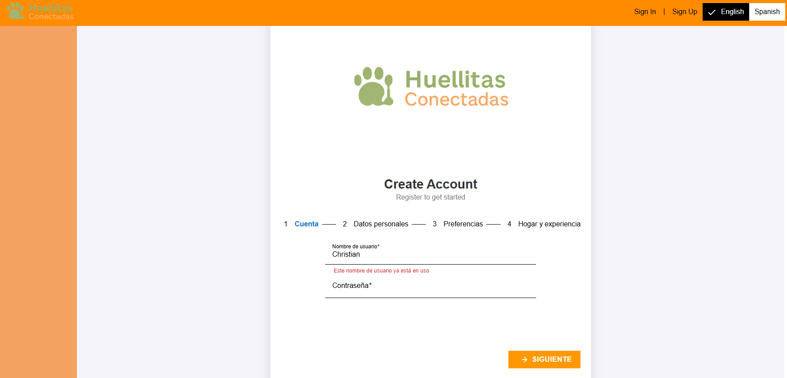
</p>

<p align="center">
    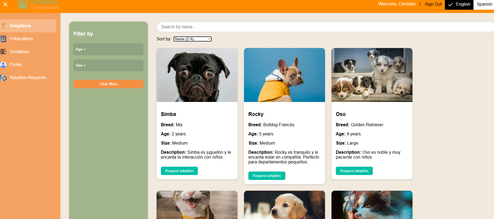
</p>

<p align="center">
    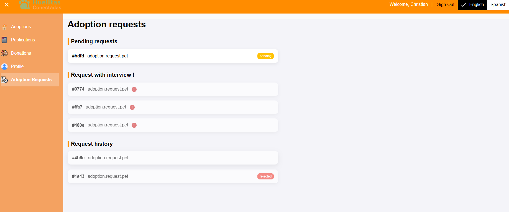
</p>

<p align="center">
    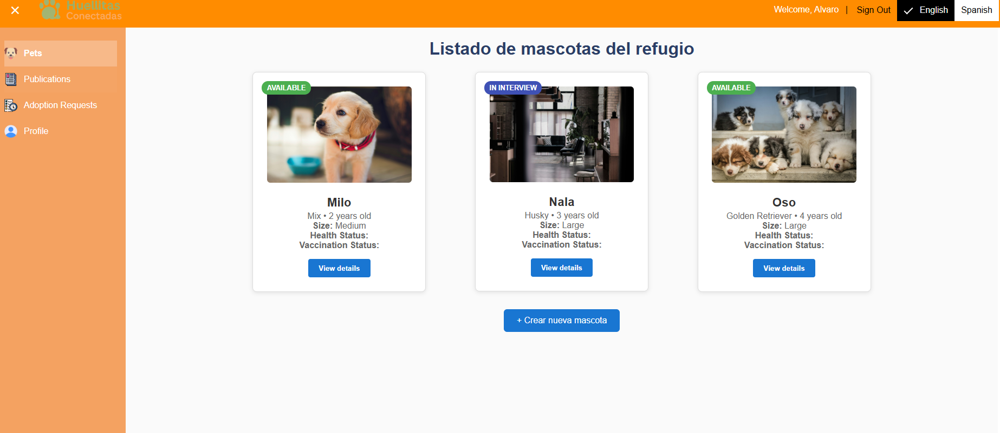
</p>

<p align="center">
    
</p>

### 8.3.3.4. Implemented To-Be Native-Mobile Application Evidence

Se adjuntan capturas de pantallas de nuestra app desarrollada para dispositivos moviles. 

<p align="center">
    
</p>
<p align="center">
    
</p>
<p align="center">
    
</p>
<p align="center">
    
</p>


### 8.3.3.5. Implemented To-Be RESTful API and/or Serverless Backend Evidence

Se adjuntan capturas de pantallas de los endpoints desarrollados en el backend.

<p align="center">
    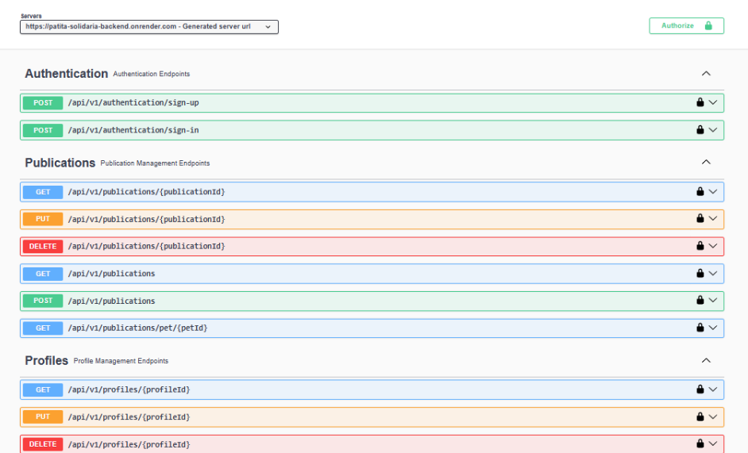
</p>

<p align="center">
    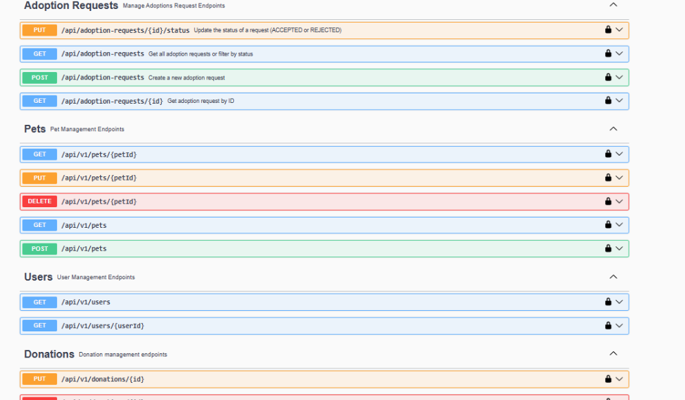
</p>


### 8.3.3.6. Team Collaboration Insights
Durante la implementación del To-Be Experiment-Driven Lifecycle, el equipo mantuvo una dinámica de colaboración basada en comunicación constante, coordinación por roles y reuniones breves al inicio y cierre de cada jornada de trabajo.
Entre los principales aspectos de colaboración se destacan:

1. Coordinación y comunicación

Uso de canales de comunicación (Discord / WhatsApp / Teams) para coordinar tareas diarias y resolver bloqueos rápidamente.

Reuniones cortas tipo daily para actualizar progreso y asignar tareas de acuerdo con las necesidades del experimento.

2. Control de versiones y trabajo técnico

Aplicación disciplinada de GitFlow para la creación de feature branches relacionados directamente con las funcionalidades To-Be.

Commits frecuentes siguiendo Conventional Commits, permitiendo claridad sobre qué se cambió, por qué y cómo aporta al experimento.

3. Colaboración en diseño

Sesiones colaborativas en Figma para ajustar pantallas y flujos derivados de las hipótesis del experimento.

Revisión cruzada (peer review) para validar que cada propuesta respondiera directamente a las métricas y preguntas del experimento.

4. Validación funcional

Pruebas conjuntas en entornos de staging para validar funcionalidades antes de las entrevistas To-Be.

Identificación y documentación inmediata de incidencias para ser corregidas dentro del sprint.

5. Aprendizajes del Sprint

La visibilidad de tareas mediante tableros Trello permitió priorizar correctamente el trabajo experimental.

Se mejoró la eficiencia reduciendo tareas duplicadas y estableciendo responsables directos por cada hipótesis y variable del experimento.


## 8.3.4. To-Be Validation Interviews
### 8.3.4.1. Diseño de Entrevistas

#### Preguntas para Adoptantes

##### 1) Diseño y navegación
1. ¿Pudiste orientarte rápidamente desde la pantalla principal?
2. ¿Alguna sección te generó confusión al navegar?

##### 2) Exploración de Mascotas
1. ¿La información mostrada por mascota fue suficiente para decidir abrir su ficha?
2. ¿El sistema de filtros te ayudó a encontrar lo que buscabas?

##### 3) Proceso de Adopción
1. ¿Comprendiste los pasos del proceso de adopción sin necesidad de ayuda?
2. ¿En qué parte del flujo sentiste mayor dificultad?

##### 4) Donaciones
1. ¿El diseño de la sección te transmitió confianza para donar?
2. ¿Qué elemento te motivaría más a completar una donación?

##### 5) Seguridad y percepción general
1. ¿Hubo algo que incrementara o redujera tu confianza en la plataforma?
2. ¿Qué parte te pareció más clara y cuál mejorarías?

##### 6) Recomendación e interés futuro
1. ¿Recomendarías esta plataforma a alguien interesado en adoptar o ayudar?
2. ¿Qué funcionalidad adicional sería más útil para ti?


#### Preguntas para Refugios / Cuidadores

##### 1) Diseño y navegación
1. ¿Identificaste sin dificultad las secciones destinadas para tu rol?
2. ¿Algún botón o sección debería renombrarse o reubicarse?

##### 2) Publicación de Mascotas
1. ¿El flujo para publicar una mascota te resultó claro?
2. ¿La información solicitada es suficiente para una publicación completa?

##### 3) Gestión de Adopciones
1. ¿Pudiste gestionar solicitudes (aceptar/rechazar/filtrar) sin complicaciones?
2. ¿Qué parte del proceso te gustaría automatizar?

##### 4) Funcionalidades y operación diaria
1. ¿Qué herramienta adicional facilitaría más tu trabajo diario?
2. ¿Qué sección te resultó más útil y cuál necesita mejoras?

##### 5) Impacto y adopción
1. ¿Crees que la plataforma reduciría tiempo o errores en tu refugio?
2. ¿Qué factor podría dificultar su adopción continua?

### 8.3.4.2. Registro de Entrevistas

**Segmento Objetivo #1: Personal de Refugios y Rescatistas de Animales (Administradores, Cuidadores y Voluntarios)**
<table>
<colgroup>
</colgroup>
<thead>
  <tr>
    <th colspan="2"><div align="center">Entrevista #1<br></div></th>
  </tr>
</thead>
<tbody>
  <tr>
    <td>Nombre</td>
    <td>Jhon</td>
  </tr>
  <tr>
    <td>Apellidos</td>
    <td>Pinto</td>
  </tr>
  <tr>
    <td>Edad</td>
    <td>22 años</td>
  </tr>
  <tr>
    <td>Distrito</td>
    <td>Ate</td>
  </tr>
  <tr>
    <td>Tecnologías</td>
    <td>Celular, laptop</td>
  </tr>

  <tr>
    <td>Entrevistador</td>
    <td>Christian Espinoza</td>
  </tr>
  <tr>
    <td>Evidencia</td>
    <td><div align="center"></div></td>
  </tr>
  <tr>
    <td>Link</td>
    <td><p><a target="_blank" href="https://upcedupe-my.sharepoint.com/:v:/g/personal/u202213208_upc_edu_pe/IQAZu9olZ7vIR72YV8tXhzjpAYGJXpRmsDzHa3sfV9xCfME?e=Pj8ip9&nav=eyJyZWZlcnJhbEluZm8iOnsicmVmZXJyYWxBcHAiOiJTdHJlYW1XZWJBcHAiLCJyZWZlcnJhbFZpZXciOiJTaGFyZURpYWxvZy1MaW5rIiwicmVmZXJyYWxBcHBQbGF0Zm9ybSI6IldlYiIsInJlZmVycmFsTW9kZSI6InZpZXcifX0%3D" title="Title">https://upcedupe-my.sharepoint.com/:v:/g/personal/u202213208_upc_edu_pe/IQAZu9olZ7vIR72YV8tXhzjpAYGJXpRmsDzHa3sfV9xCfME?e=Pj8ip9&nav=eyJyZWZlcnJhbEluZm8iOnsicmVmZXJyYWxBcHAiOiJTdHJlYW1XZWJBcHAiLCJyZWZlcnJhbFZpZXciOiJTaGFyZURpYWxvZy1MaW5rIiwicmVmZXJyYWxBcHBQbGF0Zm9ybSI6IldlYiIsInJlZmVycmFsTW9kZSI6InZpZXcifX0%3D</a></p></td> 
  </tr>
  <tr>
    <td>Duración<br></td>
    <td>4:30 min</td>
  </tr>
  <tr>
    <td>Resumen</td>
    <td style="text-align: justify;">
    Jhon Pinto, rescatista independiente, valora una plataforma que sea clara, ordenada y que facilite una adopción responsable. Destaca que la navegación es intuitiva y que las secciones para su labor están bien definidas. Considera que la información solicitada para publicar mascotas es adecuada, aunque siempre encuentra útil poder añadir breves notas de comportamiento o salud. Señala como sugerencia menor hacer más visibles algunos filtros y contar con pequeños apoyos automáticos en el seguimiento post-adopción. En general, percibe que la herramienta le ahorra tiempo, mejora la organización de solicitudes y aporta transparencia al proceso, lo que fortalece su confianza en la plataforma.</td>
  </tr>
</tbody>
</table>

<br/>

<table>
<colgroup>
</colgroup>
<thead>
  <tr>
    <th colspan="2"><div align="center">Entrevista #2<br></div></th>
  </tr>
</thead>
<tbody>
  <tr>
    <td>Nombre</td>
    <td>Julieta</td>
  </tr>
  <tr>
    <td>Apellidos</td>
    <td>Cárdenas</td>
  </tr>
  <tr>
    <td>Edad</td>
    <td>25 años</td>
  </tr>
  <tr>
    <td>Distrito</td>
    <td>Ate</td>
  </tr>
  <tr>
    <td>Tecnologías</td>
    <td>Celular, laptop y tablet</td>
  </tr>

  <tr>
    <td>Entrevistador</td>
    <td>Harrison Payesa</td>
  </tr>
  <tr>
    <td>Evidencia</td>
    <td><div align="center"></div></td>
  </tr>
  <tr>
    <td>Link</td>
    <td><p><a target="_blank" href="https://upcedupe-my.sharepoint.com/:v:/g/personal/u202221024_upc_edu_pe/IQDalhUmtOe1SZ3CAFACZkLOAc5s1A9Q3cdTC9eIe5OL_xU?nav=eyJyZWZlcnJhbEluZm8iOnsicmVmZXJyYWxBcHAiOiJPbmVEcml2ZUZvckJ1c2luZXNzIiwicmVmZXJyYWxBcHBQbGF0Zm9ybSI6IldlYiIsInJlZmVycmFsTW9kZSI6InZpZXciLCJyZWZlcnJhbFZpZXciOiJNeUZpbGVzTGlua0NvcHkifX0&e=YfXdbR" title="Title">Enlace a Entrevista Refugio</a></p></td> 
  </tr>
  <tr>
    <td>Duración<br></td>
    <td>4:30 min</td>
  </tr>
  <tr>
    <td>Resumen</td>
    <td style="text-align: justify;">
   Julieta Cárdenas, responsable de un refugio de perritos en Huaycán y emprendedora dedicada a la venta de artículos para mascotas, valora que la plataforma agilice la visibilidad de los animales que tiene a su cuidado. Destaca que la app es ordenada, fácil de usar y que le permite publicar perfiles completos rápidamente, algo esencial para un refugio con alta demanda. Considera especialmente útil la posibilidad de añadir información detallada sobre salud, tamaño y necesidades específicas, lo que ayuda a atraer adoptantes responsables. Sugiere como mejora incorporar herramientas que faciliten la coordinación logística en zonas periféricas como Huaycán, así como un espacio para promocionar alimentos o accesorios recomendados para cada caso. En general, percibe que la aplicación le ahorra tiempo, mejora la transparencia del proceso de adopción y fortalece el vínculo entre los refugios y las familias adoptantes.</td>
  </tr>
</tbody>
</table>


<br/>


**Segmento Objetivo #2: Adoptantes Potenciales (Personas interesadas en adoptar animales)**

<table>
<colgroup>
</colgroup>
<thead>
  <tr>
    <th colspan="2"><div align="center">Entrevista #1<br></div></th>
  </tr>
</thead>
<tbody>
  <tr>
    <td>Nombre</td>
    <td>Camila</td>
  </tr>
  <tr>
    <td>Apellidos</td>
    <td>Paredes</td>
  </tr>
  <tr>
    <td>Edad</td>
    <td>20 años</td>
  </tr>
  <tr>
    <td>Distrito</td>
    <td>SJL</td>
  </tr>
  <tr>
    <td>Tecnologías</td>
    <td>Celular, laptop</td>
  </tr>

  <tr>
    <td>Entrevistador</td>
    <td>Harrison Payesa</td>
  </tr>
  <tr>
    <td>Evidencia</td>
    <td><div align="center"></div></td>
  </tr>
  <tr>
    <td>Link</td>
    <td><p><a target="_blank" href="https://upcedupe-my.sharepoint.com/:v:/g/personal/u202221024_upc_edu_pe/IQDlBWKnlnULSKawk5SzCHMrAVE4ZNbWm94FNjgOgf5oZUA?nav=eyJyZWZlcnJhbEluZm8iOnsicmVmZXJyYWxBcHAiOiJPbmVEcml2ZUZvckJ1c2luZXNzIiwicmVmZXJyYWxBcHBQbGF0Zm9ybSI6IldlYiIsInJlZmVycmFsTW9kZSI6InZpZXciLCJyZWZlcnJhbFZpZXciOiJNeUZpbGVzTGlua0NvcHkifX0&e=KorGBT" title="Title">Enlace a Entrevista Adoptante</a></p></td> 
  </tr>
  <tr>
    <td>Duración<br></td>
    <td>6:32 min</td>
  </tr>
  <tr>
    <td>Resumen</td>
    <td style="text-align: justify;">
   Camila Paredes, estudiante de veterinaria, aprecia una plataforma que le permita conocer a fondo las necesidades de cada animal antes de adoptar. Destaca que la aplicación es clara y que la navegación facilita comparar distintos perfiles, algo importante para elegir un compañero que se adapte a su vida en un departamento. Valora especialmente las fichas con información de salud, comportamiento y nivel de actividad, ya que le ayudan a tomar una decisión responsable. Como sugerencia, menciona que sería útil incluir más fotografías y pequeñas historias sobre la vida previa de cada mascota. En general, siente que la herramienta le da confianza, ordena el proceso de adopción y la acerca de manera transparente a refugios y rescatistas, haciéndola sentir acompañada en cada paso hacia la adopción.</td>
  </tr>
</tbody>
</table>


</div>

# 8.4. *Experiment Aftermath & Analysis*
## 8.4.1. Analysis and Interpretation of Results

Para validar el rendimiento y la experiencia de usuario de la plataforma **Adopta!**, se realizó una evaluación utilizando **PageSpeed Insights**, una herramienta que mide métricas clave de velocidad de carga, interactividad y estabilidad visual.

### **Puntuaciones Globales**

<p align="center">
    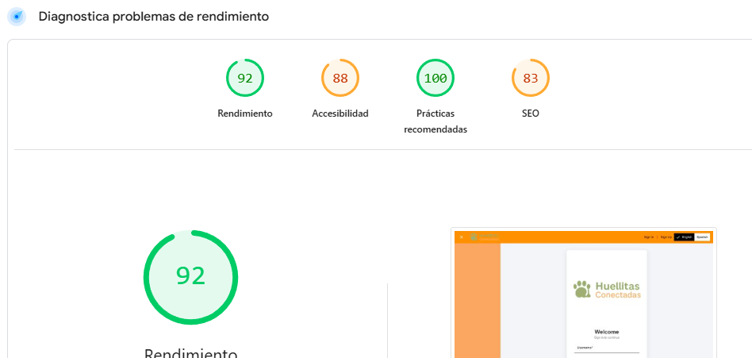
</p>

### **Métricas de Rendimiento**

| Criterio | Descripción | Valor Obtenido | Mejora |
|----------|-------------|----------------|--------|
| **Primer Renderizado de Contenido** | El primer procesamiento de imagen con contenido indica el momento en el que se visualiza en la pantalla el primer texto o imagen. | 0.6 s | +10 |
| **Renderizado del Elemento Más Grande** | La métrica Procesamiento de imagen con contenido más grande indica el momento en que se pinta el texto o la imagen más grandes. | 1.9 s | +17 |
| **Tiempo Total de Bloqueo** | Suma todos los períodos entre FCP y el Tiempo de carga, cuando la tarea tarda más de 50 ms. El resultado se expresa en milisegundos. | 30 ms | +30 |
| **Cambio de Diseño Acumulado** | El Cambio de diseño acumulado mide el movimiento de los elementos visibles dentro del viewport. | 0.034 | +25 |
| **Índice de Velocidad (SI)** | Mide la rapidez con la que el contenido se muestra visualmente durante la carga de la página. | 0.7 s | +10 |

### **Oportunidades de Optimización**

- **JavaScript no utilizado:** Ahorro estimado de 60 KiB
- **CSS no utilizado:** Ahorro estimado de 54 KiB
- **Optimización de imágenes:** Ahorro estimado de 1,454 KiB
- **Tareas largas del hilo principal:** 1 tarea larga encontrada
- **Elementos animados no compuestos:** 2 elementos detectados

Los resultados demuestran un **rendimiento excelente** (92/100) con tiempos de carga rápidos y alta estabilidad visual, garantizando una experiencia de usuario óptima para los adoptantes y refugios. Las oportunidades de optimización identificadas permitirán mejorar aún más el rendimiento en futuras iteraciones.


## 8.4.2. Re-scored and Re-prioritized Question Backlog

A partir de los resultados obtenidos durante la experimentación (prototipo con filtros avanzados, fichas con información clara y entrevistas de validación To-Be), se recalificó el **Question Backlog** definido en la sección 8.1.4, actualizando los niveles de **confianza**, **riesgo**, **impacto** e **interés** de cada pregunta.

Las preguntas relacionadas con **búsqueda, transparencia de información y confianza del adoptante** mostraron evidencia más sólida, mientras que las preguntas vinculadas al **modelo de negocio (planes premium)** permanecen con menor validación empírica.

#### Backlog re-puntualizado

| Pregunta                                                                           | Evidencia post-experimento                                                                                                                                                                                                                                                     | Confianza<br>(antes → después) | Riesgo<br>(antes → después) | Impacto   | Interés   | Nueva Prioridad |
| ---------------------------------------------------------------------------------- | ------------------------------------------------------------------------------------------------------------------------------------------------------------------------------------------------------------------------------------------------------------------------------ | ------------------------------ | --------------------------- | --------- | --------- | --------------- |
| **¿Qué información es más decisiva para que un adoptante solicite una mascota?**   | Las entrevistas y pruebas con el prototipo mostraron que los adoptantes valoran especialmente la combinación de **historia**, **estado de salud** y **detalles de comportamiento**, confirmando la importancia de este punto en la decisión de iniciar una solicitud.          | 3 → **4**                      | 5 → **4**                   | 5         | 5         | **Alta**        |
| **¿Los refugios aceptarán digitalizar su proceso con formularios estandarizados?** | El uso del flujo To-Be y la validación con rescatistas evidenciaron buena disposición a usar la plataforma siempre que **simplifique** el trabajo diario y no agregue carga adicional. Sin embargo, aún no se ha probado en un volumen grande de refugios.                     | 2 → **3**                      | 5 → **4**                   | 5         | 4         | **Alta**        |
| **¿Los filtros avanzados reducen abandono?**                                       | En las sesiones con adoptantes, los filtros fueron percibidos como útiles para encontrar más rápido mascotas compatibles, y se señalaron como algo que “ayuda a encontrar lo que buscaban”, reforzando su rol en la reducción de fricción en la búsqueda.                      | 3 → **4**                      | 4 → **3**                   | 5         | 5         | **Alta**        |
| **¿El historial médico visible genera más confianza?**                             | Los participantes indicaron que la información de salud clara y accesible aumenta la confianza en la plataforma y en el proceso de adopción, validando la hipótesis planteada en la Experiment Card de historial médico.                                                       | 3 → **4**                      | 3 → **2**                   | 4 → **5** | 5         | **Alta**        |
| **¿El chat integrado reduce mensajes externos?**                                   | El experimento se centró principalmente en filtros, rendimiento y claridad de la información; el chat integrado tuvo menor protagonismo y no se recogió suficiente evidencia cuantitativa sobre reducción real de mensajes externos.                                           | 2 → **2**                      | 3 → **3**                   | 4 → **3** | 3         | **Media**       |
| **¿Los refugios están dispuestos a pagar por un plan premium?**                    | El foco de esta iteración estuvo en validar **usabilidad y confianza**, no en monetización. No se realizaron pruebas específicas sobre disposición de pago, por lo que la incertidumbre se mantiene alta y su prioridad se desplaza a una fase futura.                         | 2 → **2**                      | 4 → **4**                   | 5 → **4** | 4 → **3** | **Baja**        |
| **¿Las historias de éxito aumentan la intención de adoptar?**                      | Aunque se reconoce el valor emocional de las historias, en esta iteración no se diseñó un experimento directo para medir su impacto en la tasa de solicitud; se mantiene como una línea prometedora pero secundaria frente a los hallazgos sobre filtros e información médica. | 4 → **4**                      | 2 → **2**                   | 3         | 3         | **Baja**        |

#### Interpretación de la nueva prioridad

* Las preguntas relacionadas con **información crítica en la ficha de la mascota** y con **mecanismos de búsqueda (filtros avanzados)** se consolidan como las de **mayor prioridad**, al estar directamente respaldadas por la evidencia de entrevistas y pruebas con el prototipo.
* La adopción de **procesos digitalizados por parte de refugios** mantiene prioridad alta, pero con una confianza moderada, al requerir más validación con un número mayor de organizaciones.
* Las preguntas centradas en **chat integrado**, **planes premium** y **historias de éxito** permanecen en el backlog para futuras iteraciones, al no haber sido el foco principal del experimento actual y contar con menor evidencia cuantitativa.

Esta re-priorización orienta el siguiente ciclo de desarrollo hacia **mejorar aún más la búsqueda, la transparencia de la información y la percepción de confianza en la plataforma**, dejando las preguntas de monetización y features complementarias para fases posteriores del producto.

# 8.5. *Continuous Learning*
## 8.5.1 Shareback Session Artifacts: Learning Workflow

### Step 1: Enough Evidence

Contamos con evidencia cuantitativa técnica (Reporte de PageSpeed Insights con puntuación de 92/100) y evidencia cualitativa de usuario (validación de hipótesis sobre la importancia del historial médico y los filtros a través de entrevistas y pruebas de prototipo).

### Step 2: Examine Evidence

#### Organize: 

Hemos clasificado los resultados en dos categorías principales:
- Rendimiento Técnico: Métricas de Core Web Vitals (LCP, TBT, CLS).
- Validación de Valor: Feedback de adoptantes sobre confianza y usabilidad.

#### Answer the question:

Pregunta: ¿Es la plataforma técnicamente viable y útil para el usuario?
Respuesta: Sí, ya que el rendimiento es excelente (Carga en 0.6s). Por ejemplo, los usuarios validaron que la información médica y los filtros avanzados son críticos para la decisión de adopción.

#### Check the Health metrics:

| Métrica de Salud         | Resultado | Estado    |
| ------------------------ | --------- | --------- |
| Puntuación Global        | 92 / 100  | Excelente |
| Velocidad (FCP)          | 0.6 s     | Rápido    |
| Estabilidad Visual (CLS) | 0.034     | Estable   |
| Interactividad (TBT)     | 30 ms     | Muy buena |

### Step 3: Consider Implications

Hemos confirmado que la confianza del adoptante depende directamente de la transparencia de la información. Además, sabemos técnicamente que podemos ahorrar ~1.5 MB optimizando imágenes, lo cual es crucial para usuarios móviles.

¿Cómo cambia la pregunta lo que pensábamos que sabíamos? 

Antes pensábamos que características como el Chat Integrado o los Planes Premium eran prioritarios. La evidencia muestra que el usuario prefiere filtros eficientes y datos de salud antes que herramientas de comunicación social o modelos de pago. Esto desplaza el foco de "Monetización/Social" a "Confianza/Búsqueda".

### Step 4: Reaching conclusions and making decisions

La hipótesis de que "más información médica genera más confianza" ha sido validada (Confianza subió a 4/5).

Decisión:
- Proceder al desarrollo de las historias de usuario de alta prioridad (Búsqueda, Solicitud, Historial).
- Posponer el desarrollo de funcionalidades de monetización (Premium) hasta consolidar la base de usuarios y refugios.
- Implementar optimizaciones técnicas (imágenes y CSS) detectadas en el análisis.

### After the experiment

#### Step 1: Re-score and re-prioritize

Suben de Prioridad (Alta):
- Información decisiva (Historial médico).
- Filtros avanzados (Reducción de abandono).

Bajan de Prioridad (Baja/Media):
- Planes Premium (Riesgo alto, interés bajo por ahora).
- Historias de éxito (Impacto emocional validado, pero secundario a la funcionalidad core).

#### Step 2: Reshape the backlog

| Prioridad | ID Story | Título                    | Epic ID |
| --------- | -------- | ------------------------- | ------- |
| MÁXIMA    | 04       | Buscar mascotas (Filtros) | 2       |
| MÁXIMA    | 16       | Ver historial médico	   | 2       |
| ALTA	    | 07       | Solicitar adopción	       | 3       |
| MEDIA	    | 19       | Ver recomendaciones	   | 2       |
| MEDIA	    | 20       | Preferencias de adopción  | 2       |
| BAJA	    | 27       | Estadísticas (Admin)	   | 6       |

#### Step 3: Consider new raw material

- Nuevas tareas generadas a partir del análisis técnico ("Oportunidades de Optimización"):
- Deuda Técnica: Tarea para remover CSS y JS no utilizado (ahorro ~114 KiB).
- Optimización: Implementar compresión de imágenes (ahorro ~1,454 KiB).
- Investigación Futura: Diseñar un nuevo experimento específico para validar la disposición de pago de los refugios (ya que la evidencia actual fue insuficiente).

# 8.6. *To-Be Software Platform Pre-launch*
## 8.6.1. About-the-Product Intro Video

El siguiente video presenta una introducción completa, explicando el propósito de la plataforma, sus funcionalidades principales y cómo conecta a adoptantes responsables con refugios y rescatistas. Este material audiovisual facilita la comprensión del producto y su impacto en el proceso de adopción de mascotas.

**Video About the Product:**  
[https://upcedupe-my.sharepoint.com/:v:/g/personal/u202213208_upc_edu_pe/IQAf5HJVDy6hQoPOfq6JtHgaAVpoTO065cB2eaZtBsq2rnI?nav=eyJyZWZlcnJhbEluZm8iOnsicmVmZXJyYWxBcHAiOiJPbmVEcml2ZUZvckJ1c2luZXNzIiwicmVmZXJyYWxBcHBQbGF0Zm9ybSI6IldlYiIsInJlZmVycmFsTW9kZSI6InZpZXciLCJyZWZlcnJhbFZpZXciOiJNeUZpbGVzTGlua0NvcHkifX0&e=KReNy9](https://upcedupe-my.sharepoint.com/:v:/g/personal/u202213208_upc_edu_pe/IQAf5HJVDy6hQoPOfq6JtHgaAVpoTO065cB2eaZtBsq2rnI?nav=eyJyZWZlcnJhbEluZm8iOnsicmVmZXJyYWxBcHAiOiJPbmVEcml2ZUZvckJ1c2luZXNzIiwicmVmZXJyYWxBcHBQbGF0Zm9ybSI6IldlYiIsInJlZmVycmFsTW9kZSI6InZpZXciLCJyZWZlcnJhbFZpZXciOiJNeUZpbGVzTGlua0NvcHkifX0&e=KReNy9)


# Conclusiones

<div align = "justify">
<br>- Las prácticas de verificación, validación e integración continua aplicadas garantizaron la calidad y estabilidad del sistema. A través de pruebas unitarias, de integración, BDD y de rendimiento, se comprobó el correcto funcionamiento de los módulos y flujos principales. Asimismo, la adopción de DevOps con herramientas como JUnit 5, Cucumber, Docker, Jenkins y GitHub Actions permitió automatizar los procesos de prueba, compilación y despliegue, logrando una entrega continua, ágil y confiable del producto.
<br> - El enfoque de experimentación guiada por datos permitió re-priorizar funcionalidades de mayor impacto para refugios y adoptantes, incrementando el valor entregado en cada iteración.
<br> - La arquitectura modular basada en DDD y las prácticas de seguridad aplicadas dejaron una base escalable, mantenible y lista para integrar nuevas capacidades.
<br>  <br>

</div>

<br>

# Recomendaciones
1. Consolidar gobierno del producto: definir roadmap trimestral, responsables por módulo y métricas núcleo (conversiones, tiempo a adopción, retención de refugios) para decisiones basadas en datos.
2. Escalar con calidad sostenible: ampliar cobertura de pruebas y preparar desacoplamiento gradual hacia servicios independientes si aumenta el tráfico.
3. Reforzar confianza del ecosistema: estandarizar formato de historial médico, formalizar seguimiento post-adopción (30/60/90 días) y publicar panel transparente de actividad y uso de donaciones para mejorar credibilidad y adopciones exitosas.

# Video App Validation
## Validation Interviews (As-Is)
- [Jhon Pinto](https://upcedupe-my.sharepoint.com/:v:/g/personal/u202213208_upc_edu_pe/IQAlChXr5pf3Ta4YAdoYcb9xAQQ6OutlLV0lJu6tHeb5gw8?nav=eyJyZWZlcnJhbEluZm8iOnsicmVmZXJyYWxBcHAiOiJTdHJlYW1XZWJBcHAiLCJyZWZlcnJhbFZpZXciOiJTaGFyZURpYWxvZy1MaW5rIiwicmVmZXJyYWxBcHBQbGF0Zm9ybSI6IldlYiIsInJlZmVycmFsTW9kZSI6InZpZXcifX0%3D&e=FTeQdu)
- [Camila Paredes](https://upcedupe-my.sharepoint.com/:v:/g/personal/u202221024_upc_edu_pe/EdTBapRNLA1AqA5Q4qIUHlwBOpdAERrRh4iirG3ggYEcGw?nav=eyJyZWZlcnJhbEluZm8iOnsicmVmZXJyYWxBcHAiOiJPbmVEcml2ZUZvckJ1c2luZXNzIiwicmVmZXJyYWxBcHBQbGF0Zm9ybSI6IldlYiIsInJlZmVycmFsTW9kZSI6InZpZXcifX0&e=Jddj0T)
- [Álvaro Acero](https://upcedupe-my.sharepoint.com/:v:/g/personal/u202213208_upc_edu_pe/EawCTTHMUWxFh29ohhHwO8ABWlcGJZHV-KMcEBqkhroo4Q?nav=eyJyZWZlcnJhbEluZm8iOnsicmVmZXJyYWxBcHAiOiJPbmVEcml2ZUZvckJ1c2luZXNzIiwicmVmZXJyYWxBcHBQbGF0Zm9ybSI6IldlYiIsInJlZmVycmFsTW9kZSI6InZpZXcifX0&e=piEtME)
- [Alejandra Ramírez](https://upcedupe-my.sharepoint.com/:v:/g/personal/u202221024_upc_edu_pe/EUDkrkSqlqBIvRShQkAQxKUBZHhzG0G6DLpM5a7ZLBuNIg?nav=eyJyZWZlcnJhbEluZm8iOnsicmVmZXJyYWxBcHAiOiJPbmVEcml2ZUZvckJ1c2luZXNzIiwicmVmZXJyYWxBcHBQbGF0Zm9ybSI6IldlYiIsInJlZmVycmFsTW9kZSI6InZpZXcifX0&e=QwtEUp)

### To-Be Validation Interviews
- [Jhon Pinto](https://upcedupe-my.sharepoint.com/:v:/g/personal/u202213208_upc_edu_pe/IQAZu9olZ7vIR72YV8tXhzjpAYGJXpRmsDzHa3sfV9xCfME?e=Pj8ip9&nav=eyJyZWZlcnJhbEluZm8iOnsicmVmZXJyYWxBcHAiOiJTdHJlYW1XZWJBcHAiLCJyZWZlcnJhbFZpZXciOiJTaGFyZURpYWxvZy1MaW5rIiwicmVmZXJyYWxBcHBQbGF0Zm9ybSI6IldlYiIsInJlZmVycmFsTW9kZSI6InZpZXcifX0%3D)
- [Julieta Cárdenas](https://upcedupe-my.sharepoint.com/:v:/g/personal/u202221024_upc_edu_pe/IQDalhUmtOe1SZ3CAFACZkLOAc5s1A9Q3cdTC9eIe5OL_xU?nav=eyJyZWZlcnJhbEluZm8iOnsicmVmZXJyYWxBcHAiOiJPbmVEcml2ZUZvckJ1c2luZXNzIiwicmVmZXJyYWxBcHBQbGF0Zm9ybSI6IldlYiIsInJlZmVycmFsTW9kZSI6InZpZXcifX0&e=YfXdbR)
- [Camila Paredes](https://upcedupe-my.sharepoint.com/:v:/g/personal/u202221024_upc_edu_pe/IQDlBWKnlnULSKawk5SzCHMrAVE4ZNbWm94FNjgOgf5oZUA?nav=eyJyZWZlcnJhbEluZm8iOnsicmVmZXJyYWxBcHAiOiJPbmVEcml2ZUZvckJ1c2luZXNzIiwicmVmZXJyYWxBcHBQbGF0Zm9ybSI6IldlYiIsInJlZmVycmFsTW9kZSI6InZpZXcifX0&e=KorGBT)
- [Álvaro Acero](https://upcedupe-my.sharepoint.com/:v:/g/personal/u202213208_upc_edu_pe/EawCTTHMUWxFh29ohhHwO8ABWlcGJZHV-KMcEBqkhroo4Q?nav=eyJyZWZlcnJhbEluZm8iOnsicmVmZXJyYWxBcHAiOiJPbmVEcml2ZUZvckJ1c2luZXNzIiwicmVmZXJyYWxBcHBQbGF0Zm9ybSI6IldlYiIsInJlZmVycmFsTW9kZSI6InZpZXcifX0&e=piEtME)

# Video About the team

- [https://upcedupe-my.sharepoint.com/:v:/g/personal/u202213208_upc_edu_pe/IQAZZVS78Cv9QIZu4AUmLbTOAUIW-rimjoggrI28XN5dF1I?e=sjacMZ&nav=eyJyZWZlcnJhbEluZm8iOnsicmVmZXJyYWxBcHAiOiJTdHJlYW1XZWJBcHAiLCJyZWZlcnJhbFZpZXciOiJTaGFyZURpYWxvZy1MaW5rIiwicmVmZXJyYWxBcHBQbGF0Zm9ybSI6IldlYiIsInJlZmVycmFsTW9kZSI6InZpZXcifX0%3D](https://upcedupe-my.sharepoint.com/:v:/g/personal/u202213208_upc_edu_pe/IQAZZVS78Cv9QIZu4AUmLbTOAUIW-rimjoggrI28XN5dF1I?e=sjacMZ&nav=eyJyZWZlcnJhbEluZm8iOnsicmVmZXJyYWxBcHAiOiJTdHJlYW1XZWJBcHAiLCJyZWZlcnJhbFZpZXciOiJTaGFyZURpYWxvZy1MaW5rIiwicmVmZXJyYWxBcHBQbGF0Zm9ybSI6IldlYiIsInJlZmVycmFsTW9kZSI6InZpZXcifX0%3D)

<br>


<div align="center">


</div>


<br>

# Bibliografía

<br>

<div align = "justify">

- GitHub. (2025). *GitHub*. [https://github.com](https://github.com)  
- WUF. (2025). *Plataforma de adopciones y bienestar animal en Perú*. [https://www.wuf.pe](https://www.wuf.pe)  
- Voz Animal Perú. (2025). *Rescate y adopción responsable*. [https://www.vozanimalperu.org](https://www.vozanimalperu.org) 
- Wukha. (2025). *Adopciones y comunidad pet-friendly*. [https://wukha.com](https://wukha.com)   
- Structurizr. (2025). *Structurizr*. [https://www.structurizr.com](https://www.structurizr.com)  

</div>

<br>

# Anexos

+ Repositorio GitHub del Informe: [Ver Repositorio](https://github.com/Huellitas-DisenodeExperimentos-14651/Project-Report)<br><br>
+ Repositorio GitHub de la Landing Page: [Ver Repositorio](https://github.com/Huellitas-DisenodeExperimentos-14651/LandingPage)
<br><br>
+ Video About the Product: [Ver Video](https://upcedupe-my.sharepoint.com/:v:/g/personal/u202213208_upc_edu_pe/IQAf5HJVDy6hQoPOfq6JtHgaAVpoTO065cB2eaZtBsq2rnI?nav=eyJyZWZlcnJhbEluZm8iOnsicmVmZXJyYWxBcHAiOiJPbmVEcml2ZUZvckJ1c2luZXNzIiwicmVmZXJyYWxBcHBQbGF0Zm9ybSI6IldlYiIsInJlZmVycmFsTW9kZSI6InZpZXciLCJyZWZlcnJhbFZpZXciOiJNeUZpbGVzTGlua0NvcHkifX0&e=pTIYtO)
<br><br>
+ Deployment de la Landing Page: [Ver Deployment](https://huellitas-disenodeexperimentos-14651.github.io/LandingPage/)
<br><br>
+ Repositorio GitHub del Forntend: [Ver Repositorio](https://github.com/Huellitas-DisenodeExperimentos-14651/Frontend)
<br><br>
+ Deployment del frontend: [Ver Deployment](https://huellitasconectas.netlify.app/)
<br><br>
+ Repositorio GitHub del Backend: [Ver Repositorio](https://github.com/Huellitas-DisenodeExperimentos-14651/Backend)
<br><br>
+ Repositorio GitHub de la App Movil: [Ver Repositorio](https://github.com/Huellitas-DisenodeExperimentos-14651/MobileApp)
<br><br>


